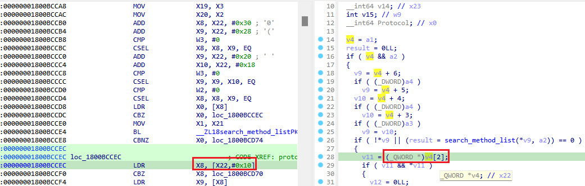
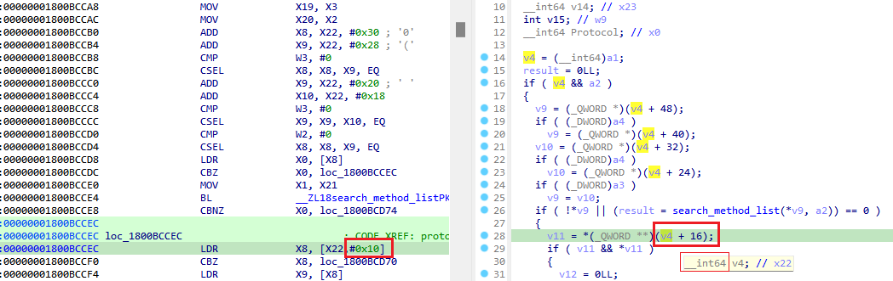

While working with decompiled code and retyping variables (or sometimes when they get typed by the decompiler automatically), you might be puzzled by the discrepancies between pseudocode and disassembly.  
在处理反编译代码和重新键入变量时（有时是反编译器自动键入变量时），您可能会对伪代码和反汇编之间的差异感到困惑。

Consider the following example:  
请看下面的例子：

We see that `X22` is accessed with offset 0x10 (16) in the disassembly but 2 in the pseudocode. Is there a bug in the decompiler?  
我们看到 `X22` 的访问偏移量在反汇编中为 0x10（16），而在伪代码中为 2。反编译器是否存在错误？

In fact, there is no bug. The difference is explained by the C/C++pointer/array referencing rules: the array indexing or integer addition operation advances the pointer value by the value of index _multiplied by the element size_. In this case, the type of `v4` is `_QWORD*`, which means that elements are `_QWORD`s (64-bit or 8-byte integers). Thus, 2*8=16(0x10), which matches the assembly code.  
事实上，没有错误。C/C++ 指针/数组引用规则可以解释这种差异：数组索引或整数加法运算将指针值乘以元素大小。在本例中， `v4` 的类型是 `_QWORD*` ，这意味着元素是 `_QWORD` （64 位或 8 字节整数）。因此，2*8=16(0x10)，与汇编代码一致。

To confirm what’s really going on, you can do “Reset pointer type” on the variable so that it reverts to the generic integer variable and the decompiler is forced to use raw byte offsets:  
要确认到底发生了什么，可以对变量执行 "重置指针类型"，使其恢复为通用整数变量，反编译器将被迫使用原始字节偏移：

See also: 另请参见：

[Igor’s Tip of the Week #117: Reset pointer type  
伊戈尔本周小贴士 #117：重置指针类型](https://hex-rays.com/blog/igors-tip-of-the-week-117-reset-pointer-type/)

[Igor’s tip of the week #42: Renaming and retyping in the decompiler  
伊戈尔的每周提示 #42：反编译器中的重命名和重打](https://hex-rays.com/blog/igors-tip-of-the-week-42-renaming-and-retyping-in-the-decompiler/)

[Igor’s Tip of the Week #118: Structure creation in the decompiler  
伊戈尔的每周窍门 #118：在反编译器中创建结构](https://hex-rays.com/blog/igors-tip-of-the-week-118-structure-creation-in-the-decompiler/)