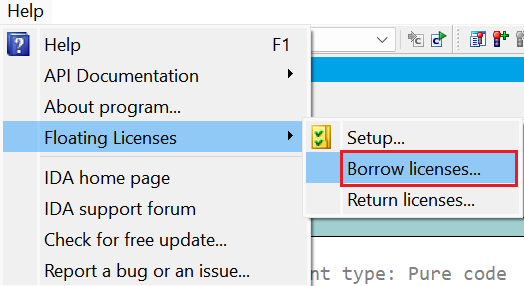
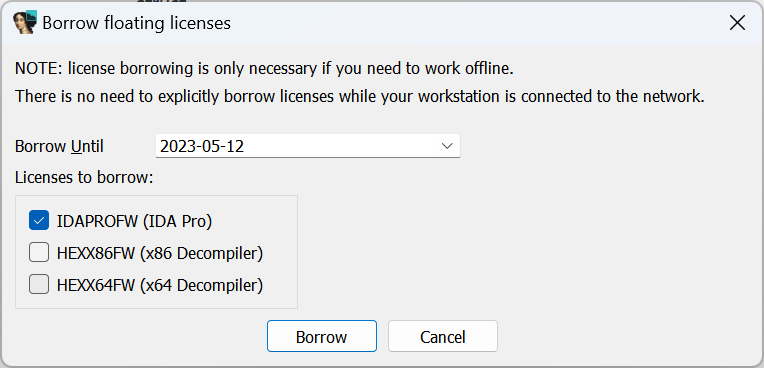
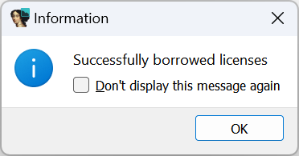
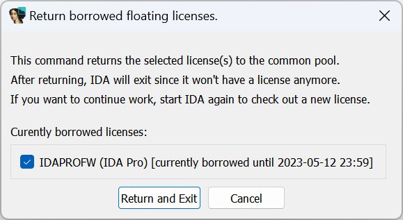

Floating licenses allow additional flexibility for companies with many IDA users: IDA can be installed on as many computers as required, but only a limited number of copies can run simultaneously.    
浮动许可证为拥有众多 IDA 用户的公司提供了额外的灵活性：IDA 可根据需要安装在任意多台计算机上，但同时运行的副本数量有限。

This flexibility its downsides: IDA needs to have permanent connection to your organization’s license server which may make things problematic in some situations (e.g. working on an isolated network or in the field/while traveling). While the first issue can be handled by placing the license server inside that network, accessing the company network during travel may be problematic or impossible. In such situations, you can use license borrowing.  
这种灵活性有其缺点：IDA 需要与企业的许可证服务器建立永久连接，这在某些情况下可能会造成问题（例如，在孤立的网络上工作或在外地/旅行时工作）。虽然第一个问题可以通过将许可证服务器放置在该网络内来解决，但在出差期间访问公司网络可能会有问题或不可能。在这种情况下，可以使用许可证借用。

Borrowing allows the user to check out the license for a fixed period and work without connection to the server during that time.  
借用允许用户在固定时间内借出许可证，并在此期间在不连接服务器的情况下工作。

### Borrowing licenses 借用许可证

To borrow a license, in a floating-license IDA go to  Help > Floating licenses > Borrow licenses…  
要借用许可证，请在浮动许可证 IDA 中转入帮助 > 浮动许可证 > 借用许可证...



You will get a dialog like the following:  
您将看到如下对话框：



Here you can pick which licenses you want to borrow and the borrow period end date. By default, IDA offers one week but you can make it shorter or longer (by default we limit the maximum borrow period to 6 months but it can be limited further by the license server administrator).   
在这里，您可以选择要借用的许可证和借用期的结束日期。默认情况下，IDA 提供一周的借用期，但您可以将其缩短或延长（默认情况下，我们将最长借用期限制为 6 个月，但许可证服务器管理员可以进一步限制）。

If you click “Borrow”, you  should see this confirmation:  
如果点击 "借用"，您应该会看到此确认信息：



and the details in the Output window:  
以及输出窗口中的详细信息：

```
Successfully borrowed licenses:
IDAPROFW (IDA Pro) [currently borrowed until 2023-05-12 23:59]
```

After this, you can disconnect from the network and IDA will continue working until the specified date.  
之后，您可以断开网络连接，IDA 将继续工作，直至指定日期。

NB: once borrowed, the license(s) remain checked out (“In Use”) on the license server and will not become available for others until the end of the borrow period or early return.  
注意：许可证一经借用，将在许可证服务器上保留借出（"使用中"）状态，直到借用期结束或提前归还时才会供他人使用。

### Returning licenses 归还许可证

If you need to return borrowed licenses early (before the end of the borrow period):  
如果需要提前（在借用期结束前）归还借用的许可证，请执行以下操作

1.  Reconnect to the network with the server from which you borrowed the license  
    通过借用许可证的服务器重新连接网络
2.  Go to Help > Floating licenses > Return licenses…  
    转到帮助 > 浮动许可证 > 归还许可证...  
    
3.  select the license(s) to return and click “Return and Exit”.  
    选择要归还的许可证，然后单击 "Return and Exit（归还并退出）"。
4.  IDA will exit since it has returned the license, but you can start it again to use the license server in online mode or borrow again for another period.  
    IDA 将退出，因为它已归还许可证，但您可以再次启动它，以在线模式使用许可证服务器，或再次借用一段时间。

### Borrowing and returning licenses from command line  
通过命令行借用和归还许可证

If you prefer using command line, check the [corresponding section on our support page](https://hex-rays.com/products/ida/support/flexlm/#borrow).  
如果您喜欢使用命令行，请查看我们支持页面的相应部分。

See also: 另请参见：

[Floating Licenses 浮动许可证](https://hex-rays.com/products/ida/support/flexlm/)