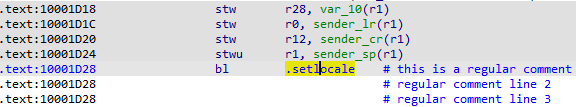
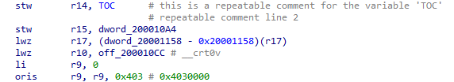
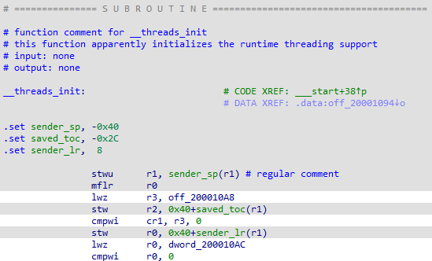
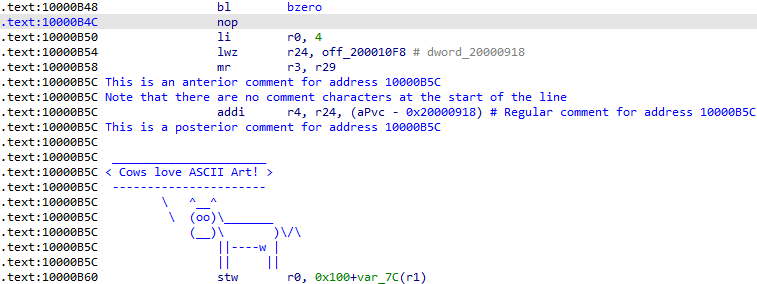
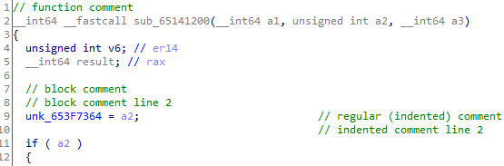
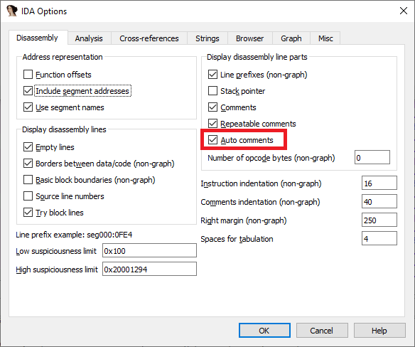
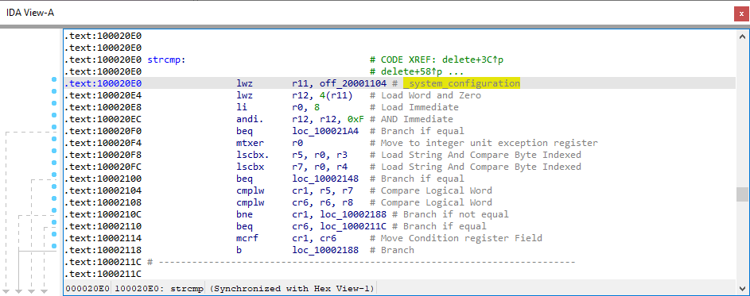
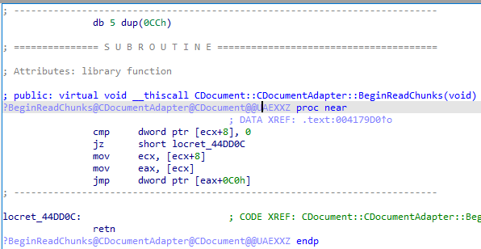
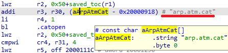

IDA 中的 “I” 代表 interactive（交互式），而你在其中最常用的交互操作之一，就是在反汇编列表（或反编译伪代码）中添加注释。 在 IDA 中，你可以添加或看到不同类型的注释。

### 常规注释（Regular comments）

这些注释放在反汇编行的末尾，由汇编器特定的注释字符分隔（分号、井号、@ 符号等）。 多行注释会将后续的列表行向下移动，并与第一行对齐，因此它们也被称为 缩进注释（indented comments）。

快捷键：`:`（冒号）

### 可重复注释（Repeatable comments）

基本上与常规注释相同，但有一个小区别： 它们会在任何引用原始注释位置的地方重复显示。 例如，如果你在一个全局变量上添加了可重复注释，那么在引用该变量的任何地方都会显示该注释。

快捷键：`;`（分号）

### 函数注释（Function comments）

在函数的第一条指令上添加的可重复注释会被视为 函数注释。 它会显示在函数头之前，并且——由于它是可重复注释——在调用该函数的任何地方都会显示。 它们适合用来描述函数的作用，比函数名所能表达的更详细。

快捷键：`;`（分号）

### 前置与后置注释（Anterior and posterior comments）

这些注释会在当前地址之前（anterior）或之后（posterior）以单独的文本行显示，并将其他列表行向下移动。 它们适合用于扩展说明、ASCII 艺术或其他独立文本。 与常规注释不同，它们不会自动添加汇编器注释字符。

- 前置注释：`Ins`（Mac 上为 `I`）
- 后置注释：`Shift + Ins`（Mac 上为 `Shift + I`）

趣闻：通常在列表开头添加的包含文件详细信息的注释，就是一个前置注释，因此你可以用 `Ins` 来编辑它。

### 伪代码注释（Pseudocode comments）

在反编译的伪代码中，你也可以添加[缩进注释](https://www.hex-rays.com/products/decompiler/manual/cmd_comments.shtml)（快捷键 `/` 斜杠）和[块注释](https://www.hex-rays.com/products/decompiler/manual/cmd_block_cmts.shtml)（快捷键 `Ins`，Mac 上为 `I`）。 它们与反汇编注释是分开存储的，但函数注释在两者之间是共享的。

### 自动注释（Automatic comments）

在某些情况下，IDA 会自动向反汇编中添加注释。 几个例子：

在 `Options > General…` 的 Disassembly 选项卡中启用 `Auto comments`，可以显示指令注释。

  

默认情况下，反汇编会将解码后的符号名（demangled names）显示为自动注释。 如果你希望直接在列表中替换被编码的符号名，可以使用 `Options > Demangled names…` 对话框。

字符串字面量的工作方式与可重复注释类似：字符串内容会作为注释显示在引用它的地方。

原文地址：https://hex-rays.com/blog/igor-tip-of-the-week-14-comments-in-ida