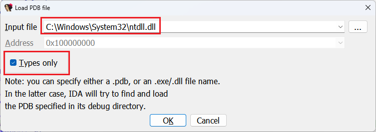
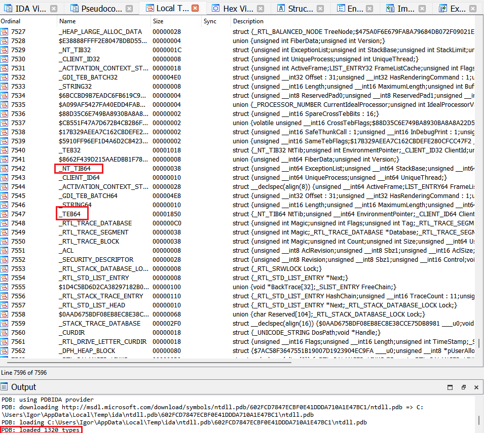

While IDA comes with a rich set of [type libraries](https://hex-rays.com/blog/igors-tip-of-the-week-60-type-libraries/) for Windows API, they don’t cover the whole set of types used in Windows. Our libraries are based on the official Windows SDK/DDK headers, which tend to only include public, stable information which is common to multiple Windows versions. A new Windows build may introduce new types or use some of the previously reserved fields. Because some of these structures are critical for proper debugging, Microsoft usually publishes a subset of actual, up-to-date types in the PDBs for the core Windows modules (`kernel32.dll` and `ntdll.dll` for user mode, `ntoskrnl.exe`for kernel mode). Thus, usually you can use these files to get types matching the Windows version you’re analyzing.  
虽然IDA为Windows API提供了丰富的类型库，但它们并没有涵盖Windows中使用的所有类型。我们的库基于官方的 Windows SDK/DDK 头文件，这些头文件往往只包含多个 Windows 版本通用的公开、稳定信息。新的 Windows 版本可能会引入新的类型或使用某些以前保留的字段。由于其中一些结构对于正确调试至关重要，因此微软通常会在 PDB 中发布核心 Windows 模块的最新实际类型子集（用户模式为 `kernel32.dll` 和 `ntdll.dll` ，内核模式为 `ntoskrnl.exe` ）。因此，通常可以使用这些文件获取与所分析的 Windows 版本相匹配的类型。

### Loading types from PDB  
从 PDB 加载类型

To load an additional PDB file, use File > Load file > PDB File…  
要加载其他 PDB 文件，请使用文件 > 加载文件 > PDB 文件...

Here, you can specify either an already downloaded PDB, or a path to .exe or .dll. In the latter case, IDA will try to fetch the matching PDB from the symbol servers. Because we’re loading the PDB which does not actually match the currently loaded file, check “Types only” so that the global symbols from it are not applied unnecessarily.  
在此，您可以指定一个已下载的 PDB，或 .exe 或 .dll 的路径。在后一种情况下，IDA 将尝试从符号服务器获取匹配的 PDB。由于我们加载的 PDB 实际上与当前加载的文件并不匹配，因此请选中 "Types only（仅类型）"，这样就不会不必要地应用其中的全局符号。

After downloading and processing the PDB, the new types can be consulted in the Local Types view.  
下载并处理 PDB 后，可在本地类型视图中查阅新类型。

See also: 另请参见：

[Igor’s tip of the week #55: Using debug symbols  
伊戈尔本周小贴士 #55：使用调试符号](https://hex-rays.com/blog/igors-tip-of-the-week-55-using-debug-symbols/)