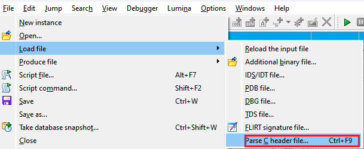
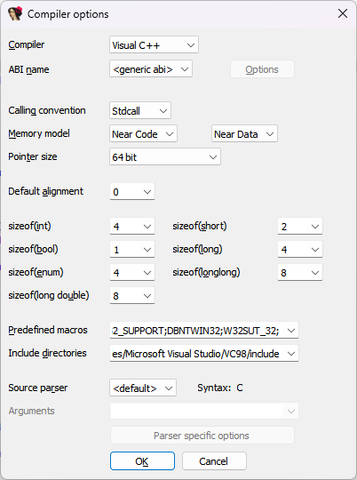

Previosuly, we’ve covered creating structures from C code [using the Local Types window](https://hex-rays.com/blog/igor-tip-of-the-week-11-quickly-creating-structures/), however this may be not very convenient when you have complex types with many dependencies (especially of scattered over several fiels or depending on preprocessor defines). In such case it may be nore convenient to parse the original header file(s) on disk.  
在此之前，我们已经介绍过使用 "本地类型 "窗口从 C 代码中创建结构，但如果您的类型非常复杂且有很多依赖关系（尤其是分散在多个字段中或依赖于预处理器定义的类型），这样做可能不太方便。在这种情况下，解析磁盘上的原始头文件可能更为方便。

### Parsing header files 解析头文件

If you happen to have the types you need in a header file, you can try using IDA’s built-in C parser via the File > Load file > Parse C header file… (shortcut Ctrl+F9).  
如果你碰巧在头文件中找到了你需要的类型，你可以尝试使用 IDA 内置的 C 解析器，方法是文件 > 加载文件 > 解析 C 头文件...（快捷键 Ctrl + F9 ）。

  
Just like a compiler, IDA will handle the preprocessor directives (`#include`,`#define`, `#ifdef` and so on), and add any types discovered to the Local Types list, from where they can be used in the decompiler (or the disassembly, after importing into the IDB).  
就像编译器一样，IDA 会处理预处理器指令（ `#include` 、 `#define` 、 `#ifdef` 等），并将发现的任何类型添加到本地类型列表中，以便在反编译器（或反汇编时导入 IDB）中使用。

### Setting compiler options  
设置编译器选项

IDA’s built-in parser can mimic several popular compilers, including Visual C++, GCC (and compatibles), Borland C++ Builder, or Watcom. For many stuctured files the compiler is preset to a detected or guessed value, but you can also change or set it via Options > Compiler… dialog:  
IDA 的内置分析器可以模仿几种流行的编译器，包括 Visual C++、GCC（及兼容编译器）、Borland C++ Builder 或 Watcom。对于许多结构化文件，编译器会预设为检测到的或猜测到的值，但您也可以通过选项 > 编译器...对话框进行更改或设置：

In this dialog you can also adjust settings necessary for the preprocessing step, such as the predefined preprocessor macros (`#define`s) or the include paths for the `#include` directives. They are pre-filled from the `CC_PARMS` setting in `ida.cfg`.  
在此对话框中，您还可以调整预处理步骤的必要设置，如预定义的预处理器宏（ `#define` s）或 `#include` 指令的包含路径。它们是根据 `ida.cfg` 中的 `CC_PARMS` 设置预先填入的。

### Clang parser Clang 解析器

The built-in parser is quite basic and handles mostly simple C syntax or very basic C++ (e.g templates are not supported). If you have complex files employing new, modern C or C++ features, you may have more luck using the Clang-based parser added in IDA 7.7. It can be selected in the _Source parser_ dropdown of the compiler options dialog  and will be used next time you invoke the _Parse C header file_ command. For the details on using it, see the dedicated [IDAClang tutorial](https://hex-rays.com/tutorials/idaclang/).  
内置解析器非常基本，主要处理简单的 C 语法或非常基本的 C++（例如不支持模板）。如果您的文件比较复杂，使用了新的现代 C 或 C++ 功能，那么使用 IDA 7.7 中添加的基于 Clang 的解析器可能会更有帮助。可以在编译器选项对话框的源解析器下拉菜单中选择它，下次调用解析 C 头文件命令时将使用它。有关使用的详细信息，请参阅专门的 IDAClang 教程。

See also:  另请参见：

[IDA Help: Load C header  
IDA 帮助：加载 C 头文件](https://www.hex-rays.com/products/ida/support/idadoc/1367.shtml)

[IDA Help: Compiler IDA 帮助：编译器](https://www.hex-rays.com/products/ida/support/idadoc/1354.shtml)

[Igor’s tip of the week #62: Creating custom type libraries  
伊戈尔本周小贴士 #62：创建自定义类型库](https://hex-rays.com/blog/igors-tip-of-the-week-62-creating-custom-type-libraries/)

[Introducing the IDAClang Tutorial  
IDAClang 教程介绍](https://hex-rays.com/blog/introducing-the-idaclang-tutorial/)