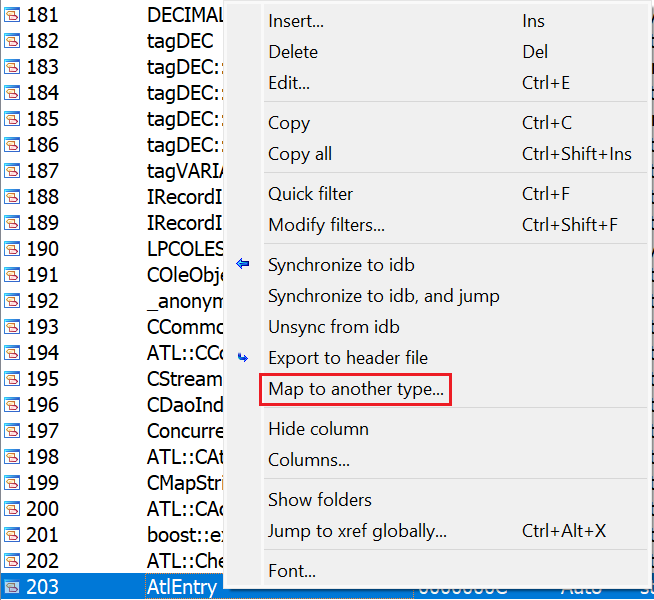
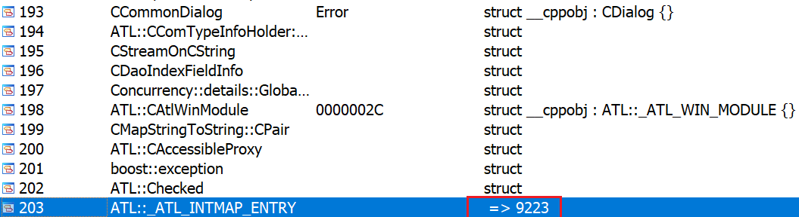

When working on a binary, you often recover types used in it from many sources:  
在处理二进制文件时，你经常会从许多来源恢复其中使用的类型：

-   creating structures manually, [from data](https://hex-rays.com/blog/igor-tip-of-the-week-11-quickly-creating-structures/), or [using decompiler](https://hex-rays.com/blog/igors-tip-of-the-week-118-structure-creation-in-the-decompiler/);  
    手动、根据数据或使用反编译器创建结构
-   [parsing header files](https://hex-rays.com/blog/igors-tip-of-the-week-141-parsing-c-files/);  解析头文件；
-   importing them from [type libraries](https://hex-rays.com/blog/igors-tip-of-the-week-60-type-libraries/) or [debug information](https://hex-rays.com/blog/igors-tip-of-the-week-140-loading-pdb-types/);  
    从类型库或调试信息中导入；

However, it may happen that eventually you discover duplicates. For example, you find out that the “custom” structure you’ve been building up is actually a well-known type and you found the correct definition in debug info or header files. Or, after analyzing two different functions, you only find out later that two structures are, in fact, one and the same. Of course, you can go and replace all references to the “wrong” one manually, which is doable if you discover this early, but if you already have hundreds of functions or other types referring to it, the process can become tedious.  
不过，最终可能会发现重复的情况。例如，你发现自己建立的 "自定义 "结构实际上是一种众所周知的类型，而你在调试信息或头文件中找到了正确的定义。或者，在分析了两个不同的函数后，你才发现这两个结构实际上是同一个结构。当然，你可以手动替换对 "错误 "结构的所有引用，如果发现得早，这也是可以做到的，但如果已经有数百个函数或其他类型引用了它，这个过程就会变得很乏味。

### Type mapping 类型映射

To map a type to another, open the Local Types window (Shift–F1), and choose “Map to another type…” from the context menu on the type you want to map.  
要将一个类型映射到另一个类型，请打开本地类型窗口（ Shift - F1 ），并从要映射的类型的上下文菜单中选择 "映射到另一个类型..."。

After choosing the type to replace it, the original type is deleted and all references to it are redirected to the new one. This is indicated by the arrow sign pointing to the new type’s definition.  
选择要替换的类型后，原来的类型将被删除，所有对它的引用都将重定向到新类型。指向新类型定义的箭头标志就是指示。

All uses of the old type in the function prototypes, local variable types etc. are replaced by the new type automatically.  
在函数原型、局部变量类型等中对旧类型的所有使用都会被新类型自动替换。

See also: 另请参见：

[IDA Help: Local types window  
IDA 帮助：局部类型窗口](https://www.hex-rays.com/products/ida/support/idadoc/1259.shtml)