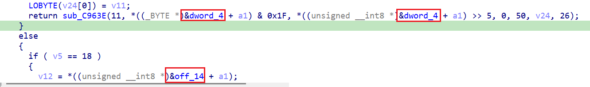
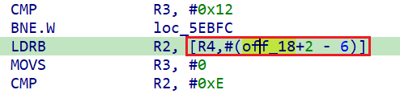
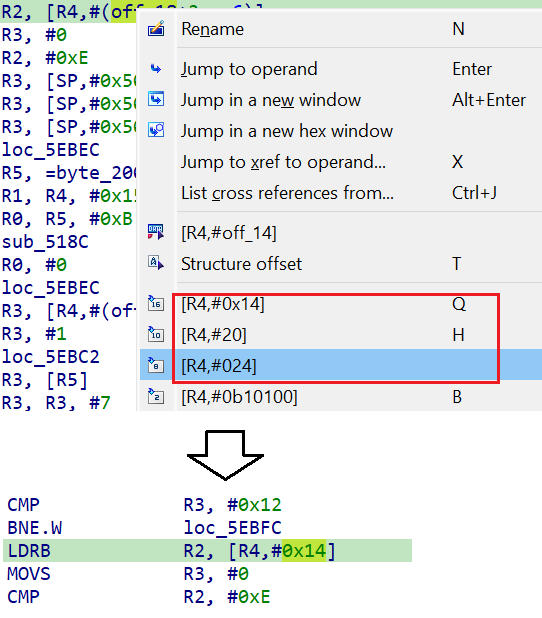
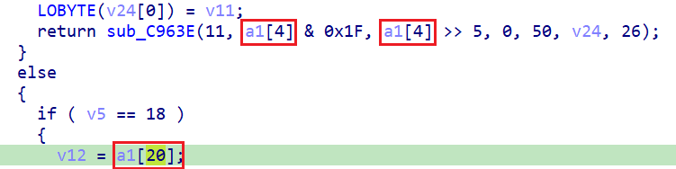

When decompiling code without high-level metadata (especially firmware), you may observe strange-looking address expressions which do not seem to make sense.  
在反编译没有高级元数据的代码（尤其是固件）时，你可能会发现一些看起来很奇怪的地址表达式。

What are these and how to fix/improve the pseudocode?  
这些是什么，如何修正/改进伪代码？

Because on the CPU level there is no difference between an [address and a simple number](https://hex-rays.com/blog/igors-tip-of-the-week-46-disassembly-operand-representation/), distinguishing addresses and plain numbers is a difficult task which is not solvable in general case without actually executing the code. IDA uses some heuristics to try and detect when a number looks like an address and convert such numbers to [offsets](https://hex-rays.com/blog/igors-tip-of-the-week-95-offsets/), but such heuristics are not always reliable and may lead to false positives. This can be especially bad when the database has valid addresses around `0`, because then many small numbers look like addresses. The decompiler relies on IDA’s analysis and uses the information provided by it to produce the pseudocode which is supposed to faithfully represent behavior of the machine code. However, this can backfire in case the analysis made a mistake. Thankfully, IDA is _interactive_ and allows you to fix almost anything.  
由于在 CPU 层面上，地址和简单的数字之间没有区别，因此区分地址和普通数字是一项艰巨的任务，在不实际执行代码的情况下，一般情况下是无法解决的。IDA 使用一些启发式方法来尝试检测数字何时看起来像地址，并将此类数字转换为偏移量，但此类启发式方法并不总是可靠的，可能会导致误报。当数据库中的有效地址在 `0` 左右时，这种情况尤其严重，因为许多小数字看起来都像地址。反编译器依赖于 IDA 的分析，并使用它提供的信息来生成伪代码，而伪代码应该忠实地反映机器代码的行为。但是，如果分析出错，就会适得其反。值得庆幸的是，IDA 是交互式的，您几乎可以修复任何问题。

In situation like above, usually the simplest algorithm is as follows:  
在上述情况下，最简单的算法通常如下：

1.  position cursor on the wrong address expression  
    将光标定位在错误的地址表达式上
2.  press Tab to switch to disassembly. You should land on or close to the wrong offset expression. Note that it does not always match what you see in the pseudocode.  
    按 Tab 键切换到反汇编。你应该在错误的偏移表达式上或接近该表达式。请注意，它并不总是与您在伪代码中看到的一致。  
    
3.  convert it to a plain number, e.g. by pressing Q (hex), H (decimal) or # (default).  
    请将其转换为普通数字，例如按 Q （十六进制）、 H （十进制）或 # （默认）。  
    
4.  press Tab to switch back to pseudocode and F5 to refresh it. The wrong expression should be converted to plain number or another context-dependent expression.  
    按 Tab 键切换回伪代码，按 F5 键刷新伪代码。错误的表达式应转换为纯数字或其他与上下文相关的表达式。

