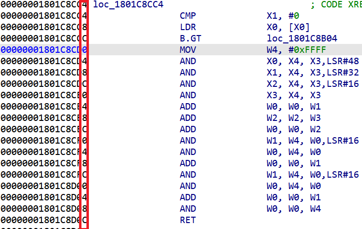
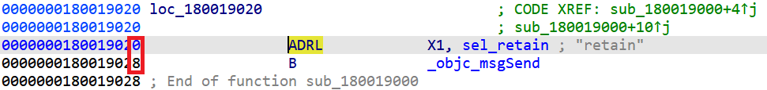
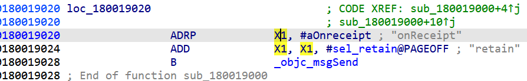
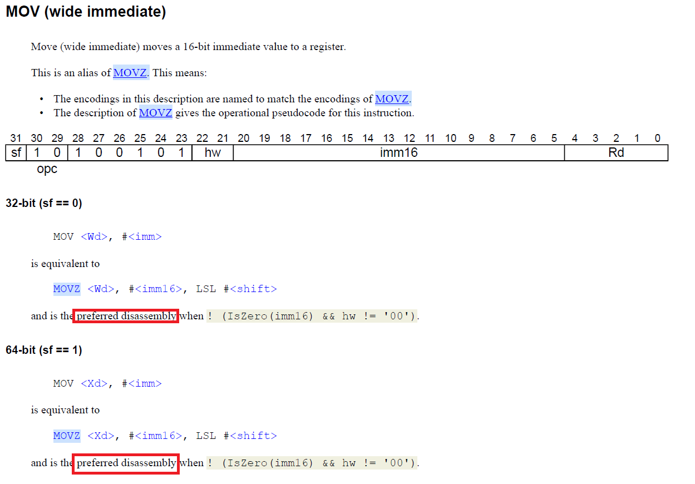
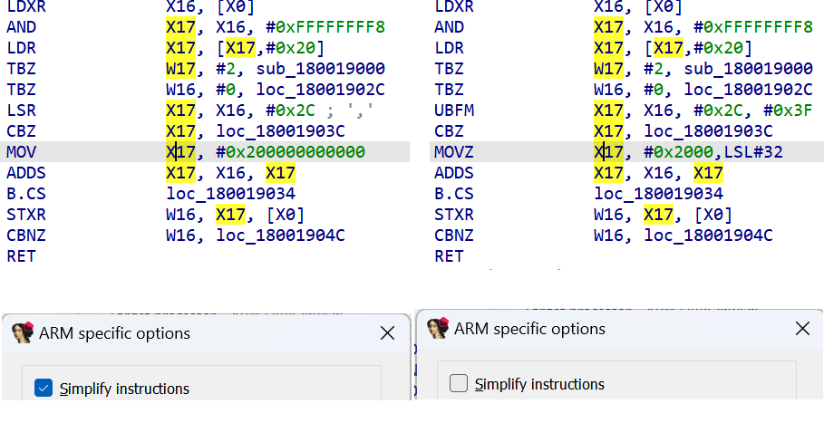
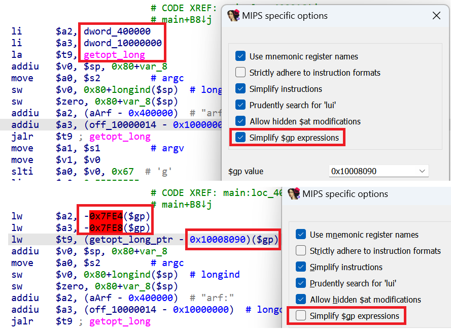
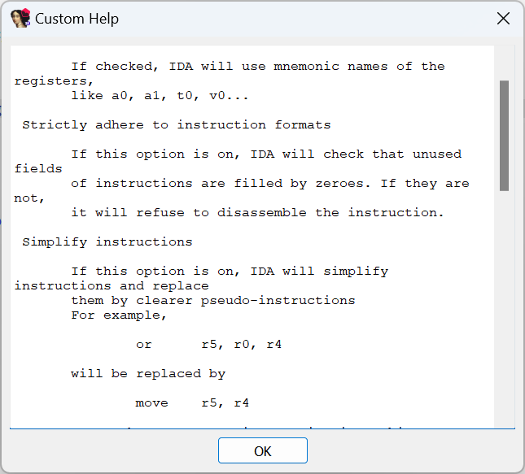

Many processors (especially RISC based) use instruction sets with fixed size (most commonly 4 bytes). Among examples are ARM, PPC, MIPS and a few others. This is also obvious in the disassembly when observing the instructions’ addresses – they increase by a fixed amount:  
许多处理器（尤其是基于 RISC 的处理器）使用固定大小（最常见的是 4 字节）的指令集。例如 ARM、PPC、MIPS 和其他一些处理器。在反汇编过程中，观察指令的地址也可以明显地看出这一点--它们的增加量是固定的：

However, occasionally you may come across larger instructions:  
不过，有时您可能会遇到更大的指示：

What is this? Does A64 ISA have 8-byte instructions?  
这是什么？A64 ISA 有 8 字节指令吗？

In fact, if you check [ARM’s documentation](https://developer.arm.com/documentation/dui0801/e/A64-General-Instructions/ADRL-pseudo-instruction?lang=en), you’ll discover that ADRL is a _pseudo-instruction_ which generates two machine instructions, `ADRP` and `ADD`. IDA combines them to provide more compact disassembly and improve cross-references.  
事实上，如果您查看 ARM 的文档，就会发现 ADRL 是一条伪指令，它生成两条机器指令 `ADRP` 和 `ADD` 。 IDA 将它们组合在一起，以提供更紧凑的反汇编并改进交叉引用。

In IDA’s terminology, a pseudo-instruction which replaces several simpler instructions is called a _macro_ instruction.  
在 IDA 的术语中，取代多条较简单指令的伪指令称为宏指令。

### Disabling macros 禁用宏指令

If you prefer to see the actual instructions, you can disable macros. This can be done in the Kernel Options 3 group of settings:  
如果你希望看到实际指令，可以禁用宏指令。这可以在内核选项 3 设置组中完成：

And now IDA no longer uses ADRL:  
现在，IDA 不再使用 ADRL：

As can be seen in this example, it can produce misleading disassembly (ADRP can only use page-aligned addresses which is why it seems to refer to some unrelated string)  
从这个例子中可以看出，它可能会产生误导性反汇编（ADRP 只能使用页面对齐地址，这就是为什么它似乎引用了一些不相关的字符串）。

### Simplified instructions 简化指令

In addition to macros, sometimes IDA may transform single instructions to improve readability or make their behavior more obvious. For example, on ARM some instructions have _preferred disassembly_ form and by default IDA uses it.  
除了宏之外，有时 IDA 还会对单条指令进行转换，以提高可读性或使其行为更加明显。例如，在 ARM 上，某些指令具有首选的反汇编形式，默认情况下 IDA 会使用这种形式。

Instruction simplification feature is usually controlled by a processor-specific option.  
指令简化功能通常由处理器特定选项控制。

Other disassembly improvements  
其他反汇编改进

Some processor modules may have other options which may change disassembly to improve readability even if it sometimes means the resulting listing is not strictly conforming. For example, MIPS has an option to simplify instructions which use the global register `$gp` which usually has a fixed value and using it makes disassembly much easier to read:  
有些处理器模块可能有其他选项，它们可以改变反汇编以提高可读性，即使这有时意味着生成的列表并不严格符合要求。例如，MIPS 有一个选项可以简化使用全局寄存器 `$gp` 的指令，该寄存器通常有一个固定值，使用它可以使反汇编更容易阅读：

If you are curious about what the options in the dialog do, clicking “Help” shows a short explanation:  
如果你想知道对话框中的选项有什么作用，点击 "Help（帮助）"会显示简短的解释：

See also: 另请参见：

[Igor’s Tip of the Week #137: Processor modes and segment registers  
伊戈尔本周小贴士 #137：处理器模式和段寄存器](https://hex-rays.com/blog/igors-tip-of-the-week-137-processor-modes-and-segment-registers/)

[Igor’s tip of the week #98: Analysis options  
伊戈尔本周提示 #98：分析选项](https://hex-rays.com/blog/igors-tip-of-the-week-98-analysis-options/)