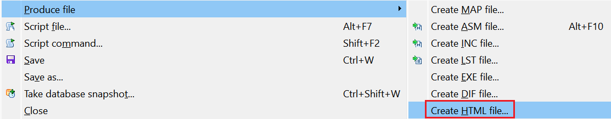
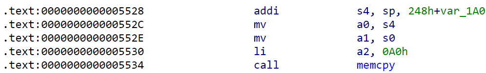
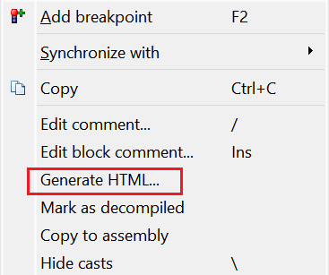

We’ve covered [exporting disassembly from IDA](https://hex-rays.com/blog/igors-tip-of-the-week-135-exporting-disassembly-from-ida/) before but it was in context of interoperability, when simple text is enough. If you want to preserve formatting and coloring of IDA View (e.g. for a web page or blog post), taking a screenshot is one option, but that has its downsides (e.g. no indexing for search engines). There is an alternative you can use instead.  
我们以前介绍过从 IDA 导出反汇编，但那是在互操作性的背景下，简单的文本就足够了。如果你想保留 IDA 视图的格式和颜色（例如用于网页或博客文章），截图是一种选择，但这也有其缺点（例如无法为搜索引擎编制索引）。你可以用另一种方法来代替。

### HTML export 导出 HTML

To export a fragment of disassembly as HTML, [select](https://hex-rays.com/blog/igor-tip-of-the-week-03-selection-in-ida/) the desired address range in the listing and invoke File > Produce file > Create HTML file…  
要将反汇编片段导出为 HTML，请在列表中选择所需的地址范围，然后调用文件 > 生成文件 > 创建 HTML 文件...



IDA will ask you for a filename and write the formatted text to it. The result will look like similar to the following:  
IDA 会询问您的文件名，并将格式化的文本写入其中。结果将与下图相似：

```
&lt;!DOCTYPE HTML PUBLIC "-//W3C//DTD HTML 4.01 Transitional//EN" "http://www.w3.org/TR/html4/loose.dtd"&gt;
&lt;html&gt;
&lt;head&gt;
&lt;meta http-equiv="Content-Type" content="text/html; charset=ISO-8859-1"&gt;
&lt;title&gt;IDA - riscv_lscolors64.elf &lt;/title&gt;
&lt;/head&gt;
&lt;body class="c41"&gt;
&lt;span style="white-space: pre; font-family: Consolas,monospace;" class="c1 c41"&gt;
&lt;span class="c44"&gt;.text:0000000000005528 &lt;/span&gt;&lt;span class="c5"&gt;addi &lt;/span&gt;&lt;span class="c33"&gt;s4&lt;/span&gt;&lt;span class="c9"&gt;, &lt;/span&gt;&lt;span class="c33"&gt;sp&lt;/span&gt;&lt;span class="c9"&gt;, &lt;/span&gt;&lt;span class="c12"&gt;248h&lt;/span&gt;&lt;span class="c9"&gt;+&lt;/span&gt;&lt;span class="c25"&gt;var_1A0
&lt;/span&gt;&lt;span class="c44"&gt;.text:000000000000552C &lt;/span&gt;&lt;span class="c5"&gt;mv &lt;/span&gt;&lt;span class="c33"&gt;a0&lt;/span&gt;&lt;span class="c9"&gt;, &lt;/span&gt;&lt;span class="c33"&gt;s4
&lt;/span&gt;&lt;span class="c44"&gt;.text:000000000000552E &lt;/span&gt;&lt;span class="c5"&gt;mv &lt;/span&gt;&lt;span class="c33"&gt;a1&lt;/span&gt;&lt;span class="c9"&gt;, &lt;/span&gt;&lt;span class="c33"&gt;s0
&lt;/span&gt;&lt;span class="c44"&gt;.text:0000000000005530 &lt;/span&gt;&lt;span class="c5"&gt;li &lt;/span&gt;&lt;span class="c33"&gt;a2&lt;/span&gt;&lt;span class="c9"&gt;, &lt;/span&gt;&lt;span class="c12"&gt;0A0h
&lt;/span&gt;&lt;span class="c44"&gt;.text:0000000000005534 &lt;/span&gt;&lt;span class="c5"&gt;call &lt;/span&gt;&lt;span class="c37"&gt;memcpy
&lt;/span&gt;
&lt;/span&gt;&lt;style type="text/css"&gt;
/* line-fg-default */
.c1 { color: blue; }
/* line-bg-default */
.c41 { background-color: white; }
/* line-pfx-func */
.c44 { color: black; }
/* line-fg-insn */
.c5 { color: navy; }
/* line-fg-register-name */
.c33 { color: navy; }
/* line-fg-punctuation */
.c9 { color: navy; }
/* line-fg-numlit-in-insn */
.c12 { color: green; }
/* line-fg-locvar */
.c25 { color: green; }
/* line-fg-code-name */
.c37 { color: blue; }
&lt;/style&gt;&lt;/body&gt;&lt;/html&gt;
```

As you can see, the color tags are represented by CSS classes which can be adjusted if necessary. When opened in browser, the result should look pretty close to IDA View:  
正如你所看到的，颜色标签由 CSS 类表示，如有必要，可以对 CSS 类进行调整。在浏览器中打开时，结果应该与 IDA 视图非常接近：



We use this feature on our web site to display disassembly snippets for the [processor gallery](https://hex-rays.com/products/ida/processor-gallery/).  
我们在网站上使用此功能来显示处理器图库的反汇编片段。

### Pseudocode to HTML 伪代码到 HTML

HTML can be generated not only for disassembly but also for the decompiled pseudocode; for this use “Generate HTML…” from the context menu in the Pseudocode view.  
不仅可以为反汇编生成 HTML，还可以为反编译后的伪代码生成 HTML；为此，请使用伪代码视图上下文菜单中的 "生成 HTML..." 。



See also: 另请参见：

[IDA Help: Create HTML File  
IDA 帮助：创建 HTML 文件](https://www.hex-rays.com/products/ida/support/idadoc/1504.shtml)

[Hex-Rays interactive operation: Generate HTML file  
Hex-Rays 交互式操作：生成 HTML 文件](https://www.hex-rays.com/products/decompiler/manual/cmd_html.shtml)

[Hack of the day #0: Somewhat-automating pseudocode HTML generation, with IDAPython.  
今日黑客 #0：使用 IDAPython 自动生成伪代码 HTML。](https://hex-rays.com/blog/hack-of-the-day-0-somewhat-automating-pseudocode-html-generation-with-idapython/)