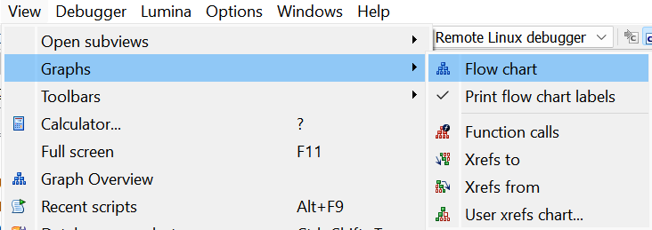
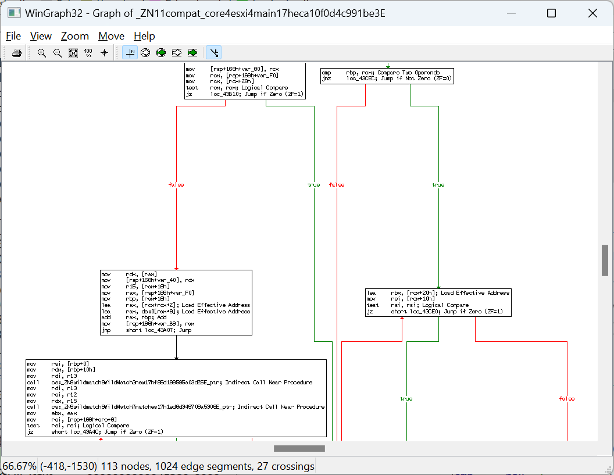
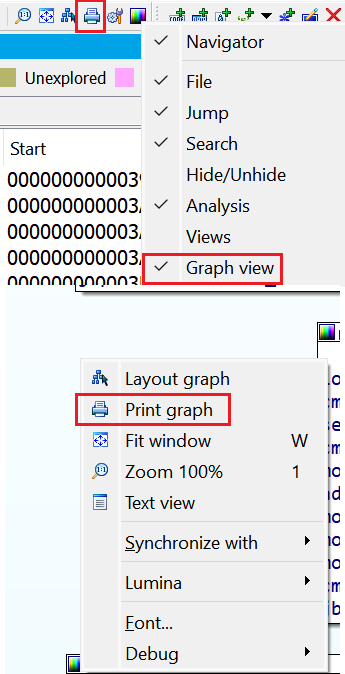
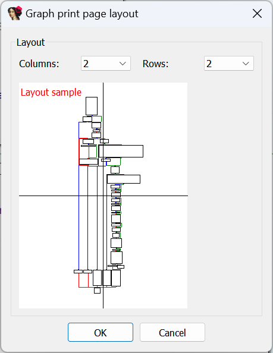

While exporting text disassembly is enough in many cases, many users nowadays prefer IDA’s [graph view](https://hex-rays.com/blog/igors-tip-of-the-week-23-graph-view/), and saving its representation may be necessary. What other options are there besides screenshots?  
虽然在很多情况下导出文本反汇编就足够了，但现在很多用户更喜欢 IDA 的图形视图，保存其表示法可能是必要的。除了截图，还有什么其他选择？

### WinGraph

WinGraph is an external program shipped with IDA which can display graphs. It was used to show function (and other) graphs before introduction of the built-in graph view in IDA 5.0 (2006). You can still use it via the  View > Graphs menu.   
WinGraph 是 IDA 附带的一个外部程序，可以显示图形。在 IDA 5.0（2006 年）引入内置图形视图之前，它用于显示函数（和其他）图形。您仍然可以通过 "视图">"图形 "菜单使用它。

For example, Flowchart action displays the graph of the current function.  
例如，流程图操作会显示当前函数的图形。

Once the graph is displayed in WinGraph, you can print it using File > Print…  or the first toolbar button. On most platforms this supports printing to PDF in addition to real printers.  
在 WinGraph 中显示图形后，您可以使用文件 > 打印... 或第一个工具栏按钮进行打印。在大多数平台上，除实际打印机外，还支持打印到 PDF。

### IDA graph view IDA 图形视图

If you prefer IDA’s graph layout, or have customized it to your liking (groups or custom layouts are ignored by WinGraph), you can also print it directly from IDA. For this, use the print buttion on the Graph View toolbar, or the context menu by right-clicking outside of  any node.  
如果您更喜欢 IDA 的图形布局，或者已经按照自己的喜好进行了自定义（WinGraph 会忽略组或自定义布局），也可以直接从 IDA 打印。为此，请使用图形视图工具栏上的打印按钮，或右键单击任何节点外的上下文菜单。  

You will be asked about the page layout – this can be useful when printing large graphs  
您会被问及页面布局--这在打印大型图表时很有用

See also: 另请参见：

[Igor’s tip of the week #23: Graph view  
伊戈尔本周小贴士 #23：图形视图](https://hex-rays.com/blog/igors-tip-of-the-week-23-graph-view/)

[Igor’s Tip of the Week #145: HTML export  
伊戈尔的每周技巧 #145：HTML 导出](https://hex-rays.com/blog/igors-tip-of-the-week-145-html-export/)

[Igor’s Tip of the Week #135: Exporting disassembly from IDA  
伊戈尔的每周窍门 #135：从 IDA 导出反汇编](https://hex-rays.com/blog/igors-tip-of-the-week-135-exporting-disassembly-from-ida/)