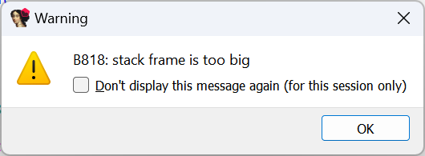
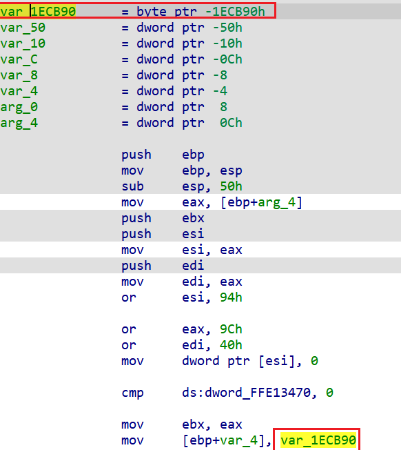
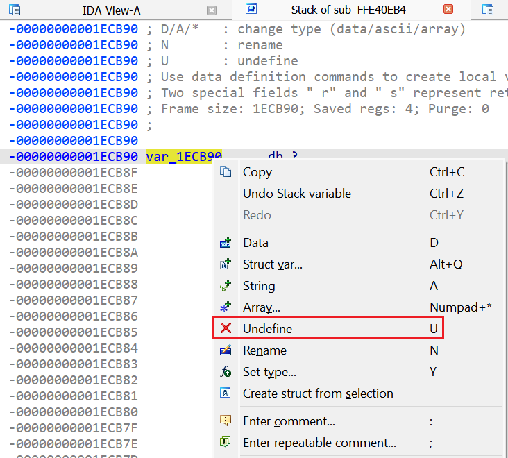
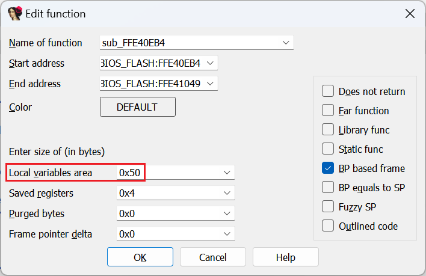

The Hex-Rays decompiler has been designed to decompile compiler-generated code, so while it can usually handle hand-written or unusual assembly, occasionally you may run into a failure, especially if the code has been modified to hinder decompilation. Here is one of such errors:  
Hex-Rays 反编译器的设计目的是反编译编译器生成的代码，因此虽然它通常可以处理手写或不寻常的汇编，但偶尔也会遇到故障，尤其是代码被修改以妨碍反编译时。下面就是其中一个错误：  

If you have a genuine function with a huge stack frame, you’ll probably have to give up and RE it the hard way – from the disassembly. However, in some situations it is possible to fix the code and get the function decompiled.  
如果你有一个堆栈框架很大的真正的函数，你可能不得不放弃，通过反汇编的艰难方式来重新获得它。不过，在某些情况下，还是有可能修复代码并反编译出函数的。

### Bogus stack variables 虚假堆栈变量

Stack variable with a large offset may be created by mistake (e.g. pressing K on an immediate operand), or induced deliberately (e.g. junk code referring to large stack offsets which are not used in reality). The fastest way to check for them is to look at the stack variable definitions at the start of the function and look for unusually large offsets:  
具有较大偏移量的堆栈变量可能是错误创建的（例如，在立即操作数上按下 K ），也可能是故意诱导的（例如，垃圾代码引用了实际上并未使用的较大堆栈偏移量）。检查的最快方法是查看函数开始时的堆栈变量定义，寻找异常大的偏移量：

To fix, double-click the variable or press Ctrl–K to open the [stack frame editor](https://hex-rays.com/blog/igors-tip-of-the-week-65-stack-frame-view/), then undefine (U) the wrong stackvar(s).  
要解决这个问题，双击变量或按 Ctrl - K 键打开堆栈帧编辑器，然后取消定义 ( U ) 错误的堆栈变量。

Then you need to edit the [function properties](https://hex-rays.com/blog/igors-tip-of-the-week-127-changing-function-bounds/) (Alt–P) and reduce the local variables area to the actually used size (usually equival to the offset of the bottom-most actually used variable):  
然后，你需要编辑函数属性 ( Alt - P ) 并将局部变量区域缩小到实际使用的大小（通常等同于实际使用的最底层变量的偏移量）：

If you still get the error message after all that, the bogus variables may have been re-added during autoanalysis, so it may be necessary to [patch out](https://hex-rays.com/blog/igors-tip-of-the-week-37-patching/) or otherwise exclude from analysis the instructions which refer to them.  
如果做完这些后仍收到错误信息，则可能是在自动分析过程中重新添加了假变量，因此有必要打补丁或以其他方式将引用这些变量的指令排除在分析之外。

### Unusual stack pointer manipulation  
不寻常的堆栈指针操作

This trick may cause IDA to decide that the stack pointer changes by a huge value, or not detect stack changes, causing it to grow the stack frame unnecessarily. This can be dealt with by [adjusting the stack pointer delta](https://hex-rays.com/blog/igors-tip-of-the-week-27-fixing-the-stack-pointer/) manually, or patching the instructions involved.  
这种技巧可能会导致 IDA 认为堆栈指针发生了巨大变化，或者无法检测到堆栈变化，从而导致堆栈帧不必要地增长。这可以通过手动调整堆栈指针 delta 或修补相关指令来解决。

See also:  另请参见：

[Igor’s tip of the week #27: Fixing the stack pointer  
伊戈尔本周小贴士 #27：修复堆栈指针](https://hex-rays.com/blog/igors-tip-of-the-week-27-fixing-the-stack-pointer/)

[Decompiler Manual: Failures and troubleshooting)  
请参阅《反编译手册》：故障和故障排除）](https://www.hex-rays.com/products/decompiler/manual/failures.shtml)