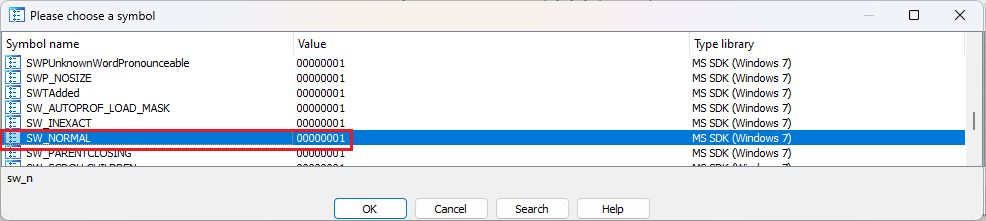
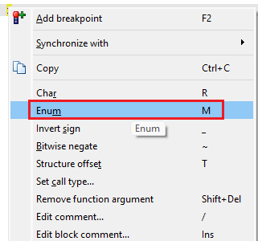
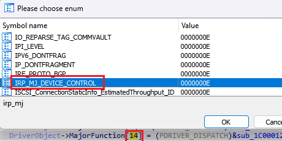
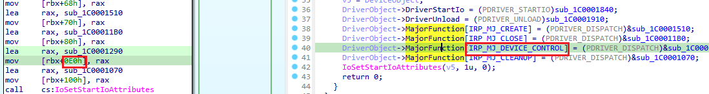

We’ve covered the usage of symbolic constants (enums) [in the disassembly](https://hex-rays.com/blog/igors-tip-of-the-week-99-enums/). but they are also useful in the pseudocode view.  
我们已经在反汇编中介绍过符号常量（枚举）的用法，但它们在伪代码视图中也很有用。

### Reusing constants from disassembly  
重复使用反汇编中的常量

If a number has been converted to a symbolic constant in the disassembly and it is present in unchanged form in pseudocode, the decompiler will use it in the output. For example, consider this call:  
如果一个数字在反汇编中被转换为符号常量，并且在伪代码中以不变的形式存在，反编译器将在输出中使用它。例如，请看这个调用：

```
.text:00405D72   push    1               ; nShowCmd
.text:00405D74   cmovnb  eax, [esp+114h+lpParameters]
.text:00405D79   push    0               ; lpDirectory
.text:00405D7B   push    eax             ; lpParameters
.text:00405D7C   push    offset File     ; "explorer.exe"
.text:00405D81   push    0               ; lpOperation
.text:00405D83   push    0               ; hwnd
.text:00405D85   call    ShellExecuteW
```

Initially, it is  decompiled like this:  
最初的反编译是这样的

```
ShellExecuteW(0, 0, L"explorer.exe", v136, 0, 1);
```

However, we [can look up](https://learn.microsoft.com/en-us/windows/win32/api/shellapi/nf-shellapi-shellexecutew) that nShowCmd’s value 1 [corresponds to](https://learn.microsoft.com/en-us/windows/win32/api/winuser/nf-winuser-showwindow) the constant `SW_NORMAL`, and apply it to the disassembly:  
不过，我们可以查找 nShowCmd 的值 1 与常量 `SW_NORMAL` 的对应关系，并将其应用到反汇编中：



![push    SW_NORMAL       ; nShowCmd         
cmovnb  eax, [esp+114h+lpParameters]       
push    0               ; lpDirectory      
push    eax             ; lpParameters     
push    offset File     ; "explorer.exe"   
push    0               ; lpOperation      
push    0               ; hwnd             
call    ShellExecuteW                      ](assets/2023/07/enums_dec2.png)

After refreshing the pseudocode, the constant appears there as well:  
刷新伪代码后，常量也会出现在伪代码中：

```
ShellExecuteW(0, 0, L"explorer.exe", v136, 0, SW_NORMAL);
```

### Applying constants in pseudocode  
在伪代码中应用常量

In fact, you can do the same directly in the pseudocode, using the context menu or the same shortcut (M):  
事实上，您也可以通过上下文菜单或快捷键 ( M ) 直接在伪代码中进行同样的操作：  


Note that there is no automatic propagation of the constants applied in pseudocode to disassembly. In fact, sometines it’s not possible to map a number you see in the pseudocode to the same number in the disassembly.  
请注意，在伪代码中应用的常量不会自动传播到反汇编中。事实上，有时无法将伪代码中的数字映射到反汇编中的相同数字。

Consider this example from a Windows driver’s initialization routine (`DriverEntry`):  
请看下面这个来自 Windows 驱动程序初始化例程 ( `DriverEntry` ) 的示例：

![      DriverObject->DriverStartIo = (PDRIVER_STARTIO)sub_1C0001840;
DriverObject->DriverUnload = (PDRIVER_UNLOAD)sub_1C0001910;
DriverObject->MajorFunction[0] = (PDRIVER_DISPATCH)&sub_1C0001510;
DriverObject->MajorFunction[2] = (PDRIVER_DISPATCH)&sub_1C00011B0;
DriverObject->MajorFunction[14] = (PDRIVER_DISPATCH)&sub_1C0001290;
DriverObject->MajorFunction[18] = (PDRIVER_DISPATCH)&sub_1C0001070;
](assets/2023/07/enums_dec4.png)

[We know](https://learn.microsoft.com/en-us/windows-hardware/drivers/kernel/driverentry-s-required-responsibilities) that indexes into the MajorFunction array correspond to the major IRP codes (`IRP_MJ_xxx`), so we can convert numerical indexes to the corresponding constants:  
我们知道 MajorFunction 数组的索引与主要 IRP 代码（ `IRP_MJ_xxx` ）相对应，因此我们可以将数字索引转换为相应的常量：



and the pseudocode becomes:  
这样，伪代码就变成了

```
DriverObject-&gt;DriverStartIo = (PDRIVER_STARTIO)sub_1C0001840;
DriverObject-&gt;DriverUnload = (PDRIVER_UNLOAD)sub_1C0001910;
DriverObject-&gt;MajorFunction[IRP_MJ_CREATE] = (PDRIVER_DISPATCH)&amp;sub_1C0001510;
DriverObject-&gt;MajorFunction[IRP_MJ_CLOSE] = (PDRIVER_DISPATCH)&amp;sub_1C00011B0;
DriverObject-&gt;MajorFunction[IRP_MJ_DEVICE_CONTROL] = (PDRIVER_DISPATCH)&amp;sub_1C0001290;
DriverObject-&gt;MajorFunction[IRP_MJ_CLEANUP] = (PDRIVER_DISPATCH)&amp;sub_1C0001070;
```

However, if we check the corresponding disassembly (e.g by using Tab or synchronizing pseudocode and IDA View), we can see that the array indexes are not present as such in the instruction operands:  
然而，如果我们检查相应的反汇编（例如使用 Tab 或同步伪代码和 IDA 视图），就会发现数组索引并不存在于指令操作数中：



Another common situation where you can use symbolic constants in pseudocode but not disassembly is swich cases.  
另一种可以在伪代码中使用符号常量但不能反汇编的常见情况是交换情况。

See also: 另请参见：

[Igor’s tip of the week #99: Enums  
伊戈尔本周小贴士 #99：枚举](https://hex-rays.com/blog/igors-tip-of-the-week-99-enums/)

[Decompiler Manual: Hex-Rays interactive operation: Set Number Representation  
反编译器手册：Hex-Rays 交互式操作：设置数字表示法](https://www.hex-rays.com/products/decompiler/manual/cmd_numform.shtml)