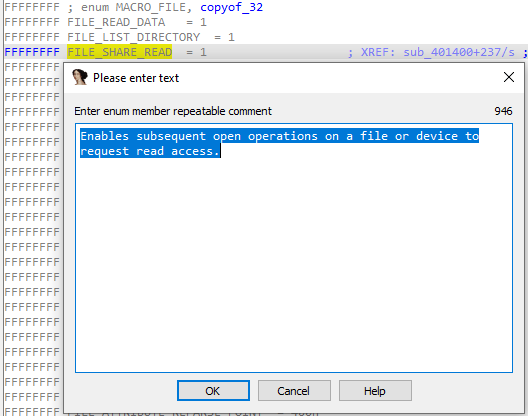
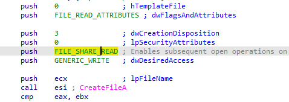
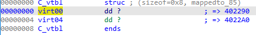
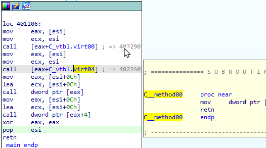

上周我们讨论了在 IDA 的反汇编和伪代码视图中使用的[各种注释](<(https://hex-rays.com/blog/igor-tip-of-the-week-14-comments-in-ida/)>)。

事实上，注释同样适用于 结构体（Structures） 和 枚举（Enums）。你既可以为整个结构体/枚举添加注释，也可以为单个成员添加注释。

与反汇编类似，支持 普通注释 和 可重复注释：

- 普通注释：仅在当前位置显示。
- 可重复注释：在枚举或结构体成员被使用的地方会重复显示。

一个有趣的用法是 C++ 类的虚函数表（vtable） 或任何包含函数指针的结构体：

- 如果你在 vtable 结构中为方法地址添加注释，那么在反汇编中会显示出来。
- 你可以双击跳转到该方法的实现，或者将鼠标悬停在上面时，在提示窗口中直接看到对应的反汇编。

👉 总结：IDA 不仅能在反汇编和伪代码中添加注释，还能在结构体和枚举中使用注释，尤其是可重复注释在分析复杂数据结构（如 vtable）时非常有用，可以大幅提升导航和理解效率。

原文地址：https://hex-rays.com/blog/igor-tip-of-the-week-15-comments-in-structures-and-enums
