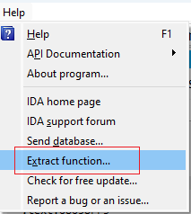
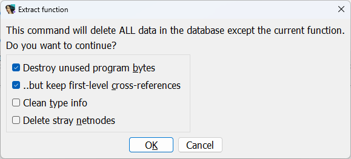
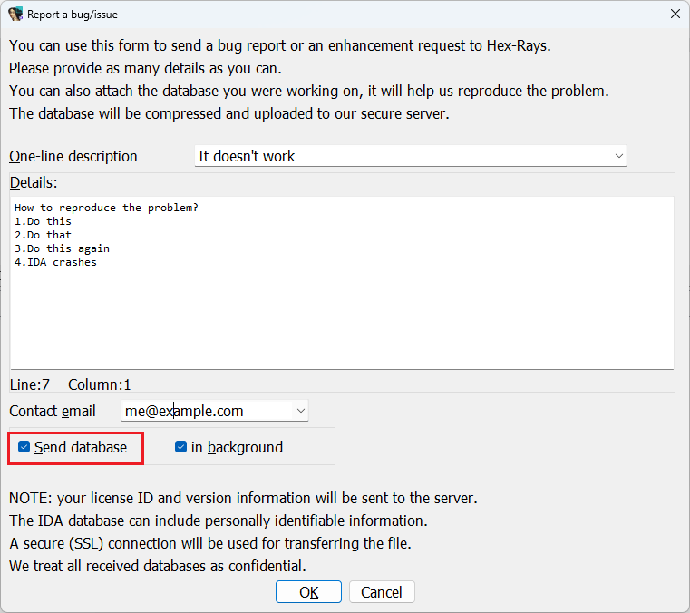

When you open a decompilable file in IDA, you get this somewhat mysterious item in the Help menu:  
当你在 IDA 中打开一个可反编译文件时，你会在帮助菜单中看到这个有点神秘的项目：

And if you invoke it, it shows an even more mysterious dialog:  
如果调用它，就会显示一个更加神秘的对话框：

So, what is it and when it is useful?  
那么，它是什么，什么时候有用？

Originally this feature was added to the decompiler to make decompiler bug reporting easier: oftentimes. a decompiler issue cannot really be reproduced or debugged without having the original database. However, in some cases sharing the whole database is impractical or impossible:  
最初在反编译器中加入这一功能是为了使反编译器的错误报告更容易：通常，如果没有原始数据库，就无法真正重现或调试反编译器的问题。然而，在某些情况下，共享整个数据库是不切实际或不可能的：

-   Whole database may be very large and difficult to share  
    整个数据库可能非常庞大，难以共享
-   parts of the database may contain private or confidential information  
    部分数据库可能包含私人或机密信息
-   the rest of the database is not really relevant to the issue and only adds noise  
    数据库的其他部分与问题并不真正相关，只会增加噪音

This feature leaves just the current function plus maybe some potentially relevant information in the database. It can then be sent to support for investigation and fixing, either by email or directly from IDA via Help > Report a bug or an issue…  
该功能只在数据库中留下当前功能和一些潜在的相关信息。然后，可以通过电子邮件或直接在 IDA 中的 "帮助 > 报告错误或问题 "将其发送给支持人员进行调查和修复......

See also: 另请参见：

[Igor’s tip of the week #39: Export Data  
伊戈尔本周提示 #39：导出数据](https://hex-rays.com/blog/igors-tip-of-the-week-39-export-data/)

[Igor’s Tip of the Week #135: Exporting disassembly from IDA  
伊戈尔的每周窍门 #135：从 IDA 导出反汇编](https://hex-rays.com/blog/igors-tip-of-the-week-135-exporting-disassembly-from-ida/)

[Decompiler Manual: Failures and troubleshooting  
反编译器手册：故障与排除](https://www.hex-rays.com/products/decompiler/manual/failures.shtml#report)