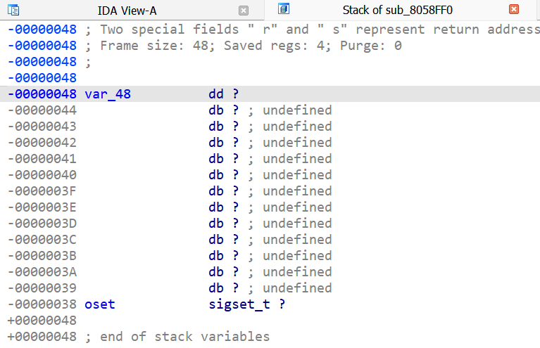
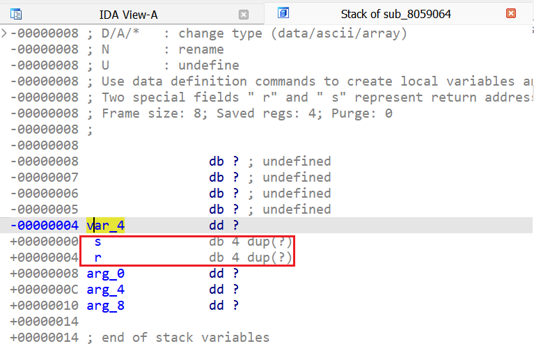
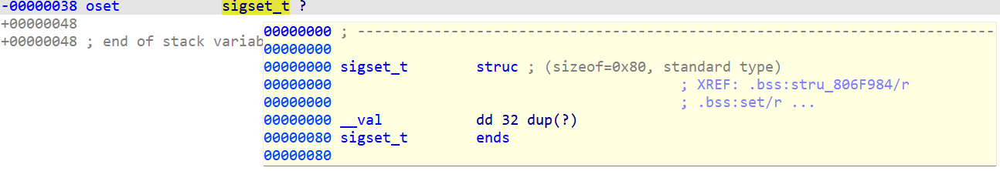
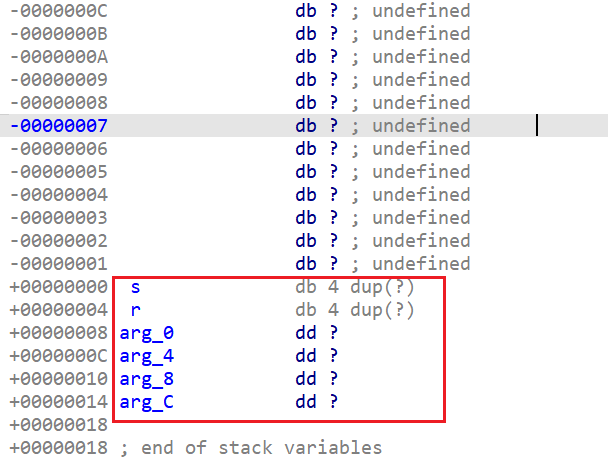
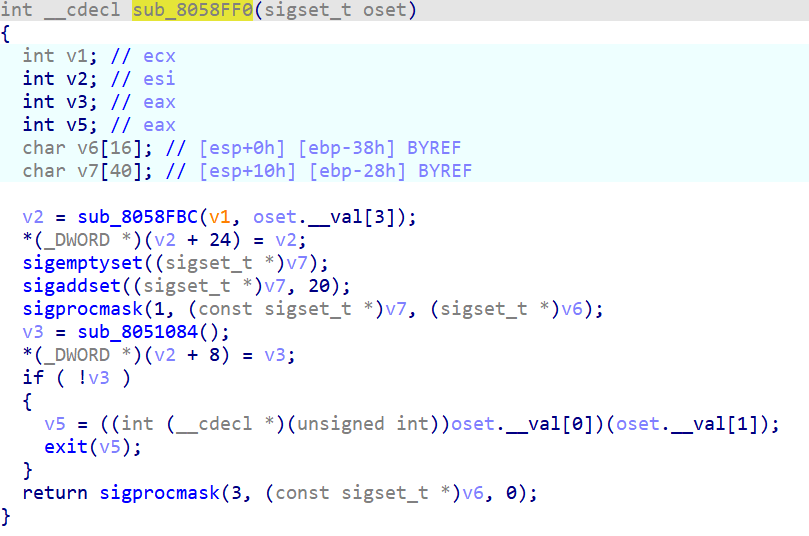
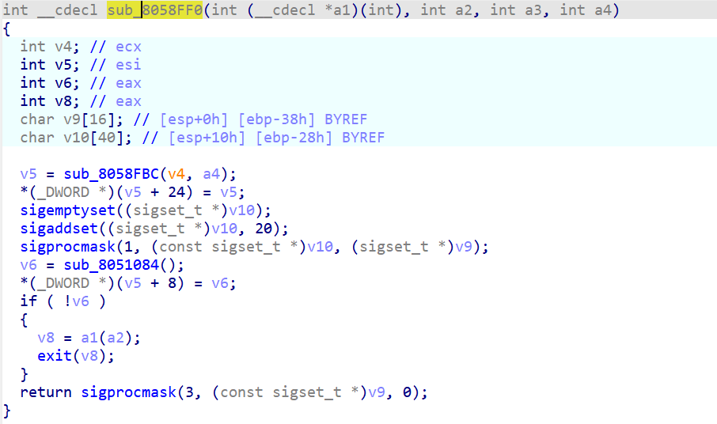

[Previously](https://hex-rays.com/blog/igors-tip-of-the-week-148-fixing-call-analysis-failed/), we’ve run into a function which produces a cryptic error if you try to decompile it:  
之前，我们遇到过一个函数，如果尝试反编译，会产生一个隐蔽的错误：

In such situations, you need to go back to disassembly to see what could be wrong. More specifically, check the [stack frame layout](https://hex-rays.com/blog/igors-tip-of-the-week-65-stack-frame-view/) by double-clicking a stack variable or pressing Ctrl–K.  
在这种情况下，你需要回过头来反汇编，看看可能出了什么问题。更具体地说，双击堆栈变量或按 Ctrl - K 键，检查堆栈帧布局。

On the first glance it looks normal:  
第一眼看上去是正常的：

However, if you compare with another function which decompiles fine, you may notice some notable differences:  
但是，如果与另一个反编译正常的函数进行比较，您可能会发现一些明显的不同：

This frame has two members which are mentioned in the top comment:  
该框架有两个成员，在顶部的注释中提到了这两个成员：

`Two special fields " r" and " s" represent return address and saved registers.`

They’re absent in the “bad” function, so the whole layout is probably wrong and the function can’t be decompiled reliably. On closer inspection, we can discover that the structure `sigset_t` (type of the variable `oset` in `sub_8058FF0`) is 0x80 bytes, so applying it to the frame overwrote the special members. You can also see that the variable crossed over from the local variable area (negative offsets) to the argument area (positive offsets), which normally should not happen.  
在 "坏 "函数中没有这两个成员，因此整个布局可能是错误的，无法可靠地反编译该函数。仔细观察，我们可以发现结构 `sigset_t` （ `sub_8058FF0` 中变量 `oset` 的类型）是 0x80 字节，因此将其应用到框架中会覆盖特殊成员。我们还可以看到，变量从局部变量区域（负偏移量）跨到了参数区域（正偏移量），这在正常情况下是不应该发生的。

### Fixing a bad stack frame  
修复错误的堆栈帧

Although you can try to fix the frame layout by rearranging or editing the local variables, this won’t bring back the special variables, so usually the best solution is to recreate the function (and thus its stack frame). This can be done by undefining (U) the first instruction, then creating the function (P). A quicker and less destructive way is to delete just the function (Ctrl–P, Del), then recreate it (P). Normally this should recreate the default frame then add local variables and stack arguments based on the instructions accessing the stack:  
虽然可以尝试通过重新排列或编辑局部变量来修复框架布局，但这并不能恢复特殊变量，因此最好的解决办法通常是重新创建函数（以及它的堆栈框架）。这可以通过取消定义 ( U ) 第一条指令，然后创建函数 ( P ) 来实现。一种更快、破坏性更小的方法是只删除函数 ( Ctrl - P , Del ) ，然后重新创建 ( P ) 。通常情况下，这应该会重新创建默认框架，然后根据访问堆栈的指令添加局部变量和堆栈参数：

And now the function decompiles fine:  
现在函数反编译正常：

Some code is wrong because the function prototype still uses wrongly detected `sigset_t` argument. This is easy to fix – just delete the prototype (Y, Del) to let the decompiler guess the arguments:  
有些代码是错误的，因为函数原型仍然使用了错误检测到的 `sigset_t` 参数。这很容易解决--只需删除原型 (Y, Del)，让反编译器猜测参数即可：

See also: 另请参见：

[Igor’s Tip of the Week #148: Fixing “call analysis failed”  
伊戈尔的每周窍门 #148：修复 "调用分析失败 "问题](https://hex-rays.com/blog/igors-tip-of-the-week-148-fixing-call-analysis-failed/)

[Igor’s tip of the week #65: stack frame view  
伊戈尔本周提示 #65：堆栈帧视图](https://hex-rays.com/blog/igors-tip-of-the-week-65-stack-frame-view/)

[Decompiler Manual: Failures and troubleshooting  
反编译器手册：故障与排除](https://www.hex-rays.com/products/decompiler/manual/failures.shtml)