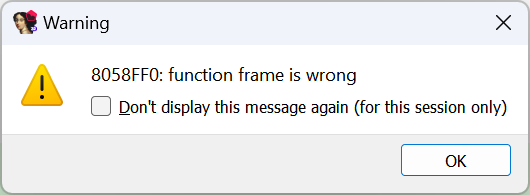

在某些情况下，当你尝试反编译一个函数时，可能会遇到一个神秘的错误提示：

遇到这种情况时，需要回到反汇编视图，检查函数的 栈帧布局。 方法：双击某个栈变量，或按下 `Ctrl+K`。

初看之下，栈帧可能看起来正常。

但如果与另一个能正常反编译的函数对比，就会发现一些明显的差异：

- 正常的栈帧包含两个特殊成员：
  - `r`（返回地址）
  - `s`（保存的寄存器）
- 在“出错”的函数中，这两个字段缺失，说明整个栈帧布局可能被破坏，导致无法可靠反编译。

进一步检查发现：

- 变量 oset 的类型是 sigset_t，其大小为 0x80 字节；
- 将其应用到栈帧时，覆盖了这些特殊成员；
- 甚至变量的范围从局部变量区（负偏移）跨越到了参数区（正偏移），这是不应该发生的。

### 修复方法

虽然可以尝试手动调整或编辑局部变量，但这并不能恢复丢失的特殊成员。 通常最好的解决方案是 重新创建函数（以及它的栈帧）：

方法一：取消定义首条指令（快捷键 `U`），然后重新创建函数（`P`）。

方法二（更快且破坏性更小）：删除函数（`Ctrl+P`，然后 `Del`），再重新创建（`P`）。

这样会重新生成默认栈帧，并根据访问栈的指令自动添加局部变量和参数。

重新创建后，函数就能正常反编译了。

不过，仍可能存在一些错误，例如函数原型中错误地使用了 `sigset_t` 参数。 解决办法很简单：删除函数原型（`Y`，然后 `Del`），让反编译器重新推断参数。

相关内容：

[Igor’s Tip of the Week #148: Fixing “call analysis failed”](https://hex-rays.com/blog/igors-tip-of-the-week-148-fixing-call-analysis-failed/)

[Igor’s tip of the week #65: stack frame view](https://hex-rays.com/blog/igors-tip-of-the-week-65-stack-frame-view/)

[Decompiler Manual: Failures and troubleshooting](https://www.hex-rays.com/products/decompiler/manual/failures.shtml)

原文地址：https://hex-rays.com/blog/igors-tip-of-the-week-151-fixing-function-frame-is-wrong
