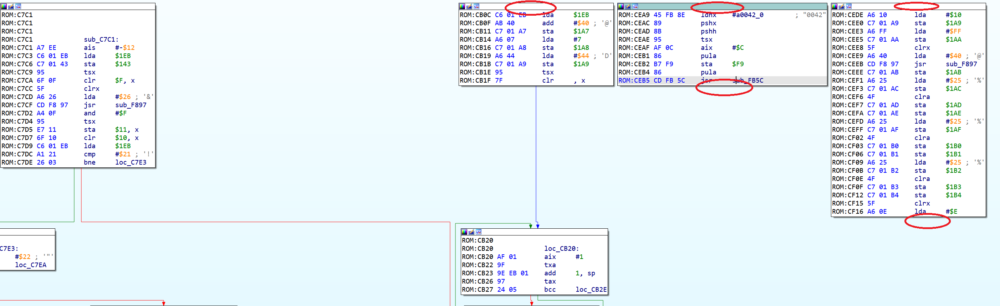

Occasionally, especially when working with embedded firmware or obfuscated code, you may see an error message when trying to create a function (from context menu or using P hotkey):  
偶尔，尤其是在处理嵌入式固件或混淆代码时，您可能会在尝试创建函数（从上下文菜单或使用 P 热键）时看到错误信息：

![[Output]
ROM:C998: The function has undefined instruction/data at the specified address.
Your request has been put in the autoanalysis queue.](assets/2023/08/forcefunc1.png)

There can be multiple reasons for it, for example:  
这可能有多种原因，例如

1.  some code has been incorrectly converted to data and the execution flows into it;  
    某些代码被错误地转换为数据，执行时流入其中；
2.  the function calls a [non-returning function](https://hex-rays.com/blog/igors-tip-of-the-week-126-non-returning-functions/) which hasn’t been marked as such, so IDA thinks that the execution flows into the following data or undefined bytes;  
    函数调用了一个非返回函数，但该函数未被标记为非返回函数，因此 IDA 认为执行流向了下面的数据或未定义字节；
3.  the function uses an unrecognized [switch pattern](https://hex-rays.com/blog/igors-tip-of-the-week-53-manual-switch-idioms/);  
    函数使用了无法识别的开关模式；
4.  the function calls some function which uses embedded data after the call, but IDA tries to decode it as instructions;  
    函数调用了某个函数，该函数在调用后使用了嵌入数据，但 IDA 试图将其解码为指令；
5.  code has been obfuscated and IDA’s autoanalysis went down a wrong path.  
    代码被混淆，IDA 的自动分析走错了路。

You can double-click the address indicated to jump there and to see if you can identify the issue and try to fix it, but it can take a long time to figure out.  
您可以双击指示的地址跳转到那里，看看能否找出问题并尝试解决，但这可能需要很长时间才能找出问题所在。

Functions are required to use some of IDA’s basic functionality such as [graph view](https://hex-rays.com/blog/igors-tip-of-the-week-23-graph-view/) or the [decompiler](https://hex-rays.com/blog/igors-tip-of-the-week-40-decompiler-basics/).  
使用 IDA 的某些基本功能（如图形视图或反编译器）需要函数。

### Forcing IDA to create a function  
强制 IDA 创建函数

Whatever the reason of the error, you can still create a function manually if you can determine its bounds using your best judgement. For this, the [anchor selection](https://hex-rays.com/blog/igor-tip-of-the-week-03-selection-in-ida/) is the most simple and convenient way:  
无论出现错误的原因是什么，如果您能根据自己的最佳判断确定函数的边界，那么您仍然可以手动创建一个函数。为此，锚点选择是最简单方便的方法：

1.  while staying on the first instruction of the function, use Edit > Begin selection, or press Alt–L;  
    停留在函数的第一条指令上，使用编辑 > 开始选择，或按 Alt - L ；
2.  navigate down to the function’s end (e.g. look for a return instruction or start of the next function);  
    向下导航到函数的终点（例如，查找返回指令或下一个函数的起点）；
3.  press P (Create function)  
    按 P （创建函数）

Note that the function created this way may have all kinds of issues, e.g. disconnected blocks in the graph view, `JUMPOUT` statements in pseudocode or wrong decompilation, but at least it should allow you to advance in your analysis.  
请注意，这样创建的函数可能会出现各种问题，例如图视图中的断开块、伪代码中的 `JUMPOUT` 语句或错误的反编译，但至少可以让您推进分析。