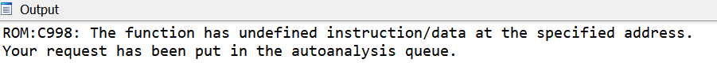

在处理嵌入式固件或混淆代码时，你可能会在尝试创建函数（通过右键菜单或快捷键 P）时遇到错误提示。

造成这种情况的原因可能有很多，例如：

- 某些代码被错误地识别为数据，执行流进入了这些区域；

- 函数调用了一个未被标记为“无返回”的函数，IDA 认为执行流进入了后续的数据或未定义字节；

- 函数使用了未识别的 `switch` 模式；

- 函数调用了某个在调用后紧跟嵌入数据的函数，但 IDA 错误地将其解码为指令；

- 代码被混淆，导致 IDA 的自动分析走错了路径。

你可以双击提示中给出的地址跳转过去，尝试识别并修复问题，但这可能会耗费大量时间。

然而，函数是使用 IDA 基本功能（如图形视图或反编译器）的前提。

### 强制 IDA 创建函数

无论错误原因是什么，如果你能大致判断函数的边界，仍然可以手动创建函数。 最简单、最方便的方法是使用 锚点选区（anchor selection）：

1. 停留在函数的第一条指令上，执行 `Edit > Begin selection`，或按下 `Alt+L`；
2. 向下导航到函数的结束位置（例如找到 `return` 指令或下一个函数的起始位置）；
3. 按下 `P`（创建函数）。

   

**注意事项**

通过这种方式创建的函数可能会存在各种问题，例如：

- 图形视图中出现不连通的基本块；

- 伪代码中出现 JUMPOUT 语句；

- 反编译结果不正确。

但至少它能让你继续推进分析工作。

原文地址：https://hex-rays.com/blog/igors-tip-of-the-week-152-force-creating-functions
