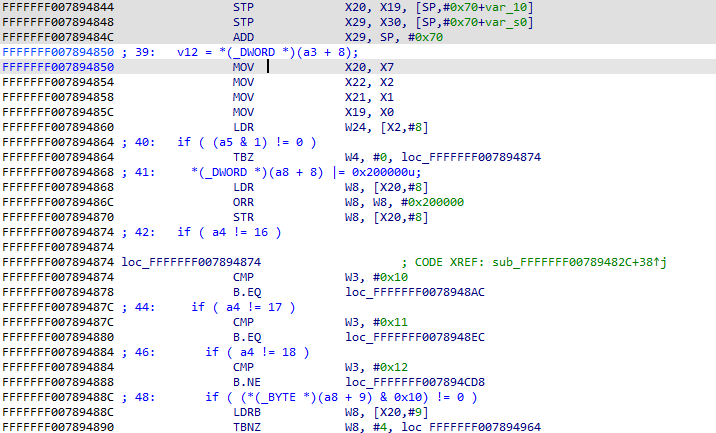
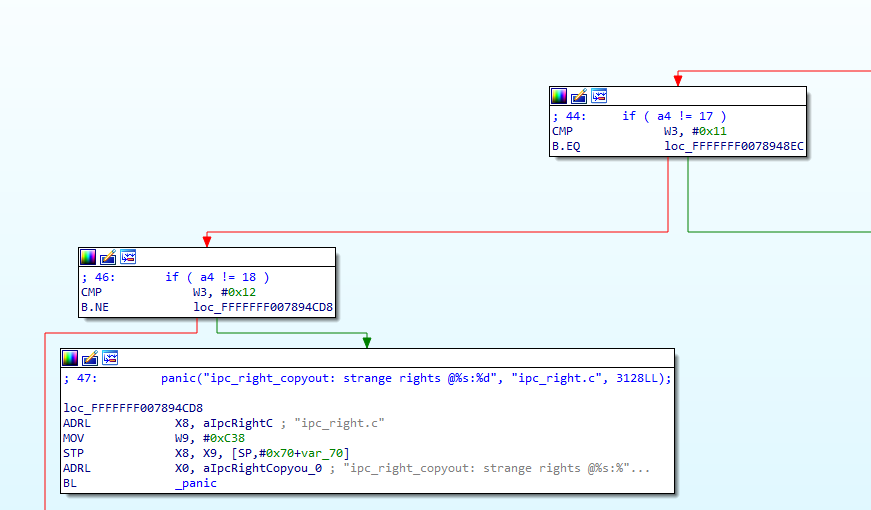
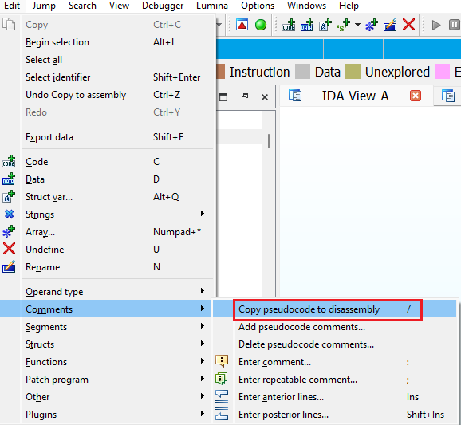

When using the decompiler, you probably spend most of the time in the [Pseudocode view](https://hex-rays.com/blog/igors-tip-of-the-week-40-decompiler-basics/). In case you need to consult the corresponding disassembly, it’s a quick Tab away. However, if you actually prefer the disassembly, there is another option you can try.  
在使用反编译器时，你可能会把大部分时间花在伪代码视图上。如果你需要查看相应的反汇编，只需 Tab 就可以了。不过，如果你更喜欢反汇编，也可以尝试另一种方法。

### Copy to assembly 复制到程序集

This action is available in the pseudocode view’s context menu when right-clicking outside of the decompiled code:  
在反编译代码外单击右键时，伪代码视图的上下文菜单中会出现此操作：

Because the decompiler uses disassembly [comments](https://hex-rays.com/blog/igor-tip-of-the-week-14-comments-in-ida/) for this feature, it warns you that the action will destroy any existing ones:  
由于反编译器使用反汇编注释来实现此功能，因此会警告您此操作将破坏任何现有注释：

After confirmation, comments with pseudocode lines are added to the disassembly:  
确认后，带有伪代码行的注释将添加到反汇编中：

You can see these comments even in the [graph view](https://hex-rays.com/blog/igors-tip-of-the-week-23-graph-view/):  
您甚至可以在图形视图中看到这些注释：

In fact, you can make use of this feature even without switching to pseudocode. While in disassembly, use Edit > Comments > Copy pseudocode to disassembly, or the shortcut /  
事实上，即使不切换到伪代码，也可以使用这一功能。在反汇编时，使用编辑 > 注释 > 复制伪代码到反汇编，或使用快捷键 /

Note that unlike pseudocode itself, these comments are static and do not change when you make changes in the pseudocode (e.g. rename variables). To update the comments, you need to trigger the action again.  
需要注意的是，与伪代码本身不同，这些注释是静态的，当你对伪代码进行修改（如重命名变量）时，注释也不会改变。要更新注释，需要再次触发操作。

In case you changed your mind and want to clean up the function, use “Delete pseudocode comments” from the same menu.  
如果你改变了主意，想要清理函数，可以使用同一菜单中的 "删除伪代码注释"。

See also: 另请参见：

[Hex-Rays interactive operation: Copy to assembly  
Hex-Rays 交互式操作：复制到程序集](https://www.hex-rays.com/products/decompiler/manual/cmd_copy.shtml)

[Igor’s tip of the week #14: Comments in IDA  
伊戈尔的每周提示 #14：IDA 中的注释](https://hex-rays.com/blog/igor-tip-of-the-week-14-comments-in-ida/)