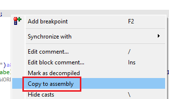

在使用反编译器时，你可能大部分时间都停留在 伪代码视图 中。 如果需要查看对应的反汇编，只需按一下 Tab 键即可快速切换。

不过，如果你更喜欢在反汇编中工作，还有另一种选择。

### 复制到反汇编

在伪代码视图中，右键点击反编译代码区域之外，可以看到 `Copy to assembly`（复制到反汇编）操作。

由于该功能会利用 反汇编注释 来显示伪代码， 因此 IDA 会提示你：此操作会覆盖已有的注释。

确认后，IDA 会在反汇编中添加带有伪代码行的注释：

这些注释在 图形视图 中同样可见。

实际上，即使不切换到伪代码视图，你也可以直接在反汇编中使用： 菜单路径：`Edit > Comments > Copy pseudocode to disassembly` 或者使用快捷键 `/`。

**注意事项**

- 与伪代码不同，这些注释是 静态的， 当你在伪代码中进行修改（例如重命名变量）时，它们不会自动更新。
- 如果需要更新，必须再次执行该操作。
- 如果你改变主意，想清理掉这些注释，可以使用同一菜单中的 `Delete pseudocode comments`（删除伪代码注释）。

相关内容：

[Hex-Rays interactive operation: Copy to assembly](https://www.hex-rays.com/products/decompiler/manual/cmd_copy.shtml)

[Igor’s tip of the week #14: Comments in IDA](https://hex-rays.com/blog/igor-tip-of-the-week-14-comments-in-ida/)

原文地址：https://hex-rays.com/blog/igors-tip-of-the-week-153-copying-pseudocode-to-disassembly
