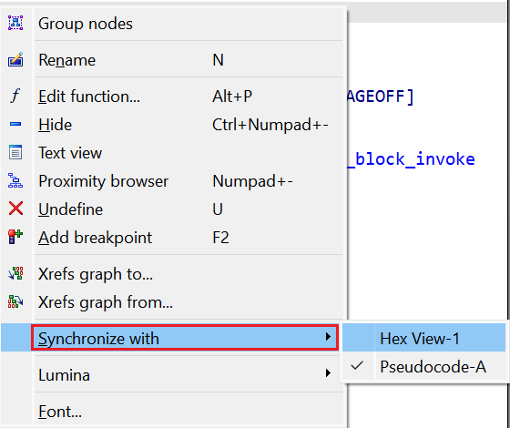
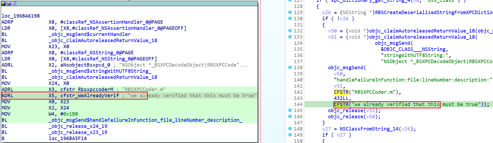
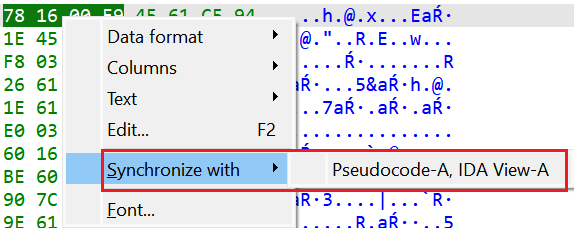
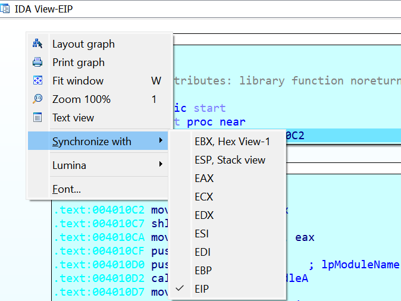
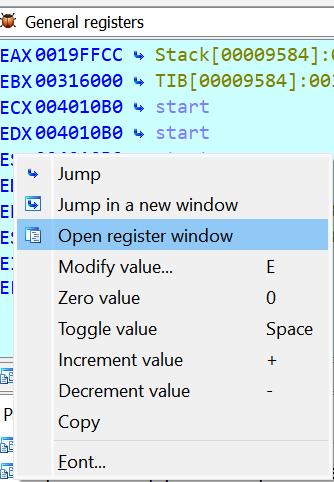
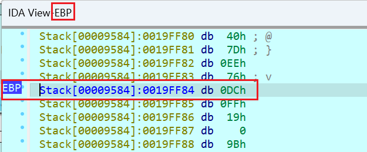

When working with a binary in IDA, most of the time you probably use one of the main views: disassembly (IDA View) or [decompilation](https://hex-rays.com/blog/igors-tip-of-the-week-40-decompiler-basics/) (Pseudocode). If you need to switch between the two, you can use the Tab key – usually it jumps to the the same location in the other view. If you want to consult disassembly and pseudocode at the same time, [copying pseudocode to disassembly](https://hex-rays.com/blog/igors-tip-of-the-week-153-copying-pseudocode-to-disassembly/) is one option, however it is of rather limited usefulness. You can [dock](https://hex-rays.com/blog/igors-tip-of-the-week-22-ida-desktop-layouts/) two view side-by-side and Tab between them, but this can be rather tedious.  
在 IDA 中处理二进制文件时，大多数情况下您可能会使用其中一个主要视图：反汇编（IDA 视图）或反编译（伪代码）。如果需要在这两个视图之间切换，可以使用 Tab 键--通常它会跳转到另一个视图的相同位置。如果你想同时查看反汇编和伪代码，复制伪代码到反汇编也是一种选择，但作用有限。您可以将两个视图并排停靠，并在它们之间进行 Tab 切换，但这可能相当繁琐。

### Synchronizing views 同步视图

To ensure that position in one view follows another automatically, select it in the “Synchronize with” context submenu.  
要确保一个视图中的位置自动跟随另一个视图，请在 "与之同步 "上下文子菜单中选择它。

  

Now, if you place disassembly and pseudocode side-by-side, the cursor position will be synchronized automatically when navigating in either window. The matching lines are also helpfully highlighted. Because a single pseudocode line may be represented by several assembly instructions and vice versa, the match is not one-to-one.  
现在，如果将反汇编和伪代码并排放置，在任一窗口中导航时，光标位置都会自动同步。匹配的行也会高亮显示。由于单行伪代码可能由多条汇编指令表示，反之亦然，因此匹配并不是一对一的。

Any view which displays information tied to addresses can be synchronized to another. As of IDA 8.3 these include:  
任何显示与地址相关信息的视图都可以与另一个视图同步。截至 IDA 8.3，这些视图包括

1.  Disassembly (IDA View) 反汇编（IDA 视图）
2.  Decompilation (Pseudocode)  
    反编译（伪代码）
3.  [Hex View  十六进制视图](https://hex-rays.com/blog/igors-tip-of-the-week-38-hex-view/)

You can even sync more than two views at the same time, although this has to be done in a specific sequence. For example:  
您甚至可以同时同步两个以上的视图，不过必须按照特定的顺序进行。例如

1.  Synchronize IDA View-A and Pseudocode-A  
    同步 IDA 视图-A 和伪代码-A
2.  Synchronize Hex View with the other pair  
    将 Hex 视图与另一对视图同步

### Synchronizing to registers in debugger  
在调试器中同步到寄存器

During debugging, an additional feature is available: synchronizing a view to a register value. You may have noticed that during debugging the default disassembly view changes name to IDA View-EIP (IDA View-RIP for x64 or IDA View-PC for ARM). This is because cursor follows the current execution address stored in the corresponding processor register.  
在调试过程中，有一项附加功能可用：将视图与寄存器值同步。您可能已经注意到，在调试过程中，默认反汇编视图会更名为 IDA View-EIP（x64 为 IDA View-RIP，ARM 为 IDA View-PC）。这是因为光标跟随存储在相应处理器寄存器中的当前执行地址。

You can also synchronize the default Hex View to a register, or open additional views if you need to follow a specific one. For this, use “Open register window” from the context menu on the register in the registers view.  
您还可以将默认的 Hex 视图同步到寄存器，或者在需要跟踪特定寄存器时打开其他视图。为此，请使用寄存器视图中寄存器右键菜单的 "打开寄存器窗口"。

  

See also: 另请参见：

[Igor’s tip of the week #22: IDA desktop layouts  
伊戈尔本周小贴士 #22：IDA 桌面布局](https://hex-rays.com/blog/igors-tip-of-the-week-22-ida-desktop-layouts/)

[Igor’s tip of the week #38: Hex view  
伊戈尔的每周秘诀 #38：六角视图](https://hex-rays.com/blog/igors-tip-of-the-week-38-hex-view/)

[Igor’s Tip of the Week #153: Copying pseudocode to disassembly  
伊戈尔的每周窍门 #153：将伪代码复制到反汇编](https://hex-rays.com/blog/igors-tip-of-the-week-153-copying-pseudocode-to-disassembly/)