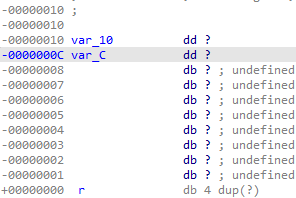

We’ve covered [splitting expressions](https://hex-rays.com/blog/igors-tip-of-the-week-69-split-expression/) before, but there may be situations where it can’t be used.  
我们以前介绍过拆分表达式，但在某些情况下可能无法使用。

For example, consider following situation:  
例如，请考虑以下情况：

The decompiler decided that the function returns a 64-bit integer and allocated a 64-bit stack varible for it. For example, the code may be manipulating a register pair commonly used for 64-bit variables (`eax:edx`) which triggers the heirustics for recovering 64-bit calculations. However, here it seems to be a false positive: we can see separate accesses to the low and high dword of the variable, and the third argument for the IndexFromId call also uses a pointer into the middle of the variable.  
反编译器认为函数返回一个 64 位整数，并为其分配了一个 64 位堆栈变量。例如，代码可能正在操作通常用于 64 位变量的寄存器对（ `eax:edx` ），从而触发了用于恢复 64 位计算的反编译器。然而，这里似乎是一个假阳性：我们可以看到对变量低字节和高字节的单独访问，IndexFromId 调用的第三个参数也使用了变量中间的指针。

One option is to hint to the decompiler that the function returns a 32-bit integer by editing the function’s prototype (use “Set item type” or the Y shotrcut on the first line).   
一种方法是通过编辑函数的原型（在第一行使用 "设置项目类型 "或 Y shotrcut），向反编译器提示函数返回一个 32 位整数。

Often this fixes the decompilation, but not here:  
通常这样就能解决反编译问题，但这里不行：

We still have a 64-bt variable on the stack at `ebp-10h`, so it’s worth inspecting the [stack frame](https://hex-rays.com/blog/igors-tip-of-the-week-65-stack-frame-view/). It can be opened by pressing Ctrl-K in disassembly view or double-cliking stack variable in disassembly or pseudocode:  
我们在 `ebp-10h` 的堆栈上仍有一个 64-bt 变量，因此值得检查堆栈帧。在反汇编视图中按下 Ctrl-K 键，或者在反汇编或伪代码中双击堆栈变量，就可以打开堆栈帧：

We see that there is a quadword (64-bit) variable at offset `-10`. it can be converted to 32-bit(dword) by pressing D three times. Another dword can be added in the same manner at offset `-C`:  
我们看到在偏移量 `-10` 处有一个四字节（64 位）变量，按三次 D 可以将其转换为 32 位（dword）。在偏移量 `-C` 处可以用同样的方法添加另一个 dword：

After refreshing pseudocode, we can see improved output:  
刷新伪代码后，我们可以看到输出有所改善：

There’s only one small issue: `v5` became an array. This happened bcause passing an array or an address of a single integer produces the same code but there was a gap in the stack frame after `var_C`, so the decompiler decided that it’s actually an array. If you’re certain that it’s a single integer, you have the following options:  
只有一个小问题： `v5` 变成了一个数组。出现这种情况的原因是，传递数组或单个整数地址产生的代码是一样的，但在 `var_C` 之后的堆栈帧中有一个空隙，因此反编译器认为它实际上是一个数组。如果你确定这是一个单整数，你有以下选择：

1.  Edit the stack frame again and define some variables after `var_C` so that there is no space for an array.  
    再次编辑堆栈框架，在 `var_C` 之后定义一些变量，这样就没有数组的空间了。
2.  retype v5 directly from the pseudocode (use Y and enter ‘int’).  
    直接从伪代码中重新输入 v5（使用 Y 并输入 "int"）。

Now the pseudocode looks correct and there is only one variable of correct size:  
现在伪代码看起来正确了，而且只有一个大小正确的变量：

Note that in some cases a variable passed by address may be really an array, or a structure – in case of doubt inspect the called function to confirm how the argument is being used.  
请注意，在某些情况下，通过地址传递的变量可能实际上是一个数组或结构体--如有疑问，请检查调用的函数以确认参数是如何使用的。

See also: 另请参见：

[Igor’s tip of the week #65: stack frame view  
伊戈尔本周提示 #65：堆栈帧视图](https://hex-rays.com/blog/igors-tip-of-the-week-65-stack-frame-view/)

[Igor’s tip of the week #42: Renaming and retyping in the decompiler  
伊戈尔的每周提示 #42：反编译器中的重命名和重打](https://hex-rays.com/blog/igors-tip-of-the-week-42-renaming-and-retyping-in-the-decompiler/)