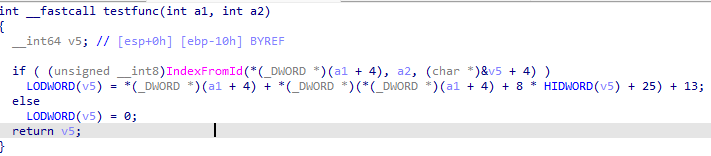
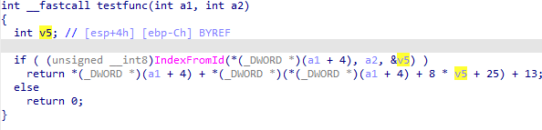

我们之前介绍过 拆分表达式，但有些情况下它并不适用。 例如：

反编译器可能会认为某个函数返回一个 64 位整数，并为此在栈上分配一个 64 位变量。 这种情况通常出现在代码操作了一个常用于 64 位运算的寄存器对（如 eax:edx），从而触发了反编译器的启发式判断。

然而，这里其实是一个 误判：

- 我们可以看到对该变量的高低 32 位分别进行了访问；
- 甚至有一个函数调用（IndexFromId）的第三个参数直接使用了该变量中间部分的指针。

解决办法是：

- 提示反编译器该函数只返回 32 位整数，
- 方法是编辑函数原型（在函数首行使用 `Set item type` 或快捷键 `Y`）。

  

在很多情况下，这能修复反编译结果。 但在本例中，问题依然存在：

- 在 `ebp-10h` 处仍然有一个 64 位变量。
- 因此值得进一步检查 栈帧。

打开栈帧的方法：

- 在反汇编视图中按 `Ctrl+K`，
- 或者在反汇编/伪代码中双击栈变量。

  

在栈帧中我们看到：

- 在偏移 `-10` 处有一个 四字（64 位）变量。
- 可以通过连续按三次 `D` 将其转换为 32 位（`dword`）。
- 然后在偏移 `-C` 处再添加一个 `dword`。

刷新伪代码后，输出结果明显改善。

不过还有一个小问题：变量 `v5` 被识别成了一个数组。原因是：

- 传递数组或单个整数地址在汇编层面生成的代码相同；
- 而在 `var_C` 之后的栈帧中存在空隙，
- 反编译器因此推断它是一个数组。

如果你确定它只是一个单独的整数，可以：

- 再次编辑栈帧，在 `var_C` 之后定义一些变量，避免空隙；
- 或者直接在伪代码中重新定义 `v5`（快捷键 `Y`，输入 `int`）。

这样伪代码就会恢复正确，只保留一个大小合适的变量。

**注意事项**

有时通过地址传递的变量确实可能是数组或结构体。 如果有疑问，请检查被调用的函数，确认参数的实际用法。

相关内容：

[Igor’s tip of the week #65: stack frame view](https://hex-rays.com/blog/igors-tip-of-the-week-65-stack-frame-view/)

[Igor’s tip of the week #42: Renaming and retyping in the decompiler](https://hex-rays.com/blog/igors-tip-of-the-week-42-renaming-and-retyping-in-the-decompiler/)

原文地址：https://hex-rays.com/blog/igors-tip-of-the-week-155-splitting-stack-variables-in-the-decompiler
