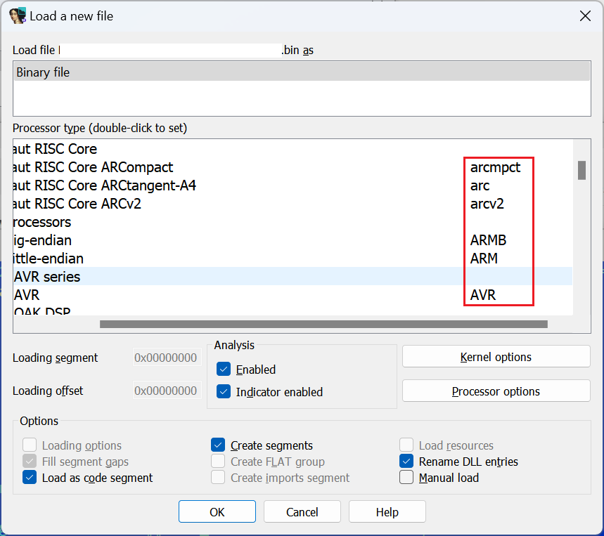
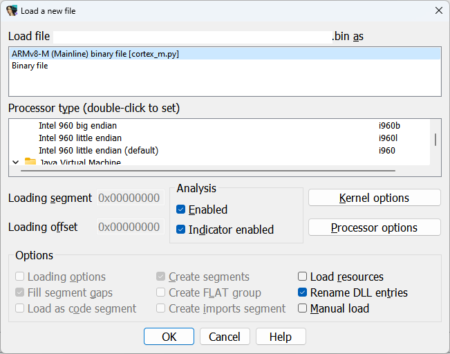

Firmware binaries often use raw binary file format without any metadata so they have to be loaded manually into IDA. You can do it interactively using the [binary file loader](https://hex-rays.com/blog/igors-tip-of-the-week-41-binary-file-loader/), but if you have many files to disassemble it can quickly get boring. If you already know some information about the files you’re disassembling, you can speed up at least the first steps. For example, if you have a binary for **big endian ARM**, which should be loaded at address **0xFFFF0000**, you can use the following command line:  
固件二进制文件通常使用原始二进制文件格式，没有任何元数据，因此必须手动加载到 IDA 中。你可以使用二进制文件加载器进行交互式操作，但如果要反汇编的文件很多，很快就会感到枯燥乏味。如果你已经知道要反汇编的文件的一些信息，至少可以加快第一步的速度。例如，如果你有一个大端ARM的二进制文件，应该加载到地址0xFFFF0000，你可以使用下面的命令行：

```
ida -parmb -bFFFF000 firmware.bin
```

The `-p` switch tells IDA which processor module to pre-select. You can see the available names for different processor types in the second column of the processor selector pane in the load dialog:  
`-p` 开关告诉 IDA 要预选哪个处理器模块。你可以在加载对话框中处理器选择窗格的第二列看到不同处理器类型的可用名称：



The `-b` switch specifies the load base to be used, however due to IDA’s origins as a DOS program, the value needs to be specified in _paragraphs_ (16-byte units), so we have to omit the last hexadecimal zero.  
`-b` 开关指定了要使用的加载基数，但由于 IDA 起源于 DOS 程序，该值需要以段落（16 字节单位）为单位指定，因此我们必须省略最后一个十六进制 0。

In case the file is recognized by IDA as some specific format, it will be used instead of the plain binary, but the processor specified will be retained if possible. For example, [since IDA 8.3](https://hex-rays.com/products/ida/news/8_3/) the firmware for Cortex-M processors is usually recognized as such out-of-box:  
如果 IDA 将文件识别为某种特定格式，则将使用该格式而不是普通二进制文件，但尽可能保留指定的处理器。例如，自 IDA 8.3 起，Cortex-M 处理器的固件通常被识别为开箱即用的格式：

 

If you prefer to have the file loaded as plain binary or another non-default format, you can force it using the `-T` switch with the unique prefix of the preferred format name:  
如果希望以纯二进制格式或其他非默认格式加载文件，可以使用 `-T` 开关和首选格式名称的唯一前缀来强制加载：

```
ida -parm -b800400 -Tbinary firmware.bin
```

(`-Tbin` would also work)  
( `-Tbin` 也可以）

See also: 另请参见：

[IDA Help: Processor Type  
IDA 帮助：处理器类型](https://www.hex-rays.com/products/ida/support/idadoc/618.shtml)

[IDA Help: Command line switches  
IDA 帮助：命令行开关](https://www.hex-rays.com/products/ida/support/idadoc/417.shtml)

[Igor’s tip of the week #41: Binary file loader  
伊戈尔本周小贴士 #41：二进制文件加载器](https://hex-rays.com/blog/igors-tip-of-the-week-41-binary-file-loader/)