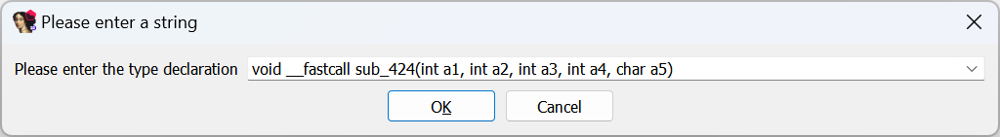
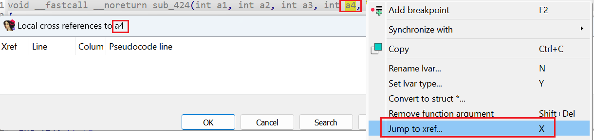
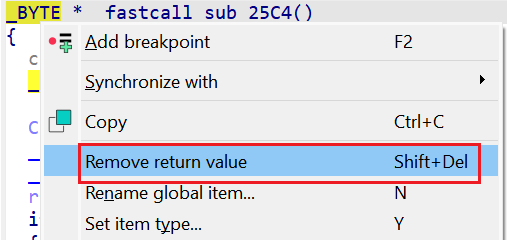
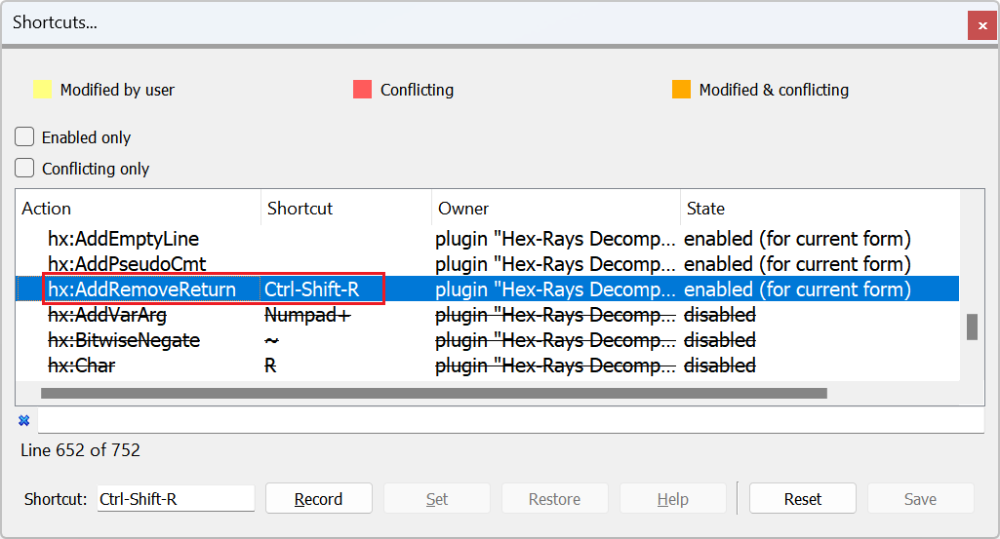

当你需要在反编译器中修改函数原型时，标准方法是使用 “`Set item type…`”（设置项类型） 操作（快捷键 `Y`）。



其中一个常见的场景就是 添加或移除参数。尤其是在嵌入式代码或反编译可变参数函数时，反编译器可能会错误地推导出参数列表。

判断参数是否虚假的一个好方法是：

- 检查它们是否在函数体中被引用。
- 使用 `Jump to xref`（跳转到交叉引用）（快捷键 `X`）即可。



如果某个参数没有任何引用，那么它（以及可能后续的参数）很可能是伪造的。

你可以通过编辑函数原型来移除它们，但有一个更简单的方法：

使用 `Remove function argument`（移除函数参数） 操作（快捷键 `Shift+Del`）。

### 删除返回值
在缺乏可靠信息的情况下，反编译器会假设函数有返回值，并在伪代码中生成相应的返回语句。 这有时会导致输出不够优化，甚至显得别扭。

例如，考虑下面这个来自 ARM 固件的小函数：
```c
_BYTE *sub_25C4()
{
  char CPSR; // r1
  _BYTE *result; // r0

  CPSR = __get_CPSR();
  __get_CPSR();
  __disable_irq();
  result = &amp;byte_10001E5C;
  if ( !byte_10001E5C )
  {
    unk_100014CC = (CPSR &amp; 1) == 0;
    byte_10001E5C = 1;
  }
  return result;
}
```

由于中间地址被存储在寄存器 `R0`（ARM 平台的标准返回寄存器）中，反编译器假设该函数返回一个值，从而生成了上面这种“奇怪”的代码。

但在这里，这个假设显然是错误的。 我们可以像移除参数一样，移除返回值。



更新后的伪代码如下：

```c
void __fastcall sub_25C4()
{
  char CPSR; // r1

  CPSR = __get_CPSR();
  __get_CPSR();
  __disable_irq();
  if ( !byte_10001E5C )
  {
    unk_100014CC = (CPSR &amp; 1) == 0;
    byte_10001E5C = 1;
  }
}
```

**快捷方式**
除了在返回值上使用上下文菜单操作外，你还可以使用快捷键：

`Ctrl+Shift+R`

- 在函数的任意位置都能使用
- 可以移除返回值
- 也可以为 `void` 函数重新引入返回值

如果你想使用不同的快捷键，可以在快捷键编辑器中查找 `AddRemoveReturn` 进行修改。



相关内容：

[Igor’s tip of the week #42: Renaming and retyping in the decompiler](https://hex-rays.com/blog/igors-tip-of-the-week-42-renaming-and-retyping-in-the-decompiler/)

原文地址：https://hex-rays.com/blog/igors-tip-of-the-week-157-removing-function-arguments-in-decompiler