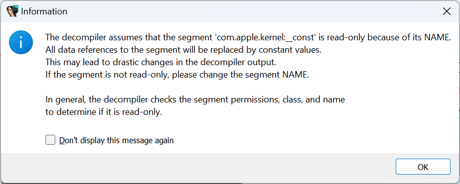
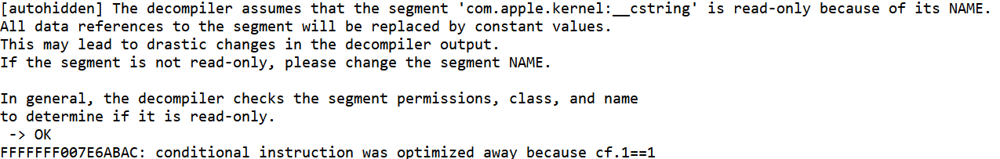

为了只向用户展示最相关的代码并隐藏不必要的杂乱，反编译器在显示伪代码之前会执行各种优化。

其中一些优化依赖于某些假设，这些假设在“行为良好”的程序中通常是正确的。 然而，在某些情况下，这些假设可能是错误的，从而导致输出不正确，因此你需要知道如何修复它们。

### 常量数据与死代码删除

来看一个来自 iOS 内核缓存的示例：

- 该函数看起来相当复杂（需要缩小图形才能完整显示），
- 但伪代码却非常简短。
- 图中大多数条件分支都消失了。

这是怎么回事？反编译器在第一次反编译函数时会显示一些警告：

如果你之前勾选了 `Don’t display message again`（不再显示此消息）”，

那么这些信息会出现在 Output 窗口。

最后一条消息尤其有用：双击提示中的地址，你会跳转到被“优化掉（`optimized away`）”的指令。

如果我们双击条件中涉及的变量，可以看到它们都位于警告信息中提到的段里（`com.apple.kernel:__const`）。

因此，反编译器认为：

- 该段是只读的，
- 两个变量都被初始化为零，
- 所以分支条件恒为真，检查语句被当作死代码删除。

类似地，之前的许多比较也被移除了。但这个假设正确吗？

### 并非那么“常量”

如果我们检查这些变量的交叉引用，会发现它们实际上是会被写入的。

当我们尝试反编译执行写入的函数时，会看到一些“有趣”的提示：

提到的地址依然位于那个所谓的常量段中。

因此，我们可以得出这样的结论：尽管名字叫 `__const`，但这个段其实并不是真正的常量。

最简单的解决方案是：

- 给该段添加 写权限（`Write flag`）。
- 操作路径：`Edit > Segments > Edit segment…`（快捷键 `Alt+S`）。

刷新伪代码（`F5`）后：

- 不再出现红色警告，
- 也不会提示“写入常量内存”。

回到之前那个“过于简短”的函数，现在所有缺失的检查语句都恢复了。

相关内容：

[Igor’s tip of the week #16: Cross-references](https://hex-rays.com/blog/igor-tip-of-the-week-16-cross-references/)

[Igor’s tip of the week #56: String literals in pseudocode](https://hex-rays.com/blog/igors-tip-of-the-week-56-string-literals-in-pseudocode/)

[Decompiler Manual > Tips and tricks: Constant memory](https://hex-rays.com/products/decompiler/manual/tricks.shtml#02)

原文地址：https://hex-rays.com/blog/igors-tip-of-the-week-159-wheres-my-code-the-case-of-not-so-constant-data
