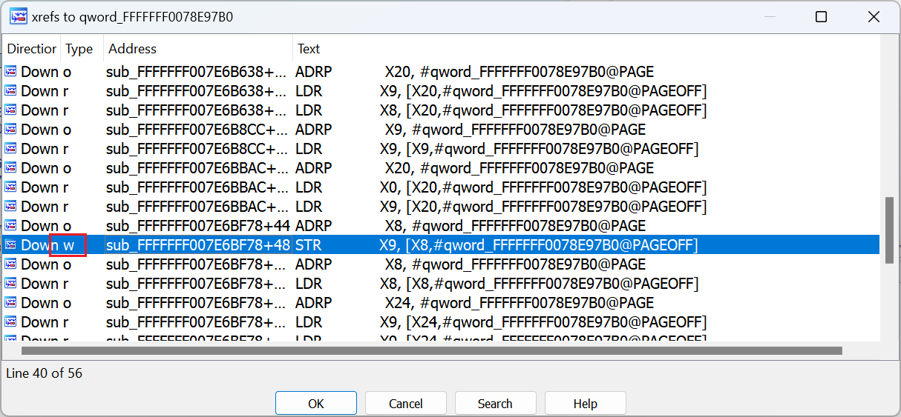

In order to show the user only the most relevant code and hide the unnecessary clutter, the decompiler performs various optimizations before displaying the pseudocode. Some of these optimizations rely on various assumptions which are usually correct in well-behaved programs. However, in some situations they may be incorrect which may lead to wrong output, so you may need to know how to fix them.  
为了只向用户显示最相关的代码，隐藏不必要的杂乱代码，反编译器在显示伪代码之前会进行各种优化。其中一些优化依赖于各种假设，这些假设在运行良好的程序中通常是正确的。但在某些情况下，这些假设可能是不正确的，从而导致错误的输出，因此您可能需要知道如何修正这些假设。

### Constant data and dead code removal  
常量数据和死代码清除

Consider this example from a recent iOS kernelcache:  
请看最近 iOS 内核缓存中的这个示例：

The function looks non-trivial (I’ve had to zoom out the graph) but the pseudocode is very short. Most of the conditional branches visible in the graph have disappeared. What’s happening?  
该函数看起来并不复杂（我不得不放大图表），但伪代码却非常简短。图中可见的大部分条件分支都消失了。这是怎么回事？

You may get some hints from the warnings shown by the decompiler when you first decompile the function:  
第一次反编译函数时，您可能会从反编译器显示的警告中得到一些提示：

![[Information]
The decompiler assumes that the segment 'com.apple.kernel:__cstring' is read-only because of its NAME.
All data references to the segment will be replaced by constant values.
This may lead to drastic changes in the decompiler output.
If the segment is not read-only, please change the segment NAME.
In general, the decompiler checks the segment permissions, class, and name
to determine if it is read-only.](assets/2023/10/const1.png)

If you have checked “Don’t display message again” previously, the message will be shown in the Output window:  
如果您之前选中了 "不再显示提示信息"，则该提示信息将显示在输出窗口中：

![[autohidden] The decompiler assumes that the segment 'com.apple.kernel:__cstring' is read-only because of its NAME.
All data references to the segment will be replaced by constant values.
This may lead to drastic changes in the decompiler output.
If the segment is not read-only, please change the segment NAME.
In general, the decompiler checks the segment permissions, class, and name
to determine if it is read-only.
-> OK
FFFFFFF007E6ABAC: conditional instruction was optimized away because cf.1==1](assets/2023/10/const2.png)

The last message is also a useful hint: if you double-click the address you’ll land on the instruction which was “optimized away”.  
最后一条信息也是一个有用的提示：如果双击该地址，就会看到被 "优化掉 "的指令。

If we double-click the variables involved in the condition, we can see that they both are situated in the segment mentioned in the warning message (`com.apple.kernel:__const`):  
如果我们双击条件中涉及的变量，可以看到它们都位于警告信息中提到的代码段（ `com.apple.kernel:__const` ）中：

So, apparently, because the segment is considered read-only and both variables are set to zero, the decompiler deduced that the branch is always taken and removed the check itself as dead code. Similarly it removed many of the previous comparisons. But is this assumption correct?  
因此，很明显，由于该代码段被视为只读代码段，而且两个变量都被设置为零，反编译器推断出分支总是被执行，并将检查本身作为死代码删除了。同样，它也删除了之前的许多比较。但这种假设正确吗？

### Not very constant 不太恒定

If we check cross-references to the variables, we can see that they’re actually written to:  
如果我们检查变量的交叉引用，就会发现它们确实被写入了：

And if we try to decompile the function doing it, we’ll see some “interesting” messages:  
如果我们尝试反编译函数，就会看到一些 "有趣 "的信息：

And again, the addresses mentioned are all in the same supposedly-constant segment.  
同样，提到的地址都在同一个所谓的常量段中。

So we can make this conclusion: despite the name, the segment is not actually constant. How do we tell the decompiler that?   
因此，我们可以得出这样的结论：尽管有这个名称，但这个程序段实际上并不是常量。如何告诉反编译器这一点呢？

The easiest solution is to add the Write flag to the segment’s permission. This can be done via the Edit > Segments > Edit segment… command (shortcut Alt-S).  
最简单的办法是在程序段权限中添加写标志。这可以通过 "编辑">"段">"编辑段... "命令（快捷键 Alt-S）完成。

After refreshing the pseudocode (F5), we no longer see the red warning or mentions of “write access to const memory”. And if we go back to the previously “too short” function, it now has all the checks which were missing:  
刷新伪代码（F5）后，我们不再看到红色警告或 "写访问常量内存 "的提示。如果我们再回到之前那个 "太短 "的函数，它现在已经具备了之前缺少的所有校验：

See also: 另请参见：

[Igor’s tip of the week #16: Cross-references  
伊戈尔本周提示 #16：交叉引用](https://hex-rays.com/blog/igor-tip-of-the-week-16-cross-references/)

[Igor’s tip of the week #56: String literals in pseudocode  
伊戈尔的每周提示 #56：伪代码中的字符串字面量](https://hex-rays.com/blog/igors-tip-of-the-week-56-string-literals-in-pseudocode/)

[Decompiler Manual > Tips and tricks: Constant memory  
反编译器手册 > 提示和技巧：常量内存](https://hex-rays.com/products/decompiler/manual/tricks.shtml#02)