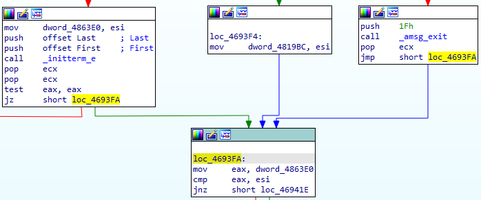
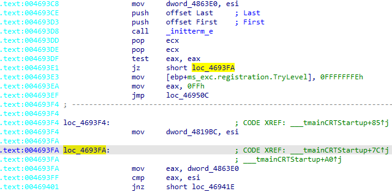
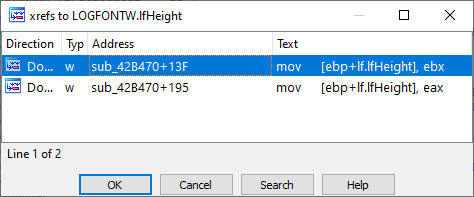
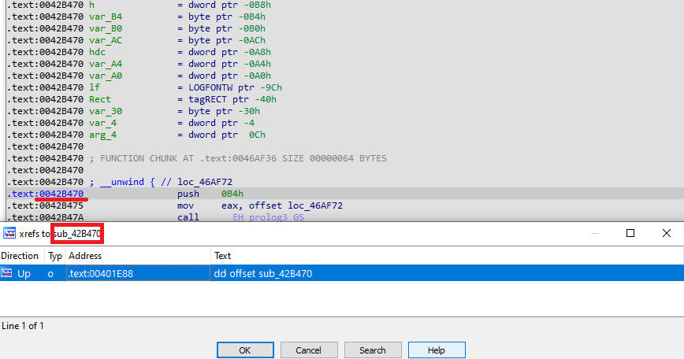
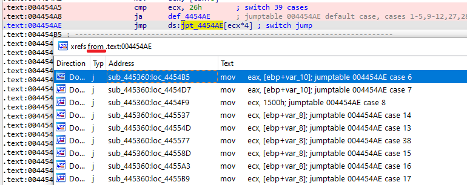

交叉引用（xref）：在一本书或其他资料中，从某个位置指向同一作品中另一处信息的引用或指示（引自 [Wiktionary](https://en.wiktionary.org/wiki/cross-reference)）。

在分析过程中，IDA 会跟踪程序不同部分之间的交叉引用。你可以查看它们、在它们之间导航，甚至添加你自己的交叉引用，以增强分析并帮助 IDA 或反编译器。

## 交叉引用的类型

交叉引用分为两大类：

### 代码交叉引用

- 跳转引用（`jump xref`）：条件或无条件地将执行流转移到另一位置。
- 调用引用（`call xref`）：函数或过程调用，隐含返回到调用指令之后的地址。
- 流程引用（`flow xref`）：表示从当前指令到下一条指令的正常执行流。
  - 这种类型在 IDA 中很少显式显示，但分析引擎和插件/脚本会大量使用。

### 数据交叉引用

- 读引用（`read xref`）：表示某地址的数据被读取。
- 写引用（`write xref`）：表示某地址的数据被写入。
- 偏移引用（`offset xref`）：表示取用了该项的地址，但没有显式读写。
- 结构体引用（`structure xref`）：当结构体在反汇编中被使用，或嵌入到另一个结构体中时添加。

IDA 的帮助文档 [Cross reference attributes](<(https://hex-rays.com/products/ida/support/idadoc/1305.shtml)>) 中描述了这些引用类型的单字母代码。

### 查看与导航交叉引用

**图形视图：** 代码交叉引用显示为代码块之间的箭头。你可以通过视觉跟随箭头或双击来导航。

**文本模式：** 交叉引用显示为行尾的注释。

- 默认最多显示两个引用，更多时会用省略号（`…`）表示。
- 可在 `Options > General… > Cross-references` 中调整显示数量。
- 文本模式只显示显式引用，不显示流程引用。
- 没有流程引用（执行流结束）时，会显示虚线，常见于无条件跳转、返回，或调用不返回的函数之后。

要跳转到交叉引用的来源，可以双击注释中的地址或按 Enter。

### 快捷键

`X`：最常用的快捷键。显示光标下标识符的交叉引用列表。选择后可直接跳转。

不仅适用于反汇编地址，还适用于函数中的栈变量、结构体成员和枚举成员。

`Ctrl–X`：显示当前地址的交叉引用列表（与光标位置无关）。

例如，在函数首条指令上使用，可以查看所有调用者。

`Ctrl–J`：显示从当前地址发出的交叉引用。

虽然这种情况较少，但在 `switch` 表（跳转表） 中非常有用，可以快速查看并跳转到各个 `case`。

如果忘记快捷键或更喜欢用鼠标，可以在 `Jump` 菜单（有时也在右键菜单）中找到对应功能。

原文地址：https://hex-rays.com/blog/igor-tip-of-the-week-16-cross-references
