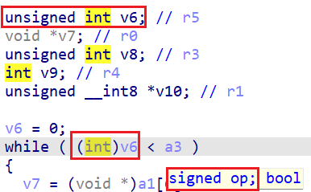
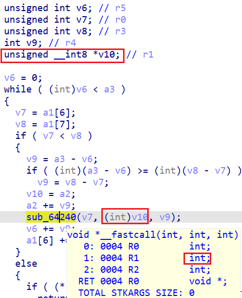
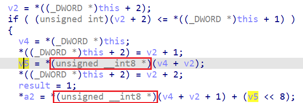
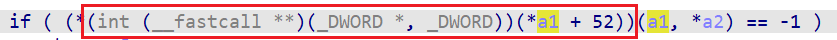
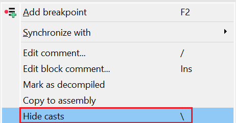

为了忠实地表现代码的行为，并符合 C 语言的规则，反编译器有时需要在伪代码中插入类型转换（cast）。

几个常见的例子：

- 一个变量被检测为无符号类型，但参与了有符号比较；

  

- 传递给函数的实参与函数原型不匹配；

  

- 从内存中加载或存储的值比寄存器宽度更窄；

  

- 实际传递给函数调用的参数与原型不符（或者原型未知）；

  

### 为什么要隐藏类型转换

有时你只想关注函数的整体结构，而不希望被大量的类型转换干扰。 在这种情况下，你可以使用 “隐藏类型转换（`Hide casts`）” 功能：

- 在伪代码窗口中，右键菜单选择 `Hide casts`，
- 或者直接使用快捷键 反斜杠 `\`。

要重新显示它们：

- 使用 `Show casts` 操作（同样的快捷键）。

**注意事项**

- 隐藏类型转换可能会让伪代码看起来更“干净”，
- 但结果可能不再是合法的 C 代码，
- 并且可能掩盖一些通过类型转换才能发现的问题。
- 因此，不建议长期关闭类型转换显示。

如果你发现反编译输出似乎不正确（例如指针运算与汇编不符）， 可能是因为你不小心按了反斜杠键，导致类型转换被隐藏。 此时请检查右键菜单，并重新启用显示。

相关内容：

[Decompiler Manual: Hex-Rays interactive operation: Hide/unhide cast operators](https://www.hex-rays.com/products/decompiler/manual/cmd_hide_casts.shtml)

原文地址：https://hex-rays.com/blog/igors-tip-of-the-week-160-hiding-casts-in-the-decompiler
