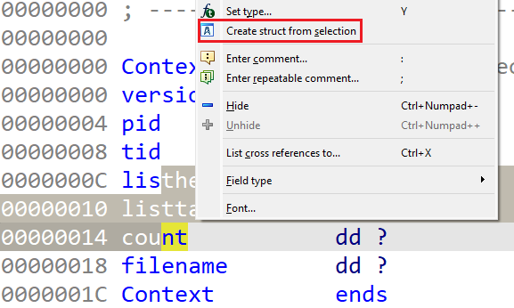
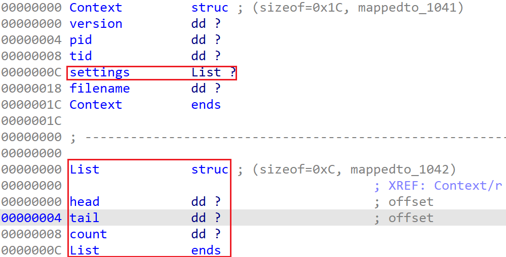
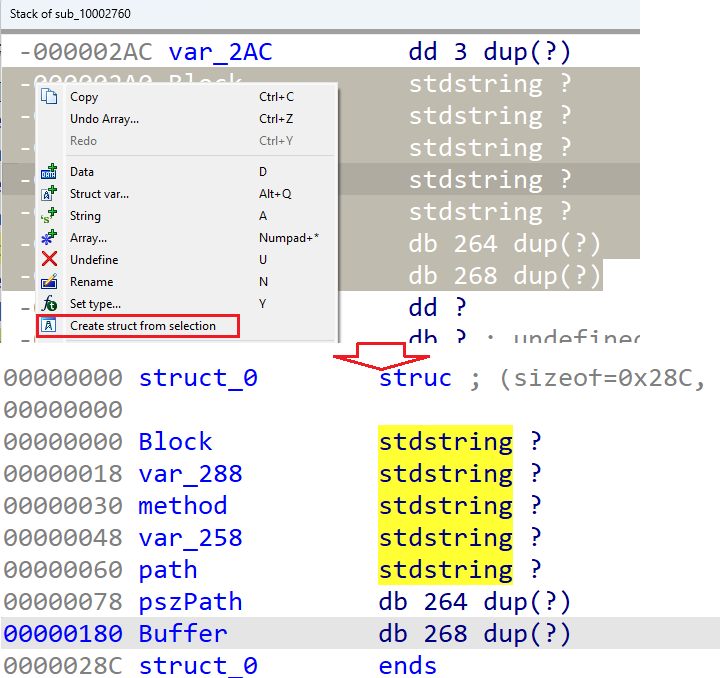

As [covered before](https://hex-rays.com/blog/igor-tip-of-the-week-11-quickly-creating-structures/), the action “Create struct from selection” can be used to quickly create structures from existing data items.   
如前所述，"从选择创建结构 "操作可用于从现有数据项中快速创建结构。


However, Disassembly view not the only place where it can be used. For example, let’s imagine you’ve created a structure to represent some context used by the binary being analyzed:  
然而，反汇编并不是唯一可以使用反汇编的地方。例如，假设你创建了一个结构来表示正在分析的二进制文件所使用的某些上下文：

```
00000000 Context         struc ; (sizeof=0x1C)
00000000 version         dd ?
00000004 pid             dd ?
00000008 tid             dd ?
0000000C listhead        dd ?                    ; offset
00000010 listtail        dd ?                    ; offset
00000014 count           dd ?
00000018 filename        dd ?
0000001C Context         ends
```

But as you analyze the code further, you realize that the list structure is generic and is used in other places independently. In this simple scenario you can, of course, create a separate `List` structure and replace the fields inside `Context` with it, but what if the substructure is big and contains hundreds of fields? Using “Create struct from selection” allows you to perform the task easily and quickly:  
但当你进一步分析代码时，你会发现这个列表结构是通用的，在其他地方也会单独使用。在这种简单的情况下，你当然可以创建一个单独的 `List` 结构，并用它替换 `Context` 中的字段，但如果子结构很大，包含数百个字段怎么办？使用 "从选择创建结构 "可以让您轻松快速地完成任务：

1.  [select](https://hex-rays.com/blog/igor-tip-of-the-week-03-selection-in-ida/) the subset of fields you want to extract;  
    选择要提取的字段子集；
2.  invoke the action 调用操作  
    
3.  rename the new structure and/or fields as necessary.  
    根据需要重命名新结构和/或字段。  
    

### Extracting structures from the stack frame  
从堆栈帧中提取结构

One more place where this action can be used is the [stack frame view](https://hex-rays.com/blog/igors-tip-of-the-week-65-stack-frame-view/), because internally it is a kind of a structure.  
堆栈框架视图也是可以使用此操作的地方，因为堆栈框架内部是一种结构。

See also: 另请参见：

[Igor’s tip of the week #11: Quickly creating structures  
伊戈尔本周小贴士 #11：快速创建结构](https://hex-rays.com/blog/igor-tip-of-the-week-11-quickly-creating-structures/)

[Igor’s tip of the week #03: Selection in IDA  
伊戈尔的每周提示 #03：IDA 中的选择](https://hex-rays.com/blog/igor-tip-of-the-week-03-selection-in-ida/)