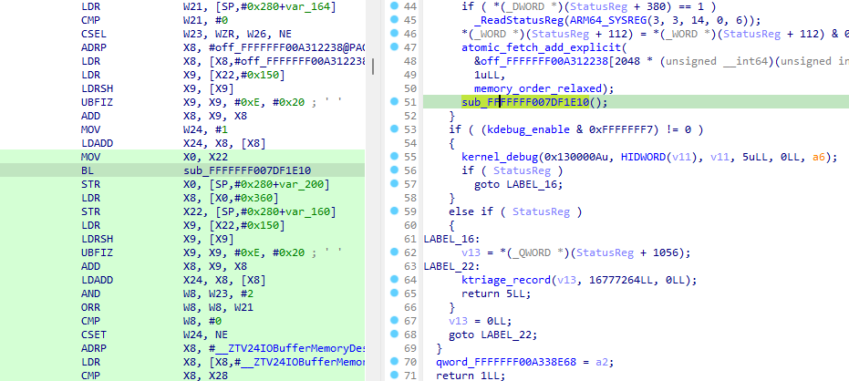
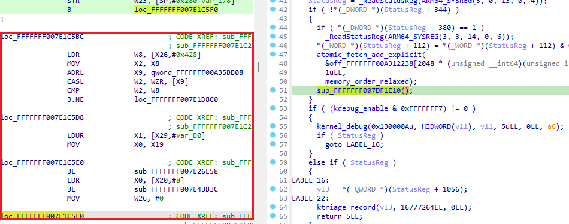
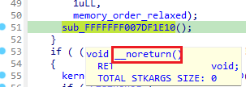
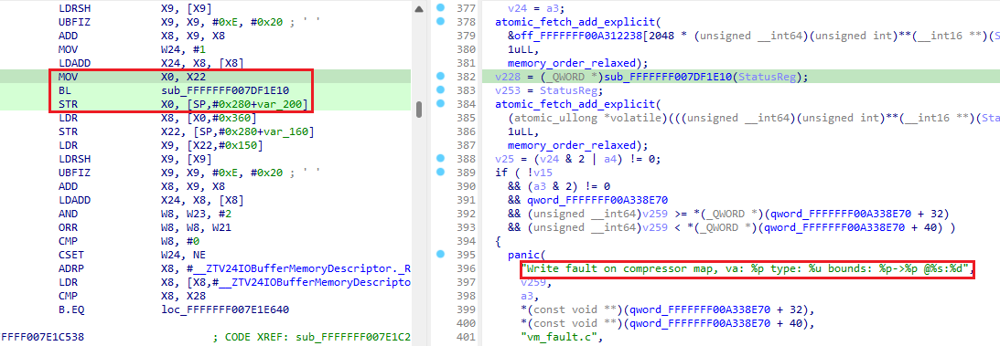

Let’s say you found a promising-looking string in the binary, followed the cross reference to the function using it, then decompiled it to see how the string is used, only to see no signs of it in the pseudocode. What’s happening?  
比方说，你在二进制代码中发现了一个看起来很有希望的字符串，按照交叉引用找到了使用该字符串的函数，然后反编译了一下，想看看该字符串是如何使用的，结果却在伪代码中看不到任何迹象。这是怎么回事？

  
In such situation it often helps to set up two [synchronized](https://hex-rays.com/blog/igors-tip-of-the-week-154-synchronized-views/) disassembly<->pseudocode views and scroll through them looking for oddities. As a rule of thumb, most pseudocode lines should map to one or few assembly instructions and most assembly instructions (except [skippable](https://hex-rays.com/blog/igors-tip-of-the-week-68-skippable-instructions/) ones such as function prolog or epilog) should map to some line in pseudocode.  
在这种情况下，设置两个同步的反汇编<->伪代码视图并滚动浏览它们以查找奇怪之处往往会有所帮助。根据经验，大多数伪代码行应映射到一条或几条汇编指令，而大多数汇编指令（可跳过的指令除外，如函数序言或后记）应映射到伪代码中的某些行。

Here’s an example of a strange case: a single function call in pseudocode maps to not only the call instruction but also a bunch of seemingly unrelated instructions after it:  
这里有一个奇怪的例子：伪代码中的单个函数调用不仅映射到调用指令，还映射到其后一系列看似无关的指令：

  
It is then followed by instructions which do not have any mapping in the pseudocode:

  
之后的指令在伪代码中没有任何映射：

  
[Hovering](https://hex-rays.com/blog/igors-tip-of-the-week-66-decompiler-annotations/) the mouse on the call gives a clue: it’s been marked as no-return:

  
将鼠标悬停在该调用上会得到提示：该调用已被标记为不返回：

Since there’s obviously some valid code after it, it seems to be a false positive. Removing the `__noreturn` attribute from the prototype (hint: [Y shortcut](https://hex-rays.com/blog/igors-tip-of-the-week-42-renaming-and-retyping-in-the-decompiler/)) brings back the missing code and more regular instruction mapping:  
因为在它后面显然还有一些有效代码，所以这似乎是一个误报。从原型中移除 `__noreturn` 属性（提示： Y 快捷键），就能恢复丢失的代码和更正常的指令映射：

NB: in some cases you may have to clear the noret flag in [function’s properties](https://hex-rays.com/blog/igors-tip-of-the-week-126-non-returning-functions/) in addition to fixing the prototype, or the `__noreturn` attribute will keep coming back.  
注意：在某些情况下，除了修正原型外，您可能还必须清除函数属性中的 noret 标志，否则 `__noreturn` 属性会继续出现。

The reasons why the function could be incorrectly marked as no-ret are numerous; for example, it may have been found to end in an infinite loop or have code paths only leading to other no-ret functions due to other issues. It may be worth investigating such functions more closely, especially if you discover multiple instances of them.  
函数被错误标记为无返回的原因有很多，例如，可能发现该函数以无限循环结束，或者由于其他问题，其代码路径只能通向其他无返回函数。值得对此类函数进行更仔细的调查，尤其是在发现多个实例的情况下。

Note that in some cases you may see valid-looking code after a function call even though the function **really** does not return. This could be caused by:  
请注意，在某些情况下，您可能会在函数调用后看到看起来有效的代码，即使该函数确实没有返回。造成这种情况的原因可能是

-   -   the compiler not deducing that the function does not return  
        编译器没有推断出函数没有返回
    -   old compiler which does not perform dead code removal  
        旧的编译器不能清除死代码
    -   optimization settings during compilation  
        编译时的优化设置
    -   other reasons (e.g. [incorrect assumptions](https://hex-rays.com/blog/igors-tip-of-the-week-159-wheres-my-code-the-case-of-not-so-constant-data/) by the decompiler)  
        其他原因（例如反编译器的假设不正确）

See also: 另请参见：

[Igor’s Tip of the Week #126: Non-returning functions  
伊戈尔的每周窍门 #126：非返回函数](https://hex-rays.com/blog/igors-tip-of-the-week-126-non-returning-functions/)  
[Igor’s Tip of the Week #159: Where’s my code? The case of not-so-constant data  
伊戈尔本周小贴士 #159：我的代码呢？数据不恒定的情况](https://hex-rays.com/blog/igors-tip-of-the-week-159-wheres-my-code-the-case-of-not-so-constant-data/)