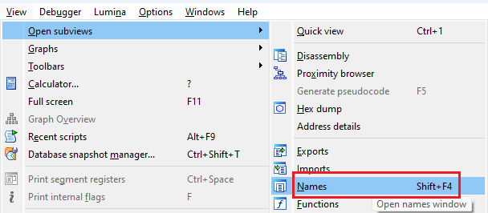
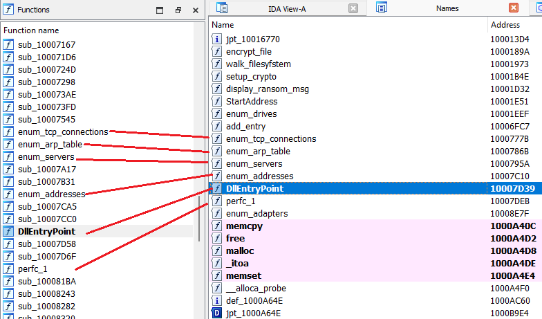
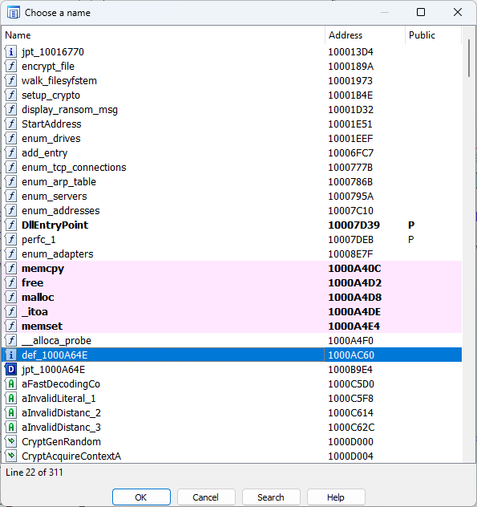

The [Functions list](https://hex-rays.com/blog/igors-tip-of-the-week-28-functions-list/) is probably the most known and used part of IDA’s default desktop layout. It includes all detected functions in the current database and offers a quick way to find and navigate to any of them. However, the database consists not only of functions but also data items or instructions which are not included into any function. For example, there may be a name provided by the debug info but IDA can fail to create a function for some reason. In that case you can have a _name_ but no function. You can [force create](https://hex-rays.com/blog/igors-tip-of-the-week-152-force-creating-functions/) a function, but how to even discover such situation? If you know the name beforehand, you can use the [“Jump to address”](https://hex-rays.com/blog/igors-tip-of-the-week-20-going-places/) (G) action to jump to it, but it can get complicated if the name is long or has uncommon characters. How to discover such names without scrolling through the whole listing?  
函数列表可能是 IDA 默认桌面布局中最广为人知和使用率最高的部分。它包括当前数据库中所有已检测到的函数，并提供了一种快速查找和导航到任意函数的方法。然而，数据库不仅包括函数，还包括未包含在任何函数中的数据项或指令。例如，调试信息可能提供了一个名称，但 IDA 可能因某种原因无法创建一个函数。在这种情况下，你可以有一个名称，但没有函数。您可以强制创建一个函数，但如何发现这种情况呢？如果事先知道名称，可以使用 "跳转到地址"（ G ）操作跳转到它，但如果名称很长或有不常用的字符，就会变得复杂。如何在不滚动整个列表的情况下发现这些名称？

### Names window 名称窗口

A separate view with the list of names can be opened using View > Open subviews > Names (Shift–F4).  
可以使用 "视图">"打开子视图">"名称"（ Shift - F4 ）打开包含名称列表的单独视图。

Many entries will be the same as in the Functions list:  
许多条目与功能列表中的条目相同：

But there are also differences:  
但也有不同之处：

-   the Functions list includes _all_ functions, including unnamed ones (they get a [dummy name](https://hex-rays.com/blog/igors-tip-of-the-week-34-dummy-names/) beginning with `sub_`)  
    函数列表包括所有函数，包括未命名的函数（它们会得到一个以 `sub_` 开头的虚名）
-   the Names list includes not only function names (marked with 𝑓) but also other names, for example global labels (`i`) or data items (`D`).  
    名称列表不仅包括函数名称（以 𝑓 标记），还包括其他名称，例如全局标签 ( `i` ) 或数据项 ( `D` ) 。

### Jump by name 按名称跳转

Instead of permanent Names window, you can also use Jump > Jump by name… (Ctrl–L). This shows the same list as a modal chooser, meaning you can [use filtering or incremental search](https://hex-rays.com/blog/igors-tip-of-the-week-36-working-with-list-views-in-ida/) to find the name you need and jump to it with Enter or double-click.  
您也可以使用 "跳转">"按名称跳转......"（ Ctrl - L ）来代替永久性的 "名称 "窗口。这将显示与模态选择器相同的列表，也就是说，你可以使用过滤或增量搜索来找到你需要的名称，然后用 Enter 或双击跳转到它。

See also: 另请参见：

[Igor’s tip of the week #28: Functions list  
伊戈尔本周提示 #28：函数列表](https://hex-rays.com/blog/igors-tip-of-the-week-28-functions-list/)

[Igor’s tip of the week #20: Going places  
伊戈尔本周小贴士 #20：去往各地](https://hex-rays.com/blog/igors-tip-of-the-week-20-going-places/)