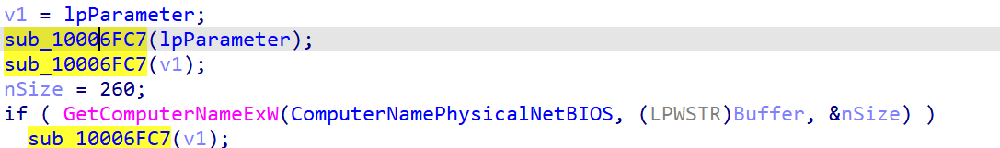
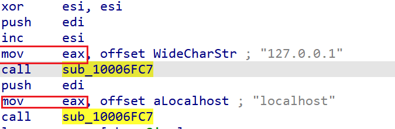
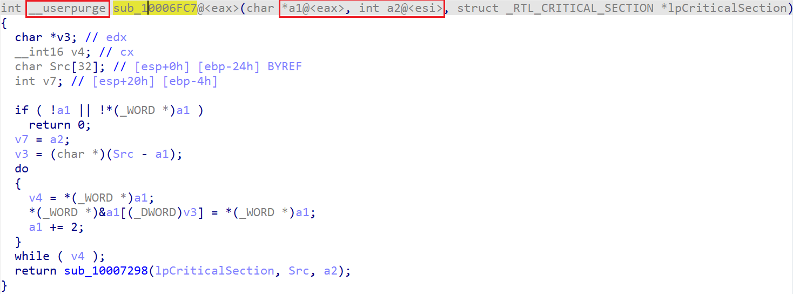
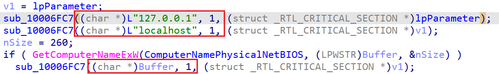

Let’s consider this snippet from decompilation of an x86 Windows binary:  
让我们来看看 x86 Windows 二进制文件的反编译片段：

The same function is called twice with the same argument and the last one doesn’t seem to use the result of the `GetComputerNameExW` call.  
同一个函数用同一个参数被调用了两次，而最后一次似乎没有使用 `GetComputerNameExW` 的调用结果。  
By switching to disassembly, we can see that `eax` is initialized before each call with a string address:  
通过反汇编，我们可以看到 `eax` 在每次调用前都用字符串地址进行了初始化：

However the decompiler does not consider it, because on x86 the stack is the usual way of passing arguments and `eax` is most commonly just a temporary scratch register.  
但是反编译器并没有考虑到这一点，因为在 x86 系统中，堆栈是传递参数的常用方式，而 `eax` 通常只是一个临时寄存器。

One option is to edit the prototype of `sub_10006FC7` to use the [__usercall calling convention](https://hex-rays.com/blog/igors-tip-of-the-week-51-custom-calling-conventions/) and add `eax` to the argument manually. But when the function is situated in the same binary, it is usually easier to simply go inside the function and decompile it so that the decompiler can see that it does use `eax` before initializing, and so it is added to the argument list:  
一种方法是编辑 `sub_10006FC7` 的原型，使用 __usercall调用约定，然后手动将 `eax` 添加到参数中。但当函数位于同一个二进制文件中时，通常更简单的做法是直接进入函数内部进行反编译，这样反编译器就能看到函数在初始化前确实使用了 `eax` ，从而将其添加到参数列表中：

In addition, `esi` is also detected to be an argument.  
此外， `esi` 也被检测到是一个参数。

If we go back to the caller now, we should see the previously missing arguments being passed to the calls:  
如果我们现在回到调用者，就会看到先前丢失的参数被传递给调用者：

NB: usage of non-standard, custom calling convention is often a sign of either functions using hand-written assembly, or whole program optimization (aka LTO or LTCG) being enabled.  
注：使用非标准的自定义调用约定通常是函数使用手写汇编或整个程序优化（又称 LTO 或 LTCG）启用的标志。

See also: 另请参见：

[Igor’s tip of the week #51: Custom calling conventions  
伊戈尔本周提示 51：自定义调用约定](https://hex-rays.com/blog/igors-tip-of-the-week-51-custom-calling-conventions/)