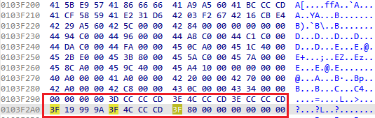
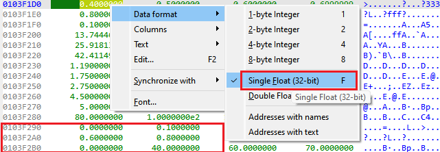
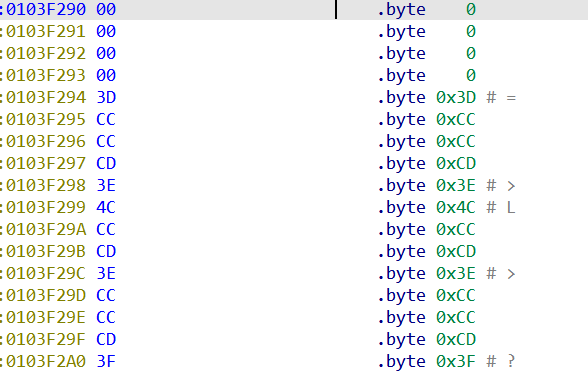
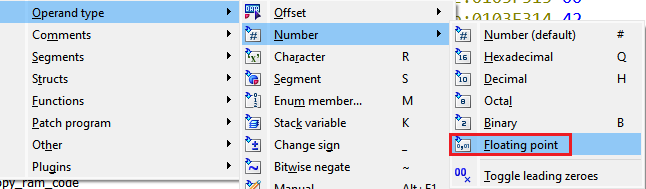
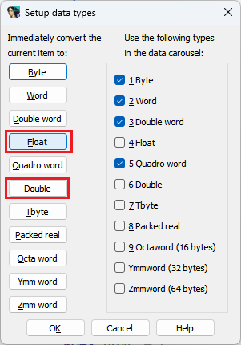
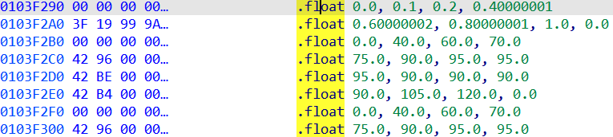

IDA 支持为指令操作数和数据项提供不同的表示方式。 不过，只有最常见的几种会出现在右键菜单中，或者有快捷键。

假设你在固件二进制文件中发现了一块区域，看起来像是一个 浮点数表：

在 `Hex View` 中切换表示方式后，你可以确认这些数据确实像浮点数。

但在反汇编视图中，它们只是普通的十六进制字节。

那么，如何把它们变成一个漂亮的浮点数表呢？

**方法一：整数转浮点**

- 先创建整数项或数组（在这种情况下是 `dword`）。
- 然后修改它们的表示方式为浮点数： 菜单路径：`Edit > Operand type > Number > Floating point`。

  

**方法二：直接创建浮点数据**

- 使用 `Options > Setup data types…` 对话框（快捷键 `Alt+D`）。
- 通过按下带下划线的快捷键快速选择数据类型（例如 `F` 表示 `float`，`U` 表示 d`ouble`）。

  

- 和往常一样，创建一个数据项后，可以使用 `*` 来创建数组。

  

**注意事项**

`Tbyte`（十字节） 对应的是 80 位扩展精度浮点格式，最早由 8087 协处理器及其后续产品使用。

这种格式在现代软件中很少见，主要存在于旧版 DOS 或 Windows 程序中。

相关内容：

[Igor’s tip of the week #46: Disassembly operand representation](https://hex-rays.com/blog/igors-tip-of-the-week-46-disassembly-operand-representation/)

[Igor’s tip of the week #10: Working with arrays](https://hex-rays.com/blog/igor-tip-of-the-week-10-working-with-arrays/)

[Igor’s tip of the week #38: Hex view](https://hex-rays.com/blog/igors-tip-of-the-week-38-hex-view/)  

原文地址：https://hex-rays.com/blog/igors-tip-of-the-week-165-defining-floating-point-data
