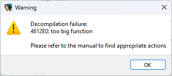

原文地址：



为了确保反编译速度保持在可接受范围内，并避免阻塞 IDA（尤其是在批量反编译时），反编译器默认拒绝反编译超过 64KB（0x10000 字节）的函数。但有时你会遇到一个函数，其大小是限制的 3 倍甚至更多。


在这种情况下，你可以手动提高限制，强制反编译器尝试反编译该函数。

### 如何修改限制

限制可以 临时修改 或 永久修改：

**1. 仅对当前数据库生效**

- 打开反编译器选项： 菜单路径：`Edit > Plugins > Hex-Rays Decompiler > Options` ，然后在 `Analysis Options 3` 中修改相关设置。

  

  

**2. 对所有新数据库生效**

- 编辑 `hexrays.cfg` 文件中的参数：
  ```bash
  MAX_FUNCSIZE
  ```
  

注意：配置文件中的设置 仅对新建数据库生效； 对于已有数据库，请使用第一种方法。

### s 小提示

与其直接修改 IDA 安装目录下的 `hexrays.cfg`， 更推荐在 用户目录 下新建一个配置文件，仅包含修改过的参数。这样即使升级 IDA 版本，你的自定义设置也会继续生效。

相关内容：

[Failures and troubleshooting (Hex-Rays Decompiler User Manual)](https://www.hex-rays.com/products/decompiler/manual/failures.shtml)

[Igor’s tip of the week #82: Decompiler options: pseudocode formatting](https://hex-rays.com/blog/igors-tip-of-the-week-82-decompiler-options-pseudocode-formatting/)

[Igor’s tip of the week #83: Decompiler options: default radix](https://hex-rays.com/blog/igors-tip-of-the-week-83-decompiler-options-default-radix/)

[Configuration (Hex-Rays Decompiler User Manual)](https://www.hex-rays.com/products/decompiler/manual/config.shtml)

原文地址：https://hex-rays.com/blog/igors-tip-of-the-week-166-dealing-with-too-big-function
