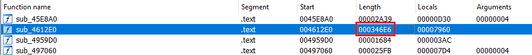
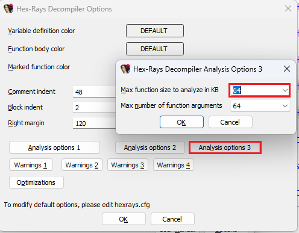
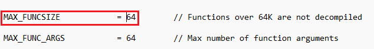

Occasionally you may run into the following error message:  
有时您可能会遇到以下错误信息：

![[Warning]
Decompilation failure:
4612E0: too big function
Please refer to the manual to find appropriate actions](assets/2023/11/bigfunc1.png)

To ensure that the decompilation speed remains acceptable and does not block IDA, especially when using batch decompilation, by default the decompiler refuses to decompile the functions over 64 kilobytes (0x10000 bytes). But here we have function which is 3x as large:  
为确保反编译速度保持在可接受的水平，并且不会阻塞 IDA，特别是在使用批量反编译时，反编译器默认拒绝反编译超过 64 千字节（0x10000 字节）的函数。但在这里，我们有一个大 3 倍的函数：

In such case you can manually increase the size to force the decompiler try decompile the function anyway. The limit can be increased temporarily or permanently.  
在这种情况下，你可以手动增加函数的大小，迫使反编译器尝试反编译该函数。可以临时或永久增加限制。

To change the limit for current database only, open the decompiler options (Edit > Plugins > Hex-Rays Decompiler, Options):  
要只更改当前数据库的限制，请打开反编译器选项（编辑 > 插件 > Hex-Rays 反编译器，选项）：

Then change the setting in Analysis Options 3:  
然后更改分析选项 3 中的设置：

To change the default for all new databases, edit the parameter `MAX_FUNCSIZE` in `hexrays.cfg`.  
要更改所有新数据库的默认设置，请编辑 `hexrays.cfg` 中的参数 `MAX_FUNCSIZE` 。

Note that settings in the config file are only applied to _new databases_; for existing databases use the first approach.  
请注意，配置文件中的设置只适用于新数据库；对于现有数据库，请使用第一种方法。

Hint: instead of editing `hexrays.cfg` in IDA’s installation, create a new file with only the changed settings in the [user directory](https://hex-rays.com/blog/igors-tip-of-the-week-33-idas-user-directory-idausr/). This way the settings will persist if you upgrade your IDA version.  
提示：与其编辑 IDA 安装中的 `hexrays.cfg` ，不如在用户目录中创建一个新文件，其中只包含已更改的设置。这样，即使你升级了 IDA 版本，这些设置也会保持不变。

See also: 另请参见：

[Failures and troubleshooting (Hex-Rays Decompiler User Manual)  
故障和疑难解答（Hex-Rays 反编译器用户手册）](https://www.hex-rays.com/products/decompiler/manual/failures.shtml)

[Igor’s tip of the week #82: Decompiler options: pseudocode formatting  
伊戈尔本周小贴士 #82：反编译器选项：伪代码格式化](https://hex-rays.com/blog/igors-tip-of-the-week-82-decompiler-options-pseudocode-formatting/)

[Igor’s tip of the week #83: Decompiler options: default radix  
伊戈尔本周小贴士 #83：反编译器选项：默认弧度](https://hex-rays.com/blog/igors-tip-of-the-week-83-decompiler-options-default-radix/)

[Configuration (Hex-Rays Decompiler User Manual)  
配置（Hex-Rays 反编译器用户手册）](https://www.hex-rays.com/products/decompiler/manual/config.shtml)