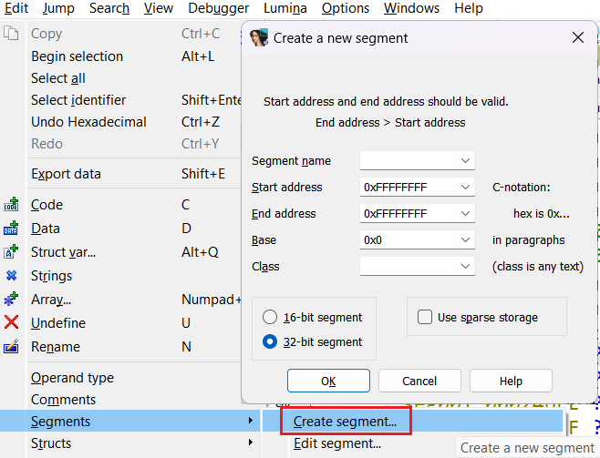
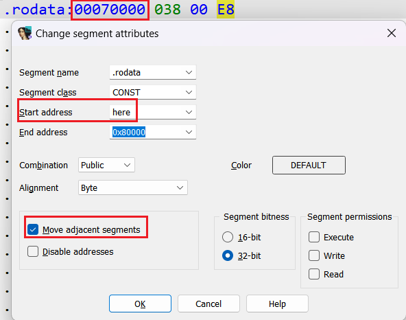

在分析固件二进制文件时，正确的内存布局非常重要。 当加载一个原始二进制文件时，IDA 通常会为整个二进制文件创建一个代码段。 如果你只需要分析代码，这通常已经足够，但并非总是如此。

例如：

- 代码可能会引用外部硬件作为 MMIO（内存映射 I/O），
- 或者使用一些不属于二进制镜像的额外内存。

那么该如何处理这种情况呢？

### 创建段

要在数据库中引入额外的地址，可以使用：菜单路径：`Edit > Segments > Create segment…`。

**输入**：

- 段名
- 起始/结束地址
- 可选的类别（class）

**说明**：

- 类别通常只是信息性标记，但可能会影响反编译器的行为。
- Use sparse storage option（稀疏存储选项）：适用于大部分为空、仅包含少量数据项的段（例如 BSS 或 MMIO）。启用后，IDA 会使用优化存储方式，即使新段很大，IDB 文件也不会显著膨胀。
- 注意：段的结束地址是 排他的，即最后一个字节的地址为 `end_ea - 1`。

创建段后，最好重新分析数据库，以便发现对新地址的引用。

### 拆分段

如果你指定的地址范围与现有段部分重叠，IDA 会自动截断已有段，为新段腾出空间。

例如：

- 你加载了一个固件，作为 ROM 段，范围是 `0x0 – 0x80000`。
- 后来发现代码区实际上在 `0x60000` 就结束了。

此时你可以创建一个新段（例如命名为 `.rodata`），范围为 `0x60000 – 0x80000`， IDA 会自动将 ROM 段截断到 `0x0 – 0x60000`。

### 移动段边界

假设进一步分析后，你发现 `.rodata` 实际上应该从 `0x70000` 开始。 你可以快速调整分割点：

1. 导航到新的分割点（例如 `0x70000`）。
2. 执行 `Edit > Segments > Edit segment`（快捷键 Alt+S）。
3. 在 `Start address`（或 `End address`，取决于移动方向）中输入 `here`。
4. 确保勾选 `Move adjacent segments`，然后点击 `OK`。

**说明**：

- IDA 的大多数数值输入框都接受 IDC 表达式。
- `here` 会被转换为当前地址（此处为 `0x70000`）。

**结果**：

- `.rodata` 段边界调整为 `0x70000 – 0x80000`
- 相邻的 ROM 段扩展为 `0x0 – 0x70000`

相关内容：

[Igor’s tip of the week #41: Binary file loader](https://hex-rays.com/blog/igors-tip-of-the-week-41-binary-file-loader/)

[IDA Help: Create a new segment](https://www.hex-rays.com/products/ida/support/idadoc/507.shtml)

[IDA Help: Change segment attributes](https://www.hex-rays.com/products/ida/support/idadoc/514.shtml)

原文地址：https://hex-rays.com/blog/igors-tip-of-the-week-167-adding-and-splitting-segments