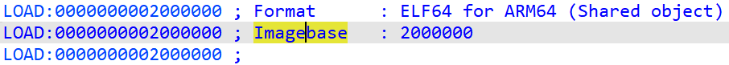

当你将一个文件加载到 IDA 中时，无论它是标准的可执行文件格式（例如 PE、ELF、Mach-O），还是一个原始二进制文件，IDA 都会为其分配一个特定的地址范围。这个范围要么来自文件的元数据，要么来自用户输入（针对二进制文件）。

文件所占用的最低地址通常被称为 imagebase，你通常可以在反汇编列表开头的文件注释中看到它：

有时你可能需要将已加载的数据移动到另一个地址。最常见的情况是 在真实系统上调试：

- 由于 ASLR（地址空间布局随机化），
- 或者由于简单的内存使用模式，

可执行文件/库在运行时所占用的地址可能与 IDA 默认使用的地址不一致。

如果你使用的是 IDA 自带的调试器，它会自动调整地址。但在其他情况下，你可以通过 重定位（rebasing）操作 手动完成。

### 重定位操作
要将当前加载的文件移动到另一个地址，可以使用：菜单路径：`Edit > Segments > Rebase program…`。

然后你可以指定新的地址，或者输入一个偏移值（正数或负数）：

#### Fix up relocations（修复重定位）

- 调整依赖于加载地址的数值（前提是输入文件包含重定位信息，并且已被 IDA 解析）。
- 这模拟了操作系统加载器/动态链接器执行的过程。

#### Rebase the whole image（重定位整个镜像）

- 使用一种优化算法一次性移动整个文件。
- 如果不勾选此选项，IDA 会逐段移动，但如果新旧地址之间存在重叠，可能会失败。

相关内容：

[Igor’s tip of the week #41: Binary file loader](https://hex-rays.com/blog/igors-tip-of-the-week-41-binary-file-loader/)

[Igor’s Tip of the Week #122: Manual load](https://hex-rays.com/blog/igors-tip-of-the-week-122-manual-load/)

原文地址：https://hex-rays.com/blog/igors-tip-of-the-week-168-rebasing