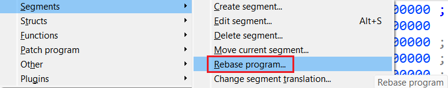
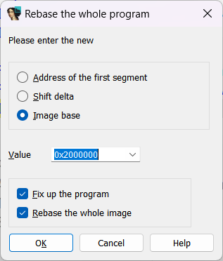

When you load a file into IDA, whether a standard executable format (e.g. PE, ELF, Macho-O), or a [raw binary](https://hex-rays.com/blog/igors-tip-of-the-week-41-binary-file-loader/), IDA assigns a particular address range to the data loaded from it, either from the file’s metadata or user’s input (in case of binary file). The lowest address from those occupied by the file is commonly called _imagebase_ and you can usually see it in the file comment at the start of the disassembly listing:  
当你向IDA加载一个文件时，无论是标准的可执行文件格式（如PE、ELF、Macho-O），还是原始的二进制文件，IDA都会为加载的数据分配一个特定的地址范围，这个地址范围可能来自文件的元数据，也可能来自用户的输入（如果是二进制文件）。文件所占地址中的最低地址通常称为 imagebase，你通常可以在反汇编列表开头的文件注释中看到它：

There may be situations where you may need to move the loaded data to another address. The most common case is probably debugging on a live system: due to ASLR (Address space layout randomization), or simple memory usage patterns, the addresses occupied by the executable/library at runtime may not match the defaults used by IDA. If you use IDA’s own debugger, it should adjust addresses automatically, but in other situations you can do it manually via the _rebasing_ action.  
在某些情况下，你可能需要将加载的数据移动到另一个地址。最常见的情况可能是在实时系统上调试：由于 ASLR（地址空间布局随机化）或简单的内存使用模式，运行时可执行文件/库占用的地址可能与 IDA 使用的默认地址不一致。如果使用 IDA 自带的调试器，它会自动调整地址，但在其他情况下，可以通过重定向操作手动调整地址。

### Rebasing 重定向

To move the currently loaded file to another address, you can use Edit > Segments > Rebase program…  
要将当前加载的文件移动到另一个地址，可以使用 "编辑"（Edit）>"段"（Segments）>"重定向程序"（Rebase program...

 You can then specify the new address or a shift value (positive or negative):  
然后，你可以指定新地址或移位值（正或负）：

The “Fix up relocations” option will adjust values which depend on the load address (if the input file has relocation info and it was parsed by IDA), simulating the process performed by the OS loader/dynamic linker.  
修复重定位 "选项将调整与加载地址相关的值（如果输入文件有重定位信息且已被 IDA 解析），模拟操作系统加载器/动态链接器执行的过程。

“Rebase the whole image” uses an algorithm optimized for moving the whole file at once (otherwise each segment is moved separately which may fail if there is an overlap between old and new addresses).  
"重新碱基化整个映像 "使用的算法经过优化，可一次性移动整个文件（否则，每个段都要单独移动，如果新旧地址重叠，可能会失败）。

See also: 另请参见：

[Igor’s tip of the week #41: Binary file loader  
伊戈尔本周小贴士 #41：二进制文件加载器](https://hex-rays.com/blog/igors-tip-of-the-week-41-binary-file-loader/)

[Igor’s Tip of the Week #122: Manual load  
伊戈尔的一周小贴士 #122：手动加载](https://hex-rays.com/blog/igors-tip-of-the-week-122-manual-load/)