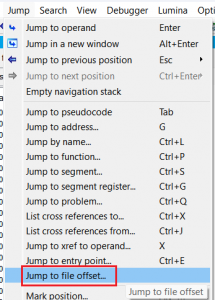
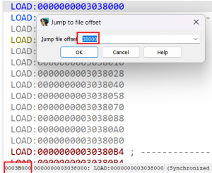

虽然大多数针对二进制文件的操作都可以直接在 IDA 中完成，但有时你可能需要借助其他工具。 例如：

- 使用 [Binwalk](https://github.com/ReFirmLabs/binwalk)  做基础固件分析
- 使用十六进制编辑器/查看器（hex editor/viewer）手动查找文件中的特定模式

假设你在文件的某个偏移位置找到了一个有趣的文本或字节模式，并希望在 IDA 中查看它。

如果是一个原始二进制文件（例如固件镜像），并且加载基址为 0，那么事情很简单： 你可以直接使用 [Jump to address](https://hex-rays.com/blog/igors-tip-of-the-week-20-going-places/)（跳转到地址） 操作，因为此时地址等于文件偏移。

但如果是 PE、ELF 或 Mach-O 这样的结构化文件，情况就会复杂得多。 幸运的是，IDA 在加载文件时会[建立文件偏移到内存地址的映射表](https://stackoverflow.com/questions/4524837/how-can-we-map-rva-relative-virtual-address-of-a-location-to-pe-file-offset)，因此在这种情况下，你可以使用 `Jump > Jump to file offset…` 操作。

跳转后，你可以通过查看 IDA View [状态栏](https://hex-rays.com/blog/igors-tip-of-the-week-61-status-bars/)的第一个字段，确认自己是否到达了正确的位置。

### 注意事项
在某些情况下，该操作可能会失败，原因包括：

- IDA 并不总是加载文件的所有部分 例如，PE 文件头默认可能不会被加载。
- 运行时不存在的数据（如文件的 overlay/尾部数据、调试信息或其他元数据）通常不会被加载到数据库中。 在某些情况下，你可以通过手动加载（[manual load](https://hex-rays.com/blog/igors-tip-of-the-week-122-manual-load/)）选项将其导入。

如果文件数据与加载到内存的数据之间不存在一一对应关系（例如磁盘数据被压缩），该操作也会失败。

另请参见：

[Igor’s tip of the week #20: Going places](https://hex-rays.com/blog/igors-tip-of-the-week-20-going-places/)

[Igor’s tip of the week #61: Status bars](https://hex-rays.com/blog/igors-tip-of-the-week-61-status-bars/)

原文地址：https://hex-rays.com/blog/igors-tip-of-the-week-169-jumping-to-a-file-offset