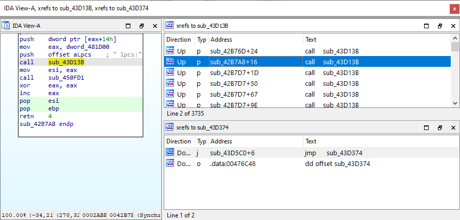
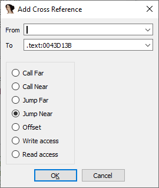
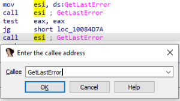

### 交叉引用视图

当交叉引用数量只有少量时，使用 跳转到交叉引用（[jump to xref](https://hex-rays.com/blog/igor-tip-of-the-week-16-cross-references/)） 功能就足够了。但如果有成百上千个交叉引用呢？ 这种情况下，交叉引用视图（`Cross references view`） 就非常有用。

可以通过 `View > Open Subviews` 菜单打开。



### 添加交叉引用

有时你需要手动添加交叉引用，例如：

- 修复被混淆函数的控制流图。
- 在调试时发现间接调用指令，需要补充调用交叉引用。

添加方式有几种：

1. 在交叉引用视图中，右键选择 `Add cross-reference…` 或按 `Ins`。
   - 在弹出的对话框中输入源地址、目标地址和交叉引用类型。
     
1. 对于 PC (x86/x64)、ARM 或 MIPS 的二进制文件，可以使用 `Edit > Plugins > Set callee address` (`Alt–F11`) 来为间接调用设置目标地址。
   
1. 通过脚本编程方式：

   - 使用 IDC 或 IDAPython 的 `add_cref` 和 `add_dref` 函数。
   - 记得与交叉引用类型一起使用 `XREF_USER` 标志，以确保在重新分析时不会被 IDA 删除。

     示例：

     ```c
     add_cref(0x100897E8, 0x100907C0, fl_CN|XREF_USER)
     add_dref(0x100A65CC, 0x100897E0, dr_O|XREF_USER)
     ```

👉 总结：当交叉引用数量庞大时，使用 交叉引用视图 可以更高效地管理和浏览；而在遇到混淆或间接调用时，手动或脚本添加交叉引用能帮助你保持分析的完整性。

原文地址：https://hex-rays.com/blog/igor-tip-of-the-week-17-cross-references-2
