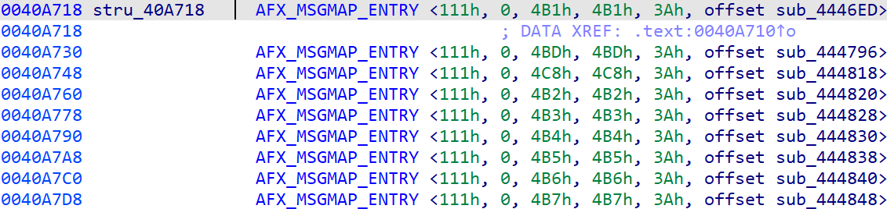

在处理使用自定义类型的代码时，[创建用户自定义结构体](https://hex-rays.com/blog/igor-tip-of-the-week-11-quickly-creating-structures/)（user-defined structures）在反汇编视图和[伪代码视图](<(https://hex-rays.com/blog/igors-tip-of-the-week-42-renaming-and-retyping-in-the-decompiler/)>)中都非常有用。 不过，结构体不仅能在代码中使用，在数据区（data areas）中同样能发挥作用。

### MFC 消息映射（Message Maps）

举个例子，来看一个使用消息映射（[message maps](https://learn.microsoft.com/en-us/cpp/mfc/tn006-message-maps?view=msvc-140)）的 MFC 程序。 这些映射表位于程序的常量数据区（constant data area），IDA 初始会将它们显示为数字与偏移量的混合：


为了理解这些数据，我们可以参考 `afxwin.h` 中定义的 `AFX_MSGMAP_ENTRY` 结构体：

```c
struct AFX_MSGMAP_ENTRY {
    UINT nMessage;   // Windows 消息
    UINT nCode;      // 控件代码或 WM_NOTIFY 代码
    UINT nID;        // 控件 ID（Windows 消息则为 0）
    UINT nLastID;    // 用于指定控件 ID 范围的条目
    UINT_PTR nSig;   // 签名类型（动作）或指向消息的指针
    AFX_PMSG pfn;    // 要调用的例程（或特殊值）
};
```

为了快速将该结构体添加到数据库，我们可以在 `Local Types` 窗口中录入它，并将 MFC 特有的 `AFX_PMSG` 类型替换为 `void*` 指针。


### 将结构体应用到数据

一旦该结构体同步到 IDB，它就可以在反汇编列表中使用。

如果目标数据区域当前是未定义（undefined），且可用结构体数量较少，可以直接通过右键菜单应用结构体。


如果候选结构体过多，或者数据已经被定义（例如自动分析已将其转换为数组），可以直接使用菜单 `Edit > Struct var…`，或快捷键 `Alt+Q`。


无论哪种方式，IDA 都会使用结构体布局来显示对应字段：


注意，位置的[临时名称](https://hex-rays.com/blog/igors-tip-of-the-week-34-dummy-names/)会改变，以反映它现在是一个结构体实例。

一旦定义了结构体实例，就可以

1. [创建结构数组](https://hex-rays.com/blog/igor-tip-of-the-week-10-working-with-arrays/)（例如使用 `*` 快捷键）：  
   
2. 在[简洁](https://hex-rays.com/blog/igors-tip-of-the-week-31-hiding-and-collapsing/)表示与完整结构体表示之间切换：  
   

### 通过重新定义类型应用结构体

除了 `Struct var…` 操作或右键菜单外，你还可以通过 `Set type…`（快捷键 `Y`）直接输入结构体名称，将其应用到数据。


这种方式同样适用于那些尚未导入到 IDB、但存在于已加载类型库（[type libraries](https://hex-rays.com/blog/igors-tip-of-the-week-60-type-libraries/).）中的结构体。

另请参见：

[IDA Help: Declare a structure variable](https://hex-rays.com//products/ida/support/idadoc/496.shtml)

[Igor’s tip of the week #11: Quickly creating structures](https://hex-rays.com/blog/igor-tip-of-the-week-11-quickly-creating-structures/)

[Igor’s tip of the week #12: Creating structures with known size](https://hex-rays.com/blog/igor-tip-of-the-week-12-creating-structures-with-known-size/)

[Igor’s tip of the week #94: Variable-sized structures](https://hex-rays.com/blog/igors-tip-of-the-week-94-variable-sized-structures/)

原文地址：https://hex-rays.com/blog/igors-tip-of-the-week-170-instantiating-structures
