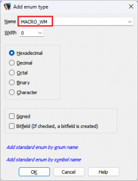
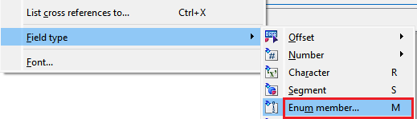
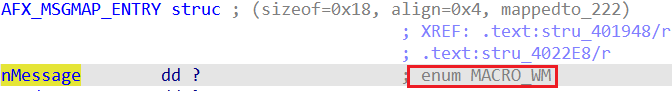
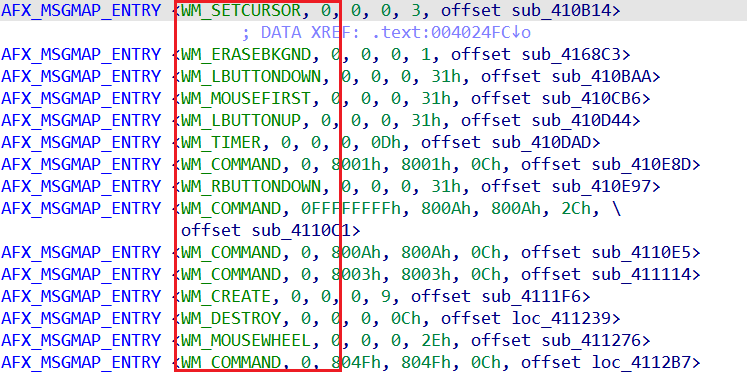

我们之前已经看到，自定义结构体（custom structures） 可以用来让[数据表](https://hex-rays.com/blog/igors-tip-of-the-week-170-instantiating-structures/)的显示更加直观，但有时通过一些小调整，还能进一步提升可读性和理解度。

例如，在我们创建的某个结构体中，第一个成员 `nMessage` 当前只是以一个普通整数的形式显示：

如果你熟悉 Win32 API，可能会认出这些数字对应的是窗口消息（[window messages](https://learn.microsoft.com/en-us/windows/win32/winmsg/window-messages)），但每次都去查 MSDN 或 Windows 头文件来确认它们的含义，显然很麻烦。 如果能直接显示符号常量（symbolic names）而不是数字，就会方便很多。

实际上，IDA 的标准类型库（[standard type libraries](https://hex-rays.com/blog/igors-tip-of-the-week-60-type-libraries/)）中已经包含了这种映射关系，我们只需要把它应用到结构体成员上即可。

操作步骤：

1. 打开 `Enums` 窗口（快捷键 `Shift+F10`）。
2. 按 `Ins` 或在右键菜单中选择 `Add Enum…`。
3. 你可以点击 `Add standard enum by symbol name`，然后选择一个已知的消息（例如 `WM_COMMAND`）； 或者直接在 `Name` 字段中输入 `MACRO_WM`，然后点击 `OK`。

   

4. 打开 `Structures`（结构体）窗口，找到 `AFX_MSGMAP_ENTRY` 结构体。
5. 在第一个字段上，右键选择 `Field type > Enum member…`，或直接按快捷键 `M`。

   

6. 在列表中选择 `MACRO_WM`。IDA 会自动为该字段添加一个自动注释（`automatic comment`）：

   

7. 回到反汇编列表中，原本的数字就会被替换为对应的符号常量：

   

另请参见：

[Igor’s tip of the week #99: Enums](https://hex-rays.com/blog/igors-tip-of-the-week-99-enums/)

[Igor’s Tip of the Week #125: Structure field representation](https://hex-rays.com/blog/igors-tip-of-the-week-125-structure-fields-representation/)

[Igor’s tip of the week #60: Type libraries](https://hex-rays.com/blog/igors-tip-of-the-week-60-type-libraries/)

原文地址：https://hex-rays.com/blog/igors-tip-of-the-week-171-enums-as-structure-members
