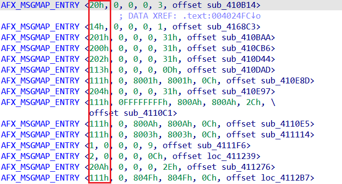

We’ve seen how custom structures can be used to [format data tables](https://hex-rays.com/blog/igors-tip-of-the-week-170-instantiating-structures/) nicely, but sometimes you can improve your understanding even further with small adjustments. For example, in the structure we created, the first member (`nMessage`) is printed as a simple integer:  
我们已经了解了如何使用自定义结构来很好地格式化数据表，但有时只需稍作调整就能进一步加深理解。例如，在我们创建的结构中，第一个成员 ( `nMessage` ) 被打印为一个简单的整数：

If you know Win32 API well, you may recognize that these numbers correspond to [window messages](https://learn.microsoft.com/en-us/windows/win32/winmsg/window-messages), but it would be nice to see the symbolic names instead of numbers without having to check MSDN or Windows headers every time. In fact, IDA already has this mapping in the standard [type libraries](https://hex-rays.com/blog/igors-tip-of-the-week-60-type-libraries/), so we just need to use it for our structure member. It can be done pretty easily using the following steps:  
如果您熟悉 Win32 API，您可能会知道这些数字对应的是窗口消息，但如果能看到符号名称而不是数字就更好了，而不必每次都查看 MSDN 或 Windows 头文件。事实上，IDA 已经在标准类型库中提供了这种映射，因此我们只需将其用于我们的结构成员。使用以下步骤就可以轻松完成：

1.  Open the Enums window (Shift+F10).  
    打开枚举窗口（ Shift + F10 ）。
2.  Press Ins or use “Add Enum…” from the context menu.  
    按 Ins 或使用上下文菜单中的 "Add Enum...（添加枚举）"。
3.  Either click _Add standard enum by symbol name_ and pick one of the known messages (e.g. `WM_COMMAND`), or just type `MACRO_WM` in the Name field directly, then click OK.  
    或者点击 "按符号名称添加标准枚举 "并从已知信息中选择一个（例如 `WM_COMMAND` ），或者直接在名称字段中输入 `MACRO_WM` ，然后点击 "确定"。  
    
4.  now go to `AFX_MSGMAP_ENTRY` in the Structures window   
    现在转到结构窗口中的 `AFX_MSGMAP_ENTRY`
5.  on the first field, use Field type > Enum member… from the context menu, or the shortcut M.  
    在第一个字段中，使用右键菜单中的字段类型 > 枚举成员...，或快捷键 M 。  
    
6.  select `MACRO_WM`from the list. An automatic comment is added for the field:  
    从列表中选择 `MACRO_WM` 。该字段将自动添加注释：  
    
7.  back in the listing, the numbers are replaced by the symbolic constants:  
    在列表中，数字被符号常量取代：  
    

See also: 另请参见：

[Igor’s tip of the week #99: Enums  
伊戈尔本周小贴士 #99：枚举](https://hex-rays.com/blog/igors-tip-of-the-week-99-enums/)

[Igor’s Tip of the Week #125: Structure field representation  
本周伊戈尔小贴士 #125：结构字段表示法](https://hex-rays.com/blog/igors-tip-of-the-week-125-structure-fields-representation/)

[Igor’s tip of the week #60: Type libraries  
伊戈尔本周提示 #60：类型库](https://hex-rays.com/blog/igors-tip-of-the-week-60-type-libraries/)