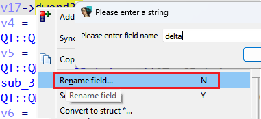
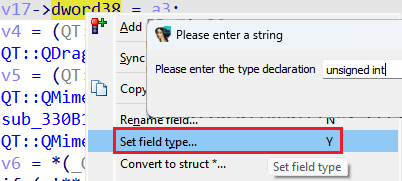
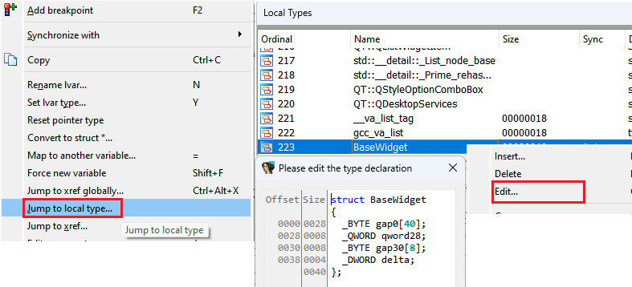

We already know that user-defined types such as [structures](https://hex-rays.com/blog/igor-tip-of-the-week-11-quickly-creating-structures/) and [enums](https://hex-rays.com/blog/igors-tip-of-the-week-99-enums/) can be created and edited through the corresponding views, or the [Local Types](https://hex-rays.com/blog/igor-tip-of-the-week-11-quickly-creating-structures/) list.  
我们已经知道，结构和枚举等用户自定义类型可以通过相应的视图或本地类型列表创建和编辑。

However, some small edits can be performed directly in the pseudocode view:  
不过，一些小的编辑也可以直接在伪代码视图中进行：

1.  structure fields can be renamed using the “Rename” action (shortcut N):  
    结构字段可以使用 "重命名 "操作（快捷键 N ）进行重命名：  
    
2.  you can also quickly retype them using the “Set type” action (Y):  
    您也可以使用 "设置类型 "操作 ( Y ) 快速重新输入：  
      
    NB: the neighboring fields are automatically overwritten if the size of the field increases so use Undo to revert if necessary.  
    注意：如果字段的大小增加，相邻的字段会被自动覆盖，因此必要时可以使用 "撤消 "来恢复。

These actions also work on stack variables because they behave like fields of the stack frame structure.  
这些操作也适用于堆栈变量，因为它们的行为类似于堆栈帧结构的字段。

If you prefer to use the free-form C syntax editor to see and edit the whole structure, you can quickly navigate to the type using the “Jump to local type” action from the context menu and then use “Edit” (Ctrl–E) on the type’s entry:  
如果你更喜欢使用自由形式的 C 语法编辑器查看和编辑整个结构，可以使用上下文菜单中的 "跳转到本地类型 "操作快速导航到类型，然后在类型的条目上使用 "编辑"（ Ctrl - E ）：  

See also: 另请参见：

[Igor’s tip of the week #99: Enums  
伊戈尔本周小贴士 #99：枚举](https://hex-rays.com/blog/igors-tip-of-the-week-99-enums/)

[Igor’s tip of the week #42: Renaming and retyping in the decompiler  
伊戈尔的每周提示 #42：反编译器中的重命名和重打](https://hex-rays.com/blog/igors-tip-of-the-week-42-renaming-and-retyping-in-the-decompiler/)

[Igor’s tip of the week #11: Quickly creating structures  
伊戈尔本周小贴士 #11：快速创建结构](https://hex-rays.com/blog/igor-tip-of-the-week-11-quickly-creating-structures/)