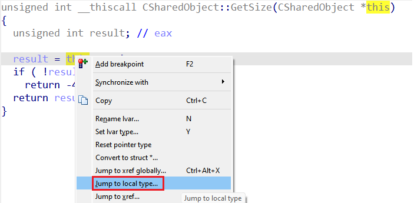
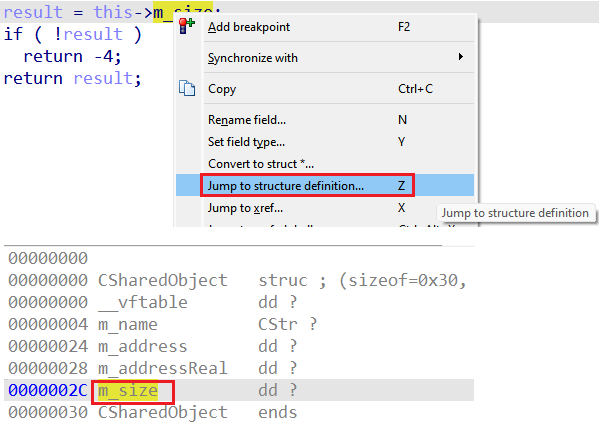

在[之前的文章](https://hex-rays.com/blog/igors-tip-of-the-week-172-type-editing-from-pseudocode/)中，我们已经看到如何直接在伪代码视图（pseudocode view）中对类型进行一些小的修改。 对于简单的调整，这种方式已经足够，但有时你仍然需要使用完整的类型编辑器来进行更复杂的修改。

当然，你可以手动打开 `Structures`（结构体）、`Enums`（枚举）或 `Local Types`（本地类型）窗口，然后在里面查找目标类型——但如果你的数据库里有成千上万个类型，这就会变得非常低效。

幸运的是，IDA 提供了更快捷的方式：

- 如果当前变量的类型是在 `Local Types` 中定义的 你可以在右键菜单中选择 `Jump to local type…`（跳转到本地类型），直接定位到该类型的定义。
  

- 如果光标位于结构体字段上 你可以使用 `Jump to structure definition…` （跳转到结构体定义）（或按快捷键 `Z`），直接打开该结构体并定位到对应字段。
  

进入这些视图后，你就可以对类型进行所需的修改，然后再切回反编译器。

注意：为了避免性能下降，反编译器不会实时跟踪在伪代码视图之外进行的类型修改，因此你可能需要按 `F5` 来刷新伪代码，以应用最新的更改。

另请参见：

[Igor’s Tip of the Week #172: Type editing from pseudocode](https://hex-rays.com/blog/igors-tip-of-the-week-172-type-editing-from-pseudocode/)

[Igor’s tip of the week #11: Quickly creating structures](https://hex-rays.com/blog/igor-tip-of-the-week-11-quickly-creating-structures/)

原文地址：

