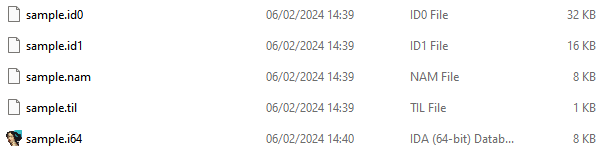
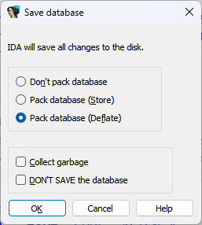

在使用 IDA 进行分析时，IDA 会将你的分析结果保存到 IDA 数据库（IDA Database）中，这样你就可以暂停工作并在之后继续。

你可以通过文件扩展名识别这些数据库文件：

- `.idb`：旧版 32 位 IDA 使用的数据库文件
- `.i64`：64 位 IDA（IDA64）使用的数据库文件

因此，它们通常被统称为 IDB。

当你在 IDA 中打开一个 IDB 时，可以通过查看工作目录（working directory）来窥探它的内部结构：

实际上，IDB 是一个容器文件，内部包含多个子文件：

- `filename.id0`
  - 实际的数据库文件（基于 B-tree 实现）
  - 存储了从输入文件中提取的所有元数据，以及用户添加的内容（符号名、注释、函数边界等）
- `filename.id1`
  - 存储虚拟数组（virtual array）
  - 包含输入文件中加载的所有数据副本，以及 IDA 所需的内部标志位
  - 通常是原始文件大小的 4–5 倍
  - 如果你向数据库[添加](https://hex-rays.com/blog/igors-tip-of-the-week-96-loading-additional-files/)或删除数据，它的大小可能会增长或缩小
- `filename.id2`（如果存在）
  - 存储稀疏内存区域（sparse memory areas）的数据，例如大部分填充为零的段
  - 仅在某些情况下使用
- `filename.nam`
  - 数据库中使用的符号名缓存（name cache）
- `filename.til`
  - 类型库（type library），包含该数据库的本地类型（[Local Types](https://hex-rays.com//products/ida/support/idadoc/1259.shtml)）

当你关闭数据库时，IDA 会询问你如何处理这些子文件：

- Don’t pack database（不打包数据库）
  - 保留各个子文件在磁盘上的独立形式
  - 保存速度最快
  - 但存在风险：没有完整性校验，文件损坏可能在很久之后才被发现
- Pack database (Store)（打包数据库 - 存储模式）
  - 将所有子文件合并为一个 .idb 或 .i64 容器
  - 添加校验和（checksum），以便检测文件损坏
  - 不使用压缩，生成的 IDB 大小与所有子文件总和大致相同
- Pack database (Deflate)（打包数据库 - 压缩模式）
  - 使用 zlib 压缩子文件
  - 相比 Store 模式，可以显著减少磁盘占用
  - 代价是保存和解包 IDB 时会花费更多时间

另请参见：

[IDA Help: Exit IDA](https://hex-rays.com//products/ida/support/idadoc/450.shtml)

[Igor’s tip of the week #58: Keyboard modifiers](https://hex-rays.com/blog/igors-tip-of-the-week-58-keyboard-modifiers/)
