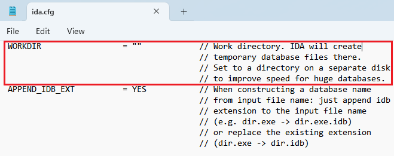
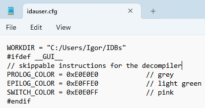

As we’ve seen [previously](https://hex-rays.com/blog/igors-tip-of-the-week-174-ida-database-idbdetails/), an IDB (IDA database) consists of several embedded files which contain the actual database data and which IDA reads/write directly when working with the database. By default, they’re unpacked next to the IDB, which can lead to various issues such as excessive disk usage, or speed (e.g. if IDB is on a remote or removable drive).  
正如我们之前所见，IDB（IDA 数据库）由多个嵌入式文件组成，其中包含实际的数据库数据，IDA 在使用数据库时会直接读/写这些文件。默认情况下，它们会被解压到 IDB 旁边，这可能会导致各种问题，如磁盘使用率过高或速度过快（例如，如果 IDB 位于远程或移动硬盘上）。

If you often work with external IDBs but have a fast local drive, it may be useful to set up a _work directory_  
如果您经常使用外部 IDB，但本地硬盘速度较快，那么设置一个工作目录可能会很有用。

The setting is mentioned in `ida.cfg`:  
设置在 `ida.cfg` 中提及：

Instead of editing `ida.cfg` directly, the recommended option is to put the changed variables into a file `idauser.cfg` in the [user directory](https://hex-rays.com/blog/igors-tip-of-the-week-33-idas-user-directory-idausr/). This way you won’t need to redo the edits when upgrading IDA. You can also put there other settings, e.g. [skippable instructions](https://hex-rays.com/blog/igors-tip-of-the-week-68-skippable-instructions/) colors.  
建议不要直接编辑 `ida.cfg` ，而是将更改的变量放入用户目录下的文件 `idauser.cfg` 中。这样，在升级 IDA 时就不需要重新编辑了。你还可以在文件中加入其他设置，例如可跳过的指令颜色。

Once the config option is added, embedded files from newly opened IDBs will be unpacked into the specified directory instead of next to the IDB. This can be especially useful for cases like IDBs on remote or removable drives: even if the drive is disconnected, local files remain and IDA will continue working.  
添加配置选项后，新打开的 IDB 中的嵌入文件将解压缩到指定目录，而不是 IDB 旁边。这对远程或移动硬盘上的 IDB 尤为有用：即使硬盘断开连接，本地文件仍会保留，IDA 也能继续工作。

See also: 另请参见：

[Igor’s Tip of the Week #174: IDA database (IDB) details  
伊戈尔本周小贴士 #174：IDA 数据库 (IDB) 详情](https://hex-rays.com/blog/igors-tip-of-the-week-174-ida-database-idbdetails/)

[Igor’s tip of the week #33: IDA’s user directory (IDAUSR)  
伊戈尔本周提示 #33：IDA 的用户目录 (IDAUSR)](https://hex-rays.com/blog/igors-tip-of-the-week-33-idas-user-directory-idausr/)

[IDA Help: Configuration files  
IDA 帮助：配置文件](https://hex-rays.com//products/ida/support/idadoc/419.shtml)