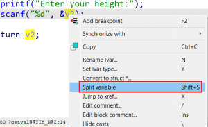
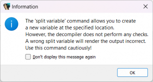
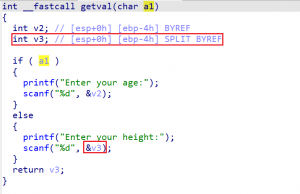

之前，我们[讨论过一种情况](https://hex-rays.com/blog/igors-tip-of-the-week-155-splitting-stack-variables-in-the-decompiler/)：反编译器错误地将两个不同的变量合并到同一个栈槽（stack slot）中使用。 当时我们能够解决这个问题，是因为每个变量在栈帧中有各自独立的位置，所以通过编辑栈帧将它们拆开就可以了。

然而，现代的优化编译器实际上可能会复用同一个栈位置来存储在不同时间段（例如不同作用域）内活动的不同变量。请看这个例子：

```c
int __fastcall getval(char a1)
{
  int v2; // [esp+0h] [ebp-4h] BYREF

  if ( a1 )
  {
    printf("Enter your age:");
    scanf("%d", &amp;v2);
  }
  else
  {
    printf("Enter your height:");
    scanf("%d", &amp;v2);
  }
  return v2;
}
```

我们可以看到，`v2` 被用来存储两种不同的值：年龄和身高。 由于它们的使用范围并不重叠，编译器决定让它们共用同一个栈槽。

在这个简短的例子中，我们可以简单地将 `v2` 重命名为一个通用的名字，然后就算完成了。 但如果两个分支中的代码更复杂，且我们确实需要区分当前处理的是哪一个值，那么就需要更精细的处理。

在这种情况下，你可以使用 `Split variable` 操作（快捷键 `Shift+S`），为同一个栈位置引入一个新的变量。



如果你是第一次执行这个操作，IDA 会警告你：错误的拆分可能会导致反编译结果不正确。 



确认后，IDA 会创建一个新变量：



注意，它与 `v2` 具有相同的栈位置，但带有 `SPLIT` 注解。

现在，你就可以根据需要对这个新变量进行重命名或重新定义类型。

如果你想回到原来的状态，可以使用 `Unsplit variable` （取消拆分变量），或者[重置当前函数的拆分变量分配](https://hex-rays.com/blog/igors-tip-of-the-week-102-resetting-decompiler-information/)。

注意：在 IDA 8.4 之前，这个操作被称为 `Force new variable`（强制新变量）。

另请参见：

[Hex-Rays interactive operation: Split variable](https://hex-rays.com/products/decompiler/manual/cmd_split_lvar.shtml)

[Igor’s Tip of the Week #155: Splitting stack variables in the decompiler](https://hex-rays.com/blog/igors-tip-of-the-week-155-splitting-stack-variables-in-the-decompiler/)