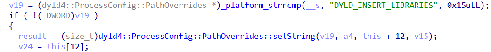
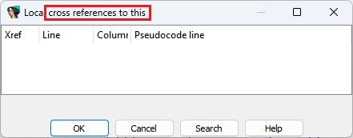
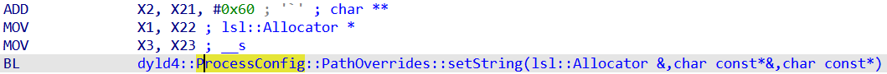
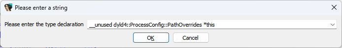
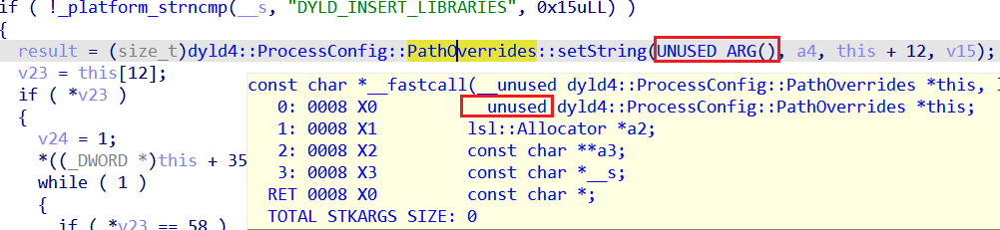

 
在之前的[一篇小贴士](https://hex-rays.com/blog/igors-tip-of-the-week-52-special-attributes/)中，我们提到过 `__unused` 属性，它可以应用于函数参数。 那么它什么时候有用呢？

让我们来看一段来自 Apple 的 dyld 的代码：



`v19` 被作为第一个参数传递给 `dyld4::ProcessConfig::PathOverrides::setString()`。 由于它的名字看起来像是一个类方法，反编译器将类类型赋给了第一个参数（通常对应于隐式的 `this` 参数）。 然而，`strncmp` 返回的是一个简单的整数比较结果，与 `PathOverrides` 类并无关系。 这是怎么回事呢？

为了弄清楚，查看被调用的函数内部会很有帮助。 它很短，所以我们可以直接展示完整的输出：

```c
const char *__fastcall dyld4::ProcessConfig::PathOverrides::setString(
        dyld4::ProcessConfig::PathOverrides *this,
        lsl::Allocator *a2,
        const char **a3,
        const char *__s)
{
  size_t v7; // x22
  size_t v8; // x8
  char *v9; // x22
  char *v10; // x0
  const char *result; // x0
  __int64 v12; // [xsp+0h] [xbp-40h] BYREF

  if ( *a3 )
  {
    v7 = _platform_strlen(*a3);
    v8 = (v7 + _platform_strlen(__s) + 17) &amp; 0xFFFFFFFFFFFFFFF0LL;
    __chkstk_darwin();
    v9 = (char *)&amp;v12 - v8;
    v10 = strcpy((char *)&amp;v12 - v8, *a3);
    *(_WORD *)&amp;v9[_platform_strlen(v10)] = 58;
    strcat(v9, __s);
    result = (const char *)lsl::Allocator::strdup(a2, v9);
  }
  else
  {
    result = (const char *)lsl::Allocator::strdup(a2, __s);
  }
  *a3 = result;
  return result;
}
```

你可能注意到一个有趣的现象： `this` 参数在函数体中根本没有被使用。

这可以通过检查交叉引用（快捷键 `X`）来确认：



另一个确认方法是查看调用该函数之前的汇编代码：



我们可以看到 `X1`、`X2` 和 `X3` 被初始化为三个参数的值，但 `X0`（`this`）并没有被显式初始化，因此反编译器会回退到使用上一次初始化的值（即调用 `__platform_strncmp()` 的返回结果），显然这与 `this` 无关。

如何让反编译结果更好看？解决方法是将 this 参数标记为未使用，可以通过编辑完整的函数原型，或者仅编辑该参数的类型来实现：



返回到调用者并刷新后，输出会变得更加简洁：



反编译器将 `strncmp` 调用直接内联到 `if` 条件中，因为它不再需要单独的 `v19` 变量。 原本错误的 `this` 参数被替换成了占位符 `UNUSED_ARG()`。